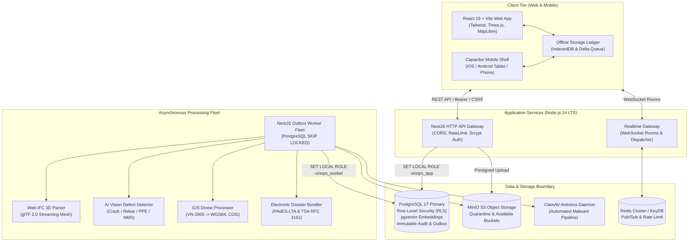

<div align="center">

# VinOps Platform

**Enterprise Digital Engineering & Common Data Environment (CDE) Platform for Capital Infrastructure Projects**

[](https://github.com/DuongVinh2004/VinOps/actions/workflows/foundation-ci.yml)
[](https://github.com/DuongVinh2004/VinOps/releases)
[](https://github.com/DuongVinh2004/VinOps/actions/workflows/codeql.yml)
[](https://nodejs.org)
[](https://pnpm.io)
[](https://www.typescriptlang.org/)
[](https://www.postgresql.org/)
[](#audit-status)
[](https://prettier.io)
[](LICENSE)

[Architecture](#system-architecture) •
[Core Modules](#core-platform-capabilities) •
[Quickstart](#developer-quickstart) •
[Engineering Standards](#engineering--regulatory-compliance) •
[Documentation](#documentation-index) •
[Contributing](CONTRIBUTING.md)

</div>

---

## Executive Summary

**VinOps** is a mission-critical Digital Engineering and Common Data Environment (CDE) platform built for mega infrastructure, capital transit, and industrial construction projects.

Designed around open international engineering standards (**openBIM IFC 4.3**, **BCF 3.0**, **ISO 19650**) and Vietnamese construction regulations (**Nghị định 207/2026/NĐ-CP**, **Thông tư 32/2026/TT-BXD**, **Luật Giao dịch điện tử 2023**), VinOps unifies 3D spatial models, field quality inspection, AI-driven site hazard detection, legal PKI remote digital signing, drone orthophoto surveying, and offline field synchronization into a single zero-trust operational platform.

---

## System Architecture



---

## Core Platform Capabilities

### 1. openBIM 3D Digital Twin & Spatial Linking (`ADR-013`)

- **Native Web-IFC Engine**: Background worker streaming converts IFC 2x3, IFC 4, and IFC 4.3 models into optimized binary glTF 2.0 geometry.
- **Bi-directional Spatial Linking**: Links any BIM component (`IfcGuid`) directly to Field Issues, Quality Inspections, Material Submittals, and 2D CAD Drawings.
- **BCF 3.0 Viewpoints**: Camera coordinates, clipping planes, component visibility state, and viewpoints synchronization for multi-party coordination.
- **Property Inspector**: Interactive hierarchy explorer extracting IFC property sets (Psets), quantities, and materials in browser without local desktop software.

### 2. AI Site Vision & RAG Technical Copilot (`ADR-014`)

- **Automated Defect Detection**: Deep learning inference worker analyzes site photos for structural concrete cracks, honeycombing, exposed rebar, and worker PPE compliance.
- **Non-Maximum Suppression (NMS)**: Eliminates redundant overlapping bounding boxes and normalizes coordinates across variable camera aspect ratios.
- **RAG Technical Specs Retrieval**: `pgvector` dense vector embeddings (`text-embedding-3-small`, 1536 dims) indexing Vietnamese national construction standards (TCVN), project specifications, and safety guidelines.
- **Interactive Engineer Assistant**: Dual-tier AI chat drawer assisting site engineers with rapid RFI drafting and specification compliance cross-referencing.

### 3. Legal PKI Remote Digital Signatures (`ADR-015`)

- **NĐ 207/2026/NĐ-CP Compliant Workflow**: Sequential 3-party acceptance sign-off: **Nhà thầu (Contractor Rep) $\rightarrow$ Tư vấn giám sát (TVGS Lead) $\rightarrow$ Ban Quản lý dự án (PMU Manager)**.
- **Cloud Signature Consortium (CSC) Integration**: Remote signing adapters for Vietnamese licensed CAs (**VNPT SmartCA**, **Viettel Cloud CA**, **TrustCA**) supporting push OTP and biometric confirmation.
- **PAdES-LTA & TSA Timestamping**: RFC 3161 cryptographic timestamps and Long-Term Archival (LTA) validation embedding OCSP responses and CRL snapshots into PDF dossiers.
- **As-Built Electronic Dossiers**: Automated dossier package compilation, SHA-256 cryptographic hash-chain sealing, and tamper-evident transmittal manifest export.

### 4. GIS Drone UAV Orthophoto Surveying (`ADR-017`)

- **VN-2000 Geodetic Converter**: Mathematical Transverse Mercator 3°/6° projection transformation between Vietnam national datum (VN-2000) and WGS-84 coordinates.
- **Cloud-Optimized GeoTIFF (COG)**: Ingestion of UAV drone orthomosaic imagery with dynamic multi-resolution tile streaming.
- **MapLibre GL Vector Canvas**: Side-by-side swipe comparison between actual drone survey flights and planned CAD site layouts; polygon spatial annotations.

### 5. Realtime Collaboration & Push Notifications (`ADR-016`)

- **Project Room WebSocket Dispatcher**: Low-latency room-based event broadcasting (`realtimeChannels`) isolated by tenant project boundaries.
- **Cross-Platform Mobile Push**: Native push delivery via Apple APNs (HTTP/2 binary protocol) and Google Firebase Cloud Messaging (FCM HTTP v1).
- **Notification Center**: Realtime notification drawer with unread counters, category preference filtering, and quiet-hours enforcement.

### 6. Offline-First Field Sync Ledger

- **Field Resilience**: Full site inspection checklists and daily construction logs operate seamlessly in zero-connectivity tunnels, basements, and remote linear sites.
- **Cryptographic Delta Queue**: Client-side IndexedDB ledger queues local mutations with idempotency tokens.
- **Multi-Version Conflict Resolution**: Server-side timestamp and version verification detects concurrent modifications and generates interactive merge diffs.

### 7. Zero-Trust Security & Data Isolation

- **PostgreSQL 17 Kernel RLS**: Every tenant query enforces `vinops.can_access_project(project_id)`. Zero cross-tenant leakage guaranteed at database engine level.
- **Least-Privilege Isolation**: Separate connection pools and privileges for HTTP API (`vinops_app`), Worker (`vinops_worker`), and Migration administrative runners.
- **ClamAV Antivirus Pipeline**: Quarantine S3 bucket quarantine pattern ensures malicious uploads are detected and purged before touching clean storage.
- **Defense-in-Depth Auth**: Parameterized `scrypt` hashing, token family rotation for refresh tokens, `HttpOnly`/`SameSite=Strict` cookies, and zero token storage in browser `localStorage`.

---

## Monorepo Architecture

```text
VinOps/
├── apps/
│   ├── api/                  # NestJS HTTP REST & WebSocket API Gateway
│   ├── web/                  # React 19 + Vite CDE Single Page Application
│   └── worker/               # NestJS Background Worker (Outbox, BIM, AI, GIS, PKI)
├── packages/
│   ├── config/               # Strongly-typed environment schemas & validation (Zod)
│   ├── contracts/            # OpenAPI 3.1 specifications & generated TypeScript interfaces
│   ├── database/             # PostgreSQL 17 migrations, seed data, RLS security policies
│   ├── domain/               # Framework-agnostic business invariants & state machines
│   ├── file/                 # S3 object storage adapters, ClamAV antivirus client
│   └── observability/        # Structured JSON logging (Pino) & correlation middleware
├── docs/
│   ├── adr/                  # Architectural Decision Records (ADR-001 .. ADR-017)
│   ├── architecture/         # System module boundaries and dependency rules
│   ├── control/              # Gate B/C verification state & pilot UAT evidence
│   └── user-guides/          # Engineering manuals (PKI remote signing, BIM, GIS)
├── evidence/                 # Verification artifacts, NFR reports & audit trails
└── deploy/                   # Production Dockerfiles, compose stacks & Kubernetes manifests
```

---

## Developer Quickstart

### Prerequisites

| Tool               | Required Version         | Verification Command     |
| ------------------ | ------------------------ | ------------------------ |
| **Node.js**        | `24.18.0` (LTS)          | `node --version`         |
| **pnpm**           | `11.15.1` (via Corepack) | `pnpm --version`         |
| **Docker Engine**  | `20.10+`                 | `docker --version`       |
| **Docker Compose** | `2.20+`                  | `docker compose version` |

### 1. Environment Setup

Activate the pinned package manager through Corepack:

```bash
corepack enable
corepack prepare pnpm@11.15.1 --activate
```

Copy the example environment configuration:

```bash
cp .env.example .env
```

### 2. Start Infrastructure Containers

Launch local PostgreSQL 17, MinIO S3, and ClamAV services:

```bash
docker compose up -d
```

Verify healthy container status:

```bash
docker compose ps
```

### 3. Install Dependencies & Build

Install dependencies with frozen lockfile:

```bash
pnpm install --frozen-lockfile
```

Build all packages and client assets:

```bash
pnpm build
```

### 4. Run Foundation Quality Gates

VinOps enforces a strict 9-stage verification gate required before any commit:

```bash
pnpm verify
```

This single command executes:

1. `pnpm format:check` - Prettier code style validation
2. `pnpm lint` - Strict ESLint rules across apps, packages, and scripts
3. `pnpm typecheck` - TypeScript project reference verification across all 9 workspaces
4. `pnpm test` - Vitest suite (286+ unit, integration, and security tests)
5. `pnpm contracts:verify` - OpenAPI 3.1 schema linting and drift detection
6. `pnpm architecture:check` - Dependency Cruiser boundary and circular dependency check
7. `pnpm build` - Clean production compilation
8. `pnpm secret:scan` - Secret scanner checking 960+ source files
9. `pnpm license:check` - Direct dependency license audit (Permitted: Apache-2.0, MIT, ISC)

---

## Engineering & Regulatory Compliance

VinOps is purpose-built to satisfy strict national and international engineering standards:

| Standard / Decree               | Subject Matter                              | VinOps Platform Implementation                                                                                        |
| ------------------------------- | ------------------------------------------- | --------------------------------------------------------------------------------------------------------------------- |
| **Nghị định 207/2026/NĐ-CP**    | Quản lý chất lượng & thi công xây dựng      | 3-party sequential acceptance signing (`Contractor -> TVGS -> PMU`), daily log freeze constraint.                     |
| **Thông tư 32/2026/TT-BXD**     | Hồ sơ nghiệm thu & hoàn công điện tử        | As-built electronic dossier compilation, cryptographic hash-chain sealing, transmittal export.                        |
| **Luật Giao dịch điện tử 2023** | Chữ ký điện tử & giá trị pháp lý            | CSC Cloud HSM remote signing integration, PAdES-LTA long-term archival validation.                                    |
| **RFC 3161**                    | Time-Stamp Protocol (TSA)                   | Independent trusted timestamp authority embedding on all legal signatures.                                            |
| **openBIM IFC 4.3**             | Building Information Modelling data sharing | Native Web-IFC parser streaming glTF 2.0 geometry into web Three.js canvas.                                           |
| **BCF 3.0**                     | BIM Collaboration Format                    | Viewpoint camera coordinates, clipping planes, and topic synchronization.                                             |
| **VN-2000 Datum**               | Hệ quy chiếu & tọa độ quốc gia Việt Nam     | Mathematical ellipsoid projection conversion between VN-2000 (3°/6°) and WGS-84 coordinates.                          |
| **ISO 19650-1/2**               | Information management using BIM            | Common Data Environment (CDE) state machine: WIP $\rightarrow$ Shared $\rightarrow$ Published $\rightarrow$ Archived. |

---

## Documentation Index

- **Architectural Decision Records**:
  - [`ADR-MEGA-001-001`](docs/adr/ADR-MEGA-001-001.md): PostgreSQL Source of Truth, Node Authentication, and Outbox Pattern
  - [`ADR-013`](docs/adr/ADR-013-BIM-3D-VIEWER.md): openBIM IFC 4.3 Web Viewer & glTF Streaming
  - [`ADR-014`](docs/adr/ADR-014-AI-COMPUTER-VISION-SITE.md): AI Computer Vision Site Inspection & RAG Technical Copilot
  - [`ADR-015`](docs/adr/ADR-015-LEGAL-PKI-REMOTE-SIGNING.md): Legal PKI Remote Signing, CSC Cloud HSM & As-Built Dossiers
  - [`ADR-016`](docs/adr/ADR-016-REALTIME-EVENT-AND-PUSH.md): Realtime Event Streaming, WebSockets & Push Notifications
  - [`ADR-017`](docs/adr/ADR-017-GIS-DRONE-ORTHOPHOTO.md): GIS Drone Orthophoto Survey & VN-2000 Geodetic Converter
- **Architecture & Boundaries**: [`MODULE_BOUNDARIES.md`](docs/architecture/MODULE_BOUNDARIES.md)
- **Security & Privacy Policy**: [`GPS_EXIF_PRIVACY_AND_SECURITY_POLICY.md`](docs/control/GPS_EXIF_PRIVACY_AND_SECURITY_POLICY.md)
- **Control & Verification Baseline**: [`CONTROL_STATE.md`](docs/control/CONTROL_STATE.md)
- **User Guides**:
  - [Hướng dẫn Ký số Điện tử Từ xa (NĐ 207/2026)](docs/user-guides/HUONG_DAN_KY_SO_DIEN_TU.md)

---

## Community & Security

- **Contributing**: Please review [CONTRIBUTING.md](CONTRIBUTING.md) for contribution guidelines, branch naming, and conventional commits.
- **Code of Conduct**: This project adheres to the [Contributor Covenant 2.1](CODE_OF_CONDUCT.md).
- **Security Policy**: To report vulnerabilities confidentially, please read [SECURITY.md](SECURITY.md).
- **Changelog**: All release notes and version history are recorded in [CHANGELOG.md](CHANGELOG.md).

<a id="audit-status"></a>

### Security Audit Status

- **Red-Team Security Remediation**: All identified vulnerabilities have been remediated, verified under Gate B/C verification baselines, and signed into the immutable evidence trail (`evidence/VIN-MEGA-002/`).
- **Continuous Static Analysis (SAST)**: GitHub CodeQL and secret scanning run on every pull request and push to `main`.

---

## License

VinOps is open-source software licensed under the [Apache License, Version 2.0](LICENSE).
Copyright &copy; 2026 VinOps Authors and Contributors.
