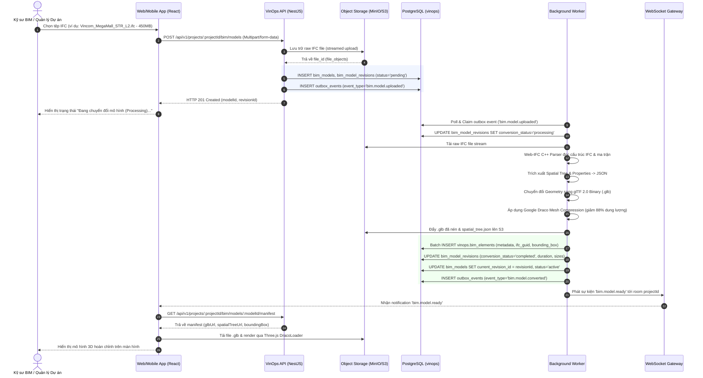
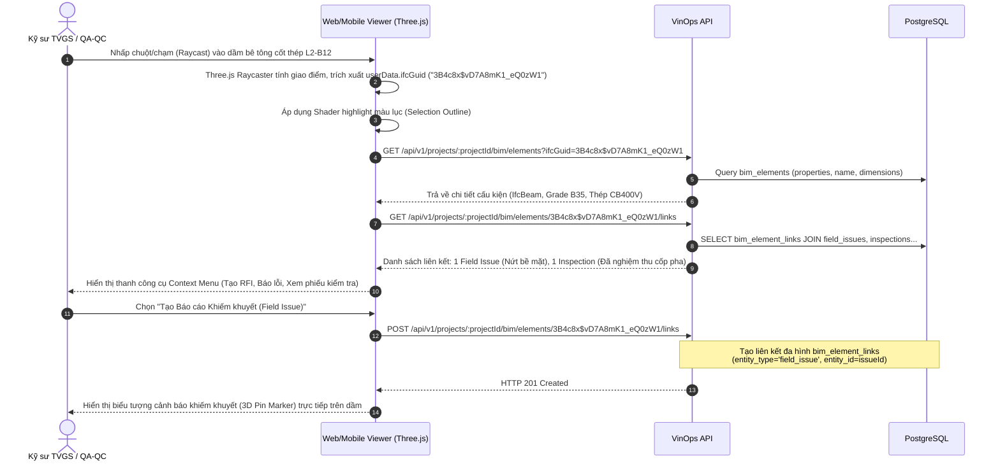
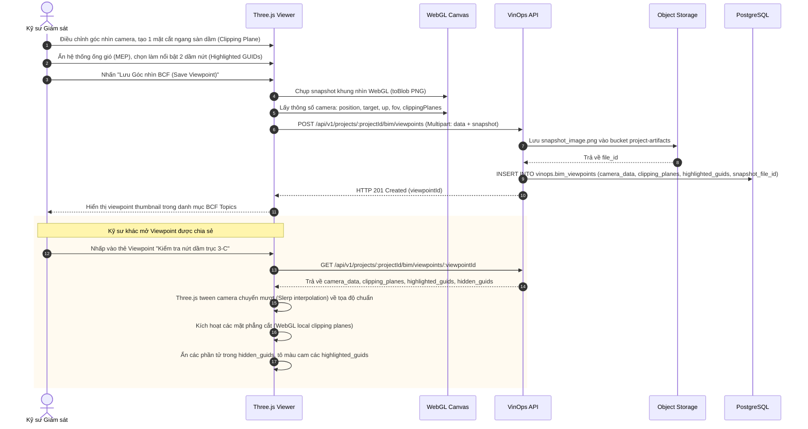

# ADR-013: Tích hợp Mô hình Không gian 3D / BIM (openBIM IFC & WebGL)

- Status: `PROPOSED`
- Effective date: 2026-09-07
- Decision owner: Principal Construction-Tech Enterprise Architect
- Scope: `apps/api`, `apps/worker`, `apps/web`, `packages/database`, `packages/domain`, `packages/contracts`

---

## 1. Context (Bối cảnh & Vấn đề Kỹ thuật)

Trong các dự án hạ tầng và công trình dân dụng quy mô lớn của VinOps, việc đối soát dữ liệu hiện trường (Field Operations) với hồ sơ thiết kế đòi hỏi trực quan hóa không gian 3 chiều (3D Spatial Context). Các kỹ sư giám sát (TVGS), chỉ huy trưởng và kỹ sư QA/QC trên công trường gặp phải các thách thức cốt lõi sau:

1. **Hiệu năng thiết bị di động và WebGL Heap Exhaustion:**
   - Tệp mô hình gốc định dạng IFC (Industry Foundation Classes) từ Autodesk Revit, Tekla Structures hoặc ArchiCAD thường có kích thước từ 150MB đến 1.5GB với hàng trăm nghìn phần tử hình học (Geometry Meshes) và cây thuộc tính (PropertySets).
   - Thiết bị máy tính bảng hiện trường (iPad 9th/10th Gen, Samsung Galaxy Tab S7/S8) chạy trình duyệt Safari/Chrome hoặc Capacitor PWA Webview có giới hạn WebGL Heap và RAM khả dụng nghiêm ngặt (~150MB – 300MB). Nếu nạp trực tiếp toàn bộ tệp IFC thô vào bộ nhớ client, trình duyệt lập tức gặp sự cố Crash (Out of Memory - OOM).

2. **Ràng buộc liên kết dữ liệu thực địa (Spatial Data Binding):**
   - Nền tảng VinOps đã có các phân hệ quản lý hiện trường: Khiếm khuyết (`vinops.field_issues`), Yêu cầu làm rõ thông quan (`vinops.rfi_requests`), Phiếu nghiệm thu công việc (`vinops.inspections`, `vinops.acceptance_records`), và Hệ thống phân chia vị trí công trường (`vinops.location_nodes` - LBS).
   - Chưa có cơ chế chuẩn hóa để gắn định danh phần tử 3D với các thực thể vận hành hiện trường, dẫn đến tình trạng kỹ sư ghi nhận vị trí khiếm khuyết bằng văn bản mô tả thủ công, gây mơ hồ khi đối soát khối lượng và vị trí thực tế trên mô hình.

3. **Nguy cơ phụ thuộc nhà cung cấp đóng (Vendor Lock-in):**
   - Việc sử dụng nền tảng thương mại đóng như Autodesk Platform Services (Forge APS) phát sinh chi phí tính theo token/lượt chuyển đổi (Cloud Credit/Flex Consumption), chi phí gia tăng không kiểm soát theo quy mô dự án.
   - Dữ liệu CAD/BIM của dự án bị lưu trữ tại hạ tầng đám mây bên thứ ba ngoài lãnh thổ, vi phạm các yêu cầu bảo mật thông tin nội bộ và quy định lưu trữ dữ liệu công trình theo Nghị định 207/2026/NĐ-CP của Chính phủ Việt Nam.

4. **Yêu cầu tuân thủ tiêu chuẩn mở (openBIM Compliance):**
   - Hệ thống phải hỗ trợ các schema chuẩn quốc tế của buildingSMART: IFC 2x3 TC1, IFC4 ADD2 TC1, và IFC4.3 (hạ tầng cầu đường, metro, cảng biển).
   - Bắt buộc chuẩn hóa trao đổi vấn đề phối hợp mô hình thông qua tiêu chuẩn BCF (BIM Collaboration Format) phiên bản 2.1 và 3.0 (camera viewpoint, component selection, clipping planes).

---

## 2. Decision (Quyết định Kiến trúc)

Đội ngũ Kiến trúc VinOps quyết định triển khai kiến trúc **Hybrid Pipeline 3D/BIM mã nguồn mở (Self-hosted openBIM Pipeline)** với các giải pháp kỹ thuật cốt lõi:

1. **Client-side Rendering Engine:**
   - Sử dụng **Three.js (WebGL 2.0)** kết hợp **Web-IFC** (bộ parser IFC viết bằng C++ biên dịch sang WebAssembly - WASM) làm nền tảng hiển thị đồ họa phía Web & Mobile PWA.
   - Áp dụng các kỹ thuật tối ưu hóa đồ họa: Frustum Culling, InstancedMesh (cho các cấu kiện lặp lại như cốt thép, bu lông, cọc, cửa sổ), Hierarchical Level of Detail (HLOD), và Octree Spatial Indexing.

2. **Server-side Asynchronous Conversion Pipeline:**
   - Xây dựng worker pipeline bất đồng bộ trong `apps/worker` xử lý chuyển đổi tệp IFC sang định dạng **glTF 2.0 Binary (`.glb`)**.
   - Tích hợp **Google Draco Mesh Compression** (nén tọa độ đỉnh, pháp tuyến, chỉ số tam giác), giảm kích thước tệp tải xuống từ **80% đến 92%** so với IFC thô.
   - Tách biệt (decouple) dữ liệu hình học (Geometry Meshes) và siêu dữ liệu cấu trúc (Metadata/PropertySets):
     - Tệp `.glb` chỉ lưu trữ hình học, vật liệu, và ma trận chuyển đổi (Transform Matrix). Mỗi phần tử gắn `userData.ifcGuid`.
     - Cây phân cấp không gian (Spatial Hierarchy Tree: `IfcProject` $\rightarrow$ `IfcSite` $\rightarrow$ `IfcBuilding` $\rightarrow$ `IfcBuildingStorey` $\rightarrow$ `IfcSpace` $\rightarrow$ `IfcProduct`) và các tập thuộc tính (`PropertySets`) được trích xuất sang JSON riêng biệt và lưu trữ phân mảnh trên Object Storage (MinIO/S3), đồng thời index vào cơ sở dữ liệu PostgreSQL.

3. **Khóa liên kết dữ liệu định danh duy nhất (Canonical Spatial Key):**
   - Chuẩn hóa sử dụng **IFC GlobalId** (chuỗi 22 ký tự định dạng Base64/Compressed UUID theo tiêu chuẩn ISO 10303-21) làm khóa liên kết bất biến (`canonical cross-reference key`) xuyên suốt hệ thống.
   - Cho phép liên kết đa hình (Polymorphic Spatial Linking) giữa `ifc_guid` với `field_issues`, `rfi_requests`, `inspections`, `acceptance_records`, và `location_nodes`.

4. **Lưu trữ Trạng thái Góc nhìn Chuẩn openBIM BCF 2.1/3.0 (BCF Viewpoints):**
   - Lưu trữ trạng thái camera (Orthographic/Perspective: Camera View Point, Camera Direction, Camera Up Vector, Field of View), mặt cắt hình học (Clipping Planes), danh sách cấu kiện làm nổi bật (`highlighted_guids`), và cấu kiện ẩn (`hidden_guids`) theo chuẩn BCF Topic Viewpoint JSON/XML.
   - Tự động sinh ảnh chụp màn hình hiện trường (Snapshot PNG) lưu tại `vinops.file_objects` phục vụ hiển thị báo cáo nghiệm thu và biên bản hiện trường.

---

## 3. PostgreSQL Database DDL (Migration 015_bim_space_model_and_spatial_linking.sql)

Toàn bộ bảng tuân thủ nghiêm ngặt quy ước cơ sở dữ liệu VinOps:

- Schema `vinops`
- Cột `organization_id uuid NOT NULL`, `project_id uuid NOT NULL`
- Ràng buộc khóa ngoại tenant: `FOREIGN KEY (organization_id, project_id) REFERENCES vinops.projects (organization_id, id)`
- Khóa chính kiểu `uuid` do ứng dụng khởi tạo
- Optimistic locking: `version bigint NOT NULL DEFAULT 1 CHECK (version > 0)`
- `created_at` và `updated_at` timestamptz
- Triggers: `prevent_delete()`, `touch_updated_at()`, `increment_version()`
- Kích hoạt RLS (Row Level Security) với hàm `vinops.can_access_project(project_id)`

```sql
-- Migration: 015_bim_space_model_and_spatial_linking.sql
-- Description: BIM 3D openBIM IFC Models, glTF Revisions, Elements, Spatial Links, and BCF Viewpoints

-- 1. Table: vinops.bim_models (Model Registry)
CREATE TABLE vinops.bim_models (
  id uuid PRIMARY KEY,
  organization_id uuid NOT NULL,
  project_id uuid NOT NULL,
  code text NOT NULL,
  name text NOT NULL,
  discipline text NOT NULL CHECK (discipline IN ('architectural', 'structural', 'mep', 'infrastructure', 'landscape', 'coordination', 'as_built')),
  status text NOT NULL DEFAULT 'draft' CHECK (status IN ('draft', 'processing', 'active', 'superseded', 'archived')),
  crs_epsg integer DEFAULT 3857,
  project_origin_x numeric(16, 6) DEFAULT 0.000000,
  project_origin_y numeric(16, 6) DEFAULT 0.000000,
  project_origin_z numeric(16, 6) DEFAULT 0.000000,
  rotation_z numeric(8, 4) DEFAULT 0.0000,
  current_revision_id uuid,
  created_by uuid NOT NULL REFERENCES vinops.users(id),
  version bigint NOT NULL DEFAULT 1 CHECK (version > 0),
  created_at timestamptz NOT NULL DEFAULT now(),
  updated_at timestamptz NOT NULL DEFAULT now(),
  archived_at timestamptz,
  FOREIGN KEY (organization_id, project_id) REFERENCES vinops.projects (organization_id, id),
  UNIQUE (project_id, code),
  CHECK (length(trim(code)) BETWEEN 1 AND 100),
  CHECK (length(trim(name)) BETWEEN 1 AND 255)
);

CREATE INDEX bim_models_project_status_idx ON vinops.bim_models (project_id, status);
CREATE INDEX bim_models_discipline_idx ON vinops.bim_models (project_id, discipline);

-- 2. Table: vinops.bim_model_revisions (Version Tracking & Conversion Lifecycle)
CREATE TABLE vinops.bim_model_revisions (
  id uuid PRIMARY KEY,
  organization_id uuid NOT NULL,
  project_id uuid NOT NULL,
  bim_model_id uuid NOT NULL REFERENCES vinops.bim_models(id) ON DELETE CASCADE,
  revision_number integer NOT NULL CHECK (revision_number > 0),
  raw_ifc_file_id uuid NOT NULL REFERENCES vinops.file_objects(id),
  converted_gltf_file_id uuid REFERENCES vinops.file_objects(id),
  spatial_tree_file_id uuid REFERENCES vinops.file_objects(id),
  file_size_bytes bigint NOT NULL CHECK (file_size_bytes > 0),
  gltf_size_bytes bigint CHECK (gltf_size_bytes > 0),
  elements_count integer DEFAULT 0 CHECK (elements_count >= 0),
  conversion_status text NOT NULL DEFAULT 'pending' CHECK (conversion_status IN ('pending', 'processing', 'completed', 'failed')),
  conversion_error text,
  conversion_duration_ms integer CHECK (conversion_duration_ms >= 0),
  bounding_box jsonb DEFAULT '{}'::jsonb,
  created_by uuid NOT NULL REFERENCES vinops.users(id),
  version bigint NOT NULL DEFAULT 1 CHECK (version > 0),
  created_at timestamptz NOT NULL DEFAULT now(),
  updated_at timestamptz NOT NULL DEFAULT now(),
  archived_at timestamptz,
  FOREIGN KEY (organization_id, project_id) REFERENCES vinops.projects (organization_id, id),
  UNIQUE (bim_model_id, revision_number)
);

CREATE INDEX bim_revisions_model_idx ON vinops.bim_model_revisions (bim_model_id, revision_number DESC);
CREATE INDEX bim_revisions_status_idx ON vinops.bim_model_revisions (conversion_status);

-- Add circular FK for current_revision_id on vinops.bim_models
ALTER TABLE vinops.bim_models
  ADD CONSTRAINT fk_bim_models_current_revision
  FOREIGN KEY (current_revision_id) REFERENCES vinops.bim_model_revisions(id)
  DEFERRABLE INITIALLY DEFERRED;

-- 3. Table: vinops.bim_elements (Extracted IFC Elements Metadata & Spatial Placement)
CREATE TABLE vinops.bim_elements (
  id uuid PRIMARY KEY,
  organization_id uuid NOT NULL,
  project_id uuid NOT NULL,
  bim_model_revision_id uuid NOT NULL REFERENCES vinops.bim_model_revisions(id) ON DELETE CASCADE,
  ifc_guid varchar(22) NOT NULL,
  ifc_type text NOT NULL,
  name text NOT NULL DEFAULT '',
  storey_name text NOT NULL DEFAULT '',
  properties jsonb NOT NULL DEFAULT '{}'::jsonb,
  bounding_box jsonb NOT NULL DEFAULT '{}'::jsonb,
  location_node_id uuid REFERENCES vinops.location_nodes(id),
  created_at timestamptz NOT NULL DEFAULT now(),
  FOREIGN KEY (organization_id, project_id) REFERENCES vinops.projects (organization_id, id),
  UNIQUE (bim_model_revision_id, ifc_guid),
  CHECK (length(ifc_guid) = 22),
  CHECK (length(trim(ifc_type)) BETWEEN 1 AND 100)
);

CREATE INDEX bim_elements_revision_guid_idx ON vinops.bim_elements (bim_model_revision_id, ifc_guid);
CREATE INDEX bim_elements_ifc_type_idx ON vinops.bim_elements (bim_model_revision_id, ifc_type);
CREATE INDEX bim_elements_location_idx ON vinops.bim_elements (project_id, location_node_id) WHERE location_node_id IS NOT NULL;
CREATE INDEX bim_elements_properties_gin_idx ON vinops.bim_elements USING gin (properties);

-- 4. Table: vinops.bim_element_links (Cross-reference linking between BIM components and VinOps records)
CREATE TABLE vinops.bim_element_links (
  id uuid PRIMARY KEY,
  organization_id uuid NOT NULL,
  project_id uuid NOT NULL,
  bim_model_id uuid NOT NULL REFERENCES vinops.bim_models(id) ON DELETE CASCADE,
  ifc_guid varchar(22) NOT NULL,
  entity_type text NOT NULL CHECK (entity_type IN ('field_issue', 'rfi_request', 'inspection', 'acceptance_record', 'location_node')),
  entity_id uuid NOT NULL,
  linked_by uuid NOT NULL REFERENCES vinops.users(id),
  linked_at timestamptz NOT NULL DEFAULT now(),
  created_at timestamptz NOT NULL DEFAULT now(),
  FOREIGN KEY (organization_id, project_id) REFERENCES vinops.projects (organization_id, id),
  UNIQUE (bim_model_id, ifc_guid, entity_type, entity_id),
  CHECK (length(ifc_guid) = 22)
);

CREATE INDEX bim_element_links_model_guid_idx ON vinops.bim_element_links (bim_model_id, ifc_guid);
CREATE INDEX bim_element_links_entity_idx ON vinops.bim_element_links (project_id, entity_type, entity_id);

-- 5. Table: vinops.bim_viewpoints (BCF 2.1/3.0 Camera Perspectives, Clipping Planes & Highlight States)
CREATE TABLE vinops.bim_viewpoints (
  id uuid PRIMARY KEY,
  organization_id uuid NOT NULL,
  project_id uuid NOT NULL,
  bim_model_id uuid NOT NULL REFERENCES vinops.bim_models(id) ON DELETE CASCADE,
  title text NOT NULL,
  camera_data jsonb NOT NULL,
  clipping_planes jsonb NOT NULL DEFAULT '[]'::jsonb,
  highlighted_guids varchar(22)[] NOT NULL DEFAULT ARRAY[]::varchar(22)[],
  hidden_guids varchar(22)[] NOT NULL DEFAULT ARRAY[]::varchar(22)[],
  snapshot_file_id uuid REFERENCES vinops.file_objects(id),
  created_by uuid NOT NULL REFERENCES vinops.users(id),
  version bigint NOT NULL DEFAULT 1 CHECK (version > 0),
  created_at timestamptz NOT NULL DEFAULT now(),
  updated_at timestamptz NOT NULL DEFAULT now(),
  archived_at timestamptz,
  FOREIGN KEY (organization_id, project_id) REFERENCES vinops.projects (organization_id, id),
  CHECK (length(trim(title)) BETWEEN 1 AND 255)
);

CREATE INDEX bim_viewpoints_model_idx ON vinops.bim_viewpoints (bim_model_id, created_at DESC);

-- 6. AUDIT & SOFT DELETE PROTECTION TRIGGERS
DO $$
DECLARE
  target_tbl text;
BEGIN
  FOREACH target_tbl IN ARRAY ARRAY[
    'bim_models', 'bim_model_revisions', 'bim_elements', 'bim_element_links', 'bim_viewpoints'
  ] LOOP
    EXECUTE format(
      'CREATE TRIGGER %I BEFORE DELETE ON vinops.%I FOR EACH ROW EXECUTE FUNCTION vinops.prevent_delete()',
      target_tbl || '_no_delete', target_tbl
    );
  END LOOP;
END;
$$;

-- Touch triggers
CREATE TRIGGER bim_models_touch
  BEFORE UPDATE ON vinops.bim_models
  FOR EACH ROW EXECUTE FUNCTION vinops.touch_updated_at();

CREATE TRIGGER bim_model_revisions_touch
  BEFORE UPDATE ON vinops.bim_model_revisions
  FOR EACH ROW EXECUTE FUNCTION vinops.touch_updated_at();

CREATE TRIGGER bim_viewpoints_touch
  BEFORE UPDATE ON vinops.bim_viewpoints
  FOR EACH ROW EXECUTE FUNCTION vinops.touch_updated_at();

-- Version increment triggers
CREATE TRIGGER bim_models_version
  BEFORE UPDATE ON vinops.bim_models
  FOR EACH ROW EXECUTE FUNCTION vinops.increment_version();

CREATE TRIGGER bim_model_revisions_version
  BEFORE UPDATE ON vinops.bim_model_revisions
  FOR EACH ROW EXECUTE FUNCTION vinops.increment_version();

CREATE TRIGGER bim_viewpoints_version
  BEFORE UPDATE ON vinops.bim_viewpoints
  FOR EACH ROW EXECUTE FUNCTION vinops.increment_version();

-- 7. ROW LEVEL SECURITY (RLS) POLICIES
ALTER TABLE vinops.bim_models ENABLE ROW LEVEL SECURITY;
ALTER TABLE vinops.bim_model_revisions ENABLE ROW LEVEL SECURITY;
ALTER TABLE vinops.bim_elements ENABLE ROW LEVEL SECURITY;
ALTER TABLE vinops.bim_element_links ENABLE ROW LEVEL SECURITY;
ALTER TABLE vinops.bim_viewpoints ENABLE ROW LEVEL SECURITY;

CREATE POLICY bim_models_tenant_isolation ON vinops.bim_models
  FOR ALL USING (vinops.can_access_project(project_id))
  WITH CHECK (vinops.can_access_project(project_id));

CREATE POLICY bim_model_revisions_tenant_isolation ON vinops.bim_model_revisions
  FOR ALL USING (vinops.can_access_project(project_id))
  WITH CHECK (vinops.can_access_project(project_id));

CREATE POLICY bim_elements_tenant_isolation ON vinops.bim_elements
  FOR ALL USING (vinops.can_access_project(project_id))
  WITH CHECK (vinops.can_access_project(project_id));

CREATE POLICY bim_element_links_tenant_isolation ON vinops.bim_element_links
  FOR ALL USING (vinops.can_access_project(project_id))
  WITH CHECK (vinops.can_access_project(project_id));

CREATE POLICY bim_viewpoints_tenant_isolation ON vinops.bim_viewpoints
  FOR ALL USING (vinops.can_access_project(project_id))
  WITH CHECK (vinops.can_access_project(project_id));

-- Runtime Privileges
GRANT SELECT, INSERT, UPDATE, DELETE ON ALL TABLES IN SCHEMA vinops TO vinops_app;
GRANT SELECT, INSERT, UPDATE ON vinops.bim_models, vinops.bim_model_revisions, vinops.bim_elements TO vinops_worker;
```

---

## 4. Sequence Diagrams (Quy trình Xử lý Nghiệp vụ)

### 4.1 Quy trình Tải lên & Chuyển đổi IFC Bất đồng bộ (Upload & Conversion Pipeline)



---

### 4.2 Quy trình 3D Object Picking & Gắn kết Thực thể Hiện trường (Entity Linking)



---

### 4.3 Quy trình Lưu trữ & Tái tạo Điểm nhìn BCF Viewpoint (BCF Viewpoint Save & Restore)



---

## 5. API Contracts (Đặc tả Giao diện Lập trình RESTful)

### 5.1 POST `/api/v1/projects/:projectId/bim/models`

- **Mô tả:** Khởi tạo bản ghi mô hình BIM và tải lên tệp IFC thô ban đầu (multipart/form-data).
- **Headers:** `Authorization: Bearer <token>`, `Content-Type: multipart/form-data`

**Request Body (FormData):**

- `file`: `VincomMegaMall_BlockA_STR_L2.ifc` (Binary)
- `code`: `"BIM-STR-BLK-A-L2"`
- `name`: `"Mô hình Kết cấu Khối A - Tầng 2"`
- `discipline`: `"structural"`
- `crsEpsg`: `3857`

**Response Example:** `HTTP 201 Created`

```json
{
  "success": true,
  "data": {
    "modelId": "550e8400-e29b-41d4-a716-446655440001",
    "projectId": "7c9e6679-7425-40de-944b-e07fc1f90ae7",
    "code": "BIM-STR-BLK-A-L2",
    "name": "Mô hình Kết cấu Khối A - Tầng 2",
    "discipline": "structural",
    "status": "processing",
    "revision": {
      "revisionId": "a1b2c3d4-e5f6-4a5b-8c9d-0e1f2a3b4c5d",
      "revisionNumber": 1,
      "rawIfcFileId": "f9e8d7c6-b5a4-4321-1234-56789abcdef0",
      "fileSizeBytes": 471859200,
      "conversionStatus": "pending",
      "createdAt": "2026-09-07T08:30:00.000Z"
    },
    "createdAt": "2026-09-07T08:30:00.000Z"
  }
}
```

---

### 5.2 GET `/api/v1/projects/:projectId/bim/models`

- **Mô tả:** Lấy danh sách mô hình BIM thuộc dự án, hỗ trợ lọc theo phân môn (discipline) và trạng thái.

**Response Example:** `HTTP 200 OK`

```json
{
  "success": true,
  "data": [
    {
      "id": "550e8400-e29b-41d4-a716-446655440001",
      "code": "BIM-STR-BLK-A-L2",
      "name": "Mô hình Kết cấu Khối A - Tầng 2",
      "discipline": "structural",
      "status": "active",
      "currentRevision": {
        "revisionNumber": 1,
        "elementsCount": 8420,
        "rawFileSizeMb": 450.0,
        "gltfFileSizeMb": 38.5,
        "compressionRatioPercent": 91.44,
        "conversionDurationSec": 42
      },
      "updatedAt": "2026-09-07T08:31:00.000Z"
    }
  ]
}
```

---

### 5.3 GET `/api/v1/projects/:projectId/bim/models/:modelId/manifest`

- **Mô tả:** Lấy thông tin tài nguyên hiển thị 3D (Presigned URLs cho glTF binary, cây không gian, bounding box).

**Response Example:** `HTTP 200 OK`

```json
{
  "success": true,
  "data": {
    "modelId": "550e8400-e29b-41d4-a716-446655440001",
    "revisionNumber": 1,
    "gltfDownloadUrl": "https://s3.vinops.local/tenant-production/bim/550e8400/model_draco.glb?X-Amz-Expires=3600&X-Amz-Signature=...",
    "spatialTreeUrl": "https://s3.vinops.local/tenant-production/bim/550e8400/spatial_tree.json?X-Amz-Expires=3600&X-Amz-Signature=...",
    "boundingBox": {
      "min": [-45.25, 0.0, -12.5],
      "max": [45.25, 7.8, 35.8],
      "center": [0.0, 3.9, 11.65]
    },
    "projectOrigin": { "x": 105.804817, "y": 21.028511, "z": 14.5 },
    "dracoCompression": {
      "enabled": true,
      "decoderPath": "/static/wasm/draco/"
    }
  }
}
```

---

### 5.4 GET `/api/v1/projects/:projectId/bim/elements?ifcGuid=xxx`

- **Mô tả:** Truy vấn thông tin chi tiết và toàn bộ thuộc tính kỹ thuật (PropertySets) của cấu kiện qua IFC GUID.

**Response Example:** `HTTP 200 OK`

```json
{
  "success": true,
  "data": {
    "ifcGuid": "3B4c8x$vD7A8mK1_eQ0zW1",
    "ifcType": "IfcBeam",
    "name": "Dầm Bê tông Cốt thép D600x300 - D2-04",
    "storeyName": "Tầng 2 (+7.800)",
    "locationNodeId": "9b1deb4d-3b7d-4bad-9bdd-2b0d7b3dcb6d",
    "locationPath": "Dự án Grand Park > Phân khu 1 > Tòa tháp B > Tầng 2 > Trục B-C",
    "properties": {
      "Pset_BeamCommon": {
        "Span": 7500.0,
        "Slope": 0.0,
        "LoadBearing": true,
        "FireRating": "REI 120"
      },
      "Phân Loại Kết Cấu": {
        "Mác Bê Tông": "B35 (C30/37)",
        "Loại Thép Chủ": "CB400-V (ASTM Grade 60)",
        "Chiều dày lớp bảo vệ": 35.0
      },
      "Dimensions": {
        "Volume": 1.35,
        "Length": 7.5,
        "Width": 0.3,
        "Height": 0.6
      }
    }
  }
}
```

---

### 5.5 GET `/api/v1/projects/:projectId/bim/elements/:ifcGuid/links`

- **Mô tả:** Lấy danh sách các bản ghi nghiệp vụ công trường đang liên kết tới phần tử BIM này.

**Response Example:** `HTTP 200 OK`

```json
{
  "success": true,
  "data": {
    "ifcGuid": "3B4c8x$vD7A8mK1_eQ0zW1",
    "links": [
      {
        "id": "8f1a2b3c-4d5e-6f7a-8b9c-0d1e2f3a4b5c",
        "entityType": "field_issue",
        "entityId": "d3a5a3a2-2b62-47ef-8d69-5a1e7bfa5e90",
        "entityCode": "ISS-2026-0042",
        "entityTitle": "Nứt chân dầm D2-04 vượt ngưỡng cho phép 0.35mm",
        "severity": "major",
        "status": "Open",
        "linkedAt": "2026-09-07T08:35:12.000Z"
      },
      {
        "id": "1e2f3a4b-5c6d-7e8f-9a0b-1c2d3e4f5a6b",
        "entityType": "inspection",
        "entityId": "c7b6a5d4-e3f2-1a0b-9c8d-7e6f5a4b3c2d",
        "entityCode": "INSP-STR-2026-0128",
        "entityTitle": "Nghiệm thu cốt thép dầm sàn tầng 2",
        "status": "Accepted",
        "linkedAt": "2026-09-05T14:20:00.000Z"
      }
    ]
  }
}
```

---

### 5.6 POST `/api/v1/projects/:projectId/bim/elements/:ifcGuid/links`

- **Mô tả:** Gắn kết phần tử 3D với một thực thể nghiệp vụ (Field Issue, RFI, Inspection, v.v.).

**Request Body:**

```json
{
  "modelId": "550e8400-e29b-41d4-a716-446655440001",
  "entityType": "field_issue",
  "entityId": "d3a5a3a2-2b62-47ef-8d69-5a1e7bfa5e90"
}
```

**Response Example:** `HTTP 201 Created`

```json
{
  "success": true,
  "data": {
    "linkId": "8f1a2b3c-4d5e-6f7a-8b9c-0d1e2f3a4b5c",
    "modelId": "550e8400-e29b-41d4-a716-446655440001",
    "ifcGuid": "3B4c8x$vD7A8mK1_eQ0zW1",
    "entityType": "field_issue",
    "entityId": "d3a5a3a2-2b62-47ef-8d69-5a1e7bfa5e90",
    "linkedAt": "2026-09-07T08:35:12.000Z"
  }
}
```

---

### 5.7 POST `/api/v1/projects/:projectId/bim/viewpoints`

- **Mô tả:** Lưu trữ một BCF Viewpoint hoàn chỉnh gồm góc quay camera, mặt phẳng cắt và ảnh chụp bằng chứng.

**Request Body:**

```json
{
  "modelId": "550e8400-e29b-41d4-a716-446655440001",
  "title": "Góc nhìn kiểm tra nứt dầm D2-04 trục 3-C",
  "cameraData": {
    "type": "perspective",
    "cameraViewPoint": { "x": 12.45, "y": 9.2, "z": 8.75 },
    "cameraDirection": { "x": -0.707, "y": -0.5, "z": -0.5 },
    "cameraUpVector": { "x": 0.0, "y": 1.0, "z": 0.0 },
    "fieldOfView": 60.0
  },
  "clippingPlanes": [
    {
      "location": { "x": 0.0, "y": 8.0, "z": 0.0 },
      "direction": { "x": 0.0, "y": -1.0, "z": 0.0 }
    }
  ],
  "highlightedGuids": ["3B4c8x$vD7A8mK1_eQ0zW1", "1A2b3c$dE5F6gH7_iJ8kL9"],
  "hiddenGuids": ["2X3y4z$aB1C2dE3_fG4hI5"]
}
```

**Response Example:** `HTTP 201 Created`

```json
{
  "success": true,
  "data": {
    "viewpointId": "6c7d8e9f-0a1b-2c3d-4e5f-6a7b8c9d0e1f",
    "title": "Góc nhìn kiểm tra nứt dầm D2-04 trục 3-C",
    "snapshotFileId": "c4d3e2f1-0b9a-8c7d-6e5f-4a3b2c1d0e9f",
    "createdAt": "2026-09-07T08:40:00.000Z"
  }
}
```

---

### 5.8 GET `/api/v1/projects/:projectId/bim/viewpoints`

- **Mô tả:** Lấy danh sách các BCF Viewpoint đã lưu thuộc mô hình.

**Response Example:** `HTTP 200 OK`

```json
{
  "success": true,
  "data": [
    {
      "id": "6c7d8e9f-0a1b-2c3d-4e5f-6a7b8c9d0e1f",
      "modelId": "550e8400-e29b-41d4-a716-446655440001",
      "title": "Góc nhìn kiểm tra nứt dầm D2-04 trục 3-C",
      "snapshotUrl": "https://s3.vinops.local/tenant-production/snapshots/6c7d8e9f.png?...",
      "highlightedCount": 2,
      "hiddenCount": 1,
      "createdBy": "Trần Văn Hưng (TVGS Trưởng)",
      "createdAt": "2026-09-07T08:40:00.000Z"
    }
  ]
}
```

---

## 6. Alternatives Considered (So sánh và Đánh giá Giải pháp Thay thế)

| Tiêu chí Đánh giá              | Giải pháp Chọn: Web-IFC + Three.js + Worker Pipeline                            | Phương án 2: Autodesk Platform Services (Forge APS)                                          | Phương án 3: Xeokit SDK (Open Source / Commercial)                                       | Phương án 4: Client-side Only Parsing (Web-IFC on Browser)                                 |
| :----------------------------- | :------------------------------------------------------------------------------ | :------------------------------------------------------------------------------------------- | :--------------------------------------------------------------------------------------- | :----------------------------------------------------------------------------------------- |
| **Bản quyền & Chi phí**        | **100% Open Source (MIT/Apache 2.0)**, không phí định kỳ.                       | Trả phí theo lượt xem và convert (Flex Token). Rất tốn kém khi mở rộng hàng trăm công trình. | Mã nguồn mở giới hạn (GPL / AGPL). Bản thương mại yêu cầu phí bản quyền thường niên cao. | Hoàn toàn miễn phí.                                                                        |
| **Kiểm soát Dữ liệu**          | **Lưu trữ On-Premise/Private Cloud** tại Việt Nam, đáp ứng NĐ 207/2026/NĐ-CP.   | Dữ liệu mô hình bắt buộc gửi qua máy chủ Autodesk tại US/EU. Vi phạm quy định bảo mật dự án. | Lưu trữ độc lập trên hạ tầng tự quản.                                                    | Dữ liệu lưu tại hạ tầng tự quản.                                                           |
| **Hiệu năng Thiết bị Di động** | **Rất cao.** Tệp glTF + Draco chỉ 20-50MB. GPU Render mượt mà 60 FPS trên iPad. | Tốt thông qua SVF/SVF2 định dạng streaming độc quyền của Autodesk.                           | Khá tốt với định dạng XKT nén hình học riêng biệt.                                       | **Rất kém.** Tệp IFC 400MB giải nén ngốn 1.2GB RAM client, crash trình duyệt ngay lập tức. |
| **Khả năng Mở rộng**           | Tùy biến sâu Shader, kết nối Pin 3D, tích hợp bản đồ GIS MapLibre/Cesium.       | Bị giới hạn trong Viewer SDK của Autodesk, khó can thiệp sâu vào cấu trúc buffer hình học.   | Hỗ trợ tốt các nghiệp vụ BIM, nhưng hệ sinh thái plugin nhỏ hơn Three.js.                | Không tối ưu được các pipeline phụ trợ (trích xuất PropertySets sang PostgreSQL).          |
| **Chuẩn mở (openBIM)**         | Hỗ trợ IFC 2x3, IFC4, IFC4.3 và BCF 2.1/3.0 trực tiếp.                          | Chủ yếu tối ưu cho định dạng đóng RVT, DWG, NWD. Chuyển đổi IFC đôi khi mất tham số.         | Hỗ trợ IFC chuẩn qua bộ chuyển đổi xeokit-convert.                                       | Phụ thuộc hoàn toàn vào WASM parser trên máy trạm người dùng.                              |

---

## 7. Consequences & Safeguards (Hệ quả & Biện pháp Đảm bảo An toàn Kỹ thuật)

### 7.1 Giới hạn Tài nguyên Phía Worker (Worker Resource Governance)

- **Rủi ro:** Khi kỹ sư tải lên tệp IFC hạ tầng phức tạp (kích thước $>1\text{GB}$), tiến trình phân giải (WASM parsing) có thể làm cạn kiệt bộ nhớ RAM hoặc chiếm dụng 100% CPU của máy chủ worker.
- **Biện pháp (Safeguards):**
  - Giới hạn tệp tải lên tối đa là $800\text{MB}$ tại tầng API Gateway (NestJS `MulterOptions`).
  - Container hóa Worker xử lý chuyển đổi hình học với giới hạn tài nguyên nghiêm ngặt: `memory: 4Gi`, `cpu: 2.0`.
  - Triển khai cơ chế Timeout: Hủy bỏ tiến trình và đánh dấu `conversion_status = 'failed'` nếu thời gian phân giải vượt quá 600 giây (10 phút). Ghi nhận `conversion_error` chi tiết phục vụ chẩn đoán lỗi.

### 7.2 Cơ chế Dự phòng cho Thiết bị Cấu hình Yếu (Low-spec Device Fallback)

- **Rủi ro:** Một số giám sát viên sử dụng điện thoại thông minh hoặc máy tính bảng đời cũ có VRAM dưới 1GB, không đủ khả năng render mô hình phức tạp.
- **Biện pháp (Safeguards):**
  - **Tải phân mảnh theo Tầng (Storey-based Progressive Loading):** Khi khởi động, chỉ tải kết cấu tầng đang thi công theo lựa chọn của người dùng, thay vì nạp toàn bộ tòa nhà.
  - **Fallback sang Chế độ Bản vẽ 2D (2D Drawing Fallback):** Nếu WebGL Context bị mất (`gl.isContextLost()`), ứng dụng tự động hiển thị thông báo chuyển hướng sang bản vẽ mặt bằng PDF 2D có gắn vị trí LBS tương ứng.

### 7.3 Kiểm định Tính Toàn vẹn Mô hình IFC (IFC Compliance & Schema Validation)

- **Rủi ro:** Tệp IFC xuất từ các phần mềm thiết kế không đạt chuẩn hoặc bị lỗi cú pháp STEP/EXPRESS dẫn đến thất bại chuyển đổi.
- **Biện pháp (Safeguards):**
  - Kiểm tra Header tệp IFC (chứa `FILE_DESCRIPTION` và `FILE_SCHEMA`) ngay tại giai đoạn tiền kiểm tra (pre-validation) trước khi xếp hàng vào outbox.
  - Hỗ trợ báo cáo lỗi cụ thể cho người dùng (ví dụ: "Thiếu hệ tọa độ quy chiếu CRS", "Cấu trúc IfcSite không hợp lệ") để đội ngũ BIM điều chỉnh mô hình nguồn.
