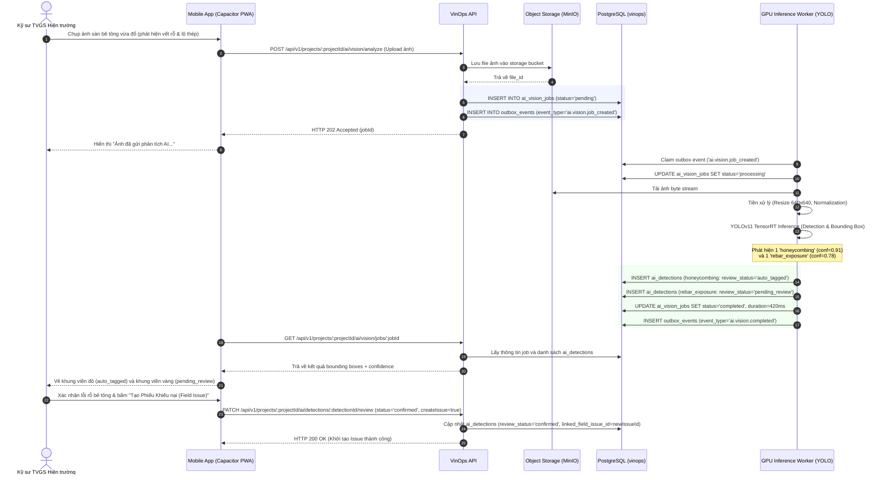
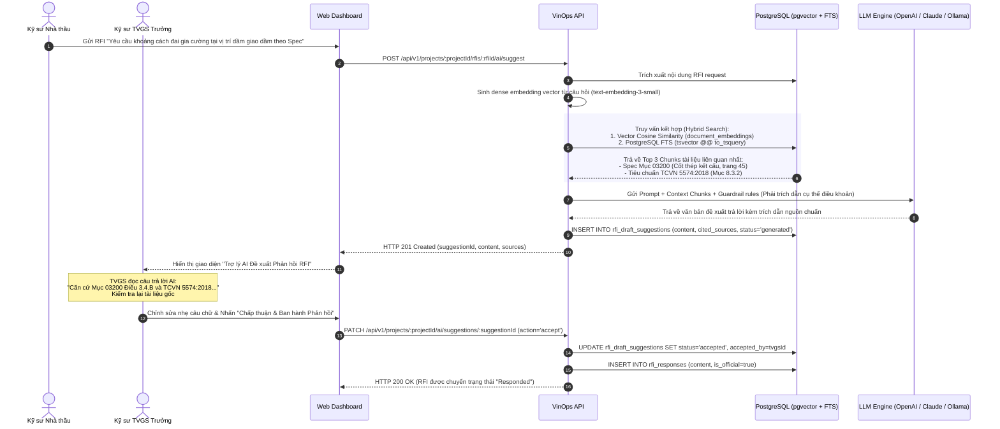

# ADR-014: AI & Computer Vision Giám sát Hiện trường & Trợ lý RFI Copilot

- Status: `PROPOSED`
- Effective date: 2026-09-07
- Decision owner: Principal Construction-Tech Enterprise Architect
- Scope: `apps/api`, `apps/worker`, `apps/web`, `packages/database`, `packages/domain`, `packages/contracts`

---

## 1. Context (Bối cảnh & Vấn đề Kỹ thuật)

Trên các đại công trường xây dựng dân dụng, công nghiệp và hạ tầng giao thông của VinOps, công tác kiểm soát chất lượng thi công (QA/QC) và an toàn lao động (HSE) hiện đối mặt với các nút thắt vận hành:

1. **Kiểm tra Hiện trường Thủ công (Manual Site Inspection) Chậm trễ và Cảm tính:**
   - Hoạt động nghiệm thu phụ thuộc hoàn toàn vào mắt thường và kinh nghiệm cá nhân của kỹ sư TVGS. Tại các dự án trải rộng hàng chục hecta, việc rà soát hàng ngàn mét vuông bề mặt bê tông, cốt thép sàn dầm, hệ thống cốp pha thường xuyên xảy ra thiếu sót.
   - Các khiếm khuyết vật lý phổ biến như: nứt kết cấu bê tông (cracks), rỗ tổ ong (honeycombing), mất lớp bê tông bảo vệ để lộ cốt thép (rebar exposure), sai lệch bước thép đai (rebar misalignment) hoặc rò rỉ ngấm nước (water damage) nếu không được phát hiện kịp thời trước giai đoạn đổ bê tông sẽ gây rủi ro an toàn kết cấu nghiêm trọng.

2. **Vi phạm An toàn Lao động (PPE Compliance Violations):**
   - Vi phạm quy định bảo hộ lao động cá nhân (không đội mũ bảo hộ cứng - hard hat, không mặc áo phản quang - safety vest, không cài dây an toàn trên cao - safety harness) diễn ra cục bộ khi vắng mặt cán bộ an toàn chuyên trách, tiềm ẩn nguy cơ tai nạn lao động chết người.

3. **Áp lực Xử lý Yêu cầu Làm rõ Thông tin (RFI Bottlenecks):**
   - Hồ sơ dự án bao gồm hàng chục ngàn trang tài liệu kỹ thuật (Chỉ dẫn kỹ thuật - Specs, Bản vẽ thiết kế kỹ thuật thi công - Shop Drawings, Tiêu chuẩn Việt Nam TCVN, Bảng khối lượng - BOQ).
   - Khi nhà thầu gửi Yêu cầu làm rõ thông tin (`rfi_requests`), kỹ sư tư vấn thiết kế và TVGS thường mất từ 2 đến 7 ngày tra cứu thủ công qua các tệp PDF phân tán để tìm đúng điều khoản đối chiếu, dẫn đến chậm tiến độ phê duyệt biện pháp thi công.

4. **Nguyên tắc "Con người Kiểm soát Quyết định" (Human-in-the-Loop Principle):**
   - Theo pháp lý xây dựng Việt Nam (Nghị định 207/2026/NĐ-CP và Thông tư 32/2026/TT-BXD), kết luận của thuật toán trí tuệ nhân tạo (AI) **không thể thay thế chữ ký pháp lý của Kỹ sư Tư vấn Giám sát**.
   - Mọi phát hiện từ Computer Vision hoặc dự thảo câu trả lời từ Mô hình Ngôn ngữ Lớn (LLM) bắt buộc phải đóng vai trò là "gợi ý/khuyến nghị" (Suggestions/Drafts) và chỉ trở thành hồ sơ pháp lý chính thức khi được kỹ sư có thẩm quyền thẩm định và phê duyệt (Human Verification & Acceptance).

---

## 2. Decision (Quyết định Kiến trúc)

Kiến trúc AI của VinOps được thiết kế theo mô hình **Module tích hợp phi tập trung (Decoupled AI Engine)** với 2 trụ cột chính:

### 2.1 Thị giác Máy tính Giám sát Khiếm khuyết & An toàn (Site Computer Vision Engine)

1. **Mô hình Thị giác chuyên dụng:**
   - Triển khai mô hình **YOLOv8 / YOLOv11 (You Only Look Once)** được fine-tune trên tập dữ liệu ảnh xây dựng hiện trường (VinOps Construction Defect & PPE Dataset với hơn 120.000 ảnh gán nhãn thực tế tại Việt Nam).
   - Nhận diện 9 phân lớp cốt lõi: `crack`, `honeycombing`, `rebar_exposure`, `rebar_misalignment`, `ppe_violation_hardhat`, `ppe_violation_vest`, `ppe_violation_harness`, `formwork_defect`, `water_damage`.
2. **Xử lý Hàng đợi Bất đồng bộ (Asynchronous Worker Inference):**
   - Không xử lý suy luận AI đồng bộ trên tiến trình API Web (`apps/api`).
   - Khi kỹ sư tải ảnh chụp hiện trường (từ `field_issues`, `inspections`, hoặc `daily_logs`), API ghi nhận bản ghi `vinops.ai_vision_jobs` và phát sự kiện outbox `ai.vision.job_created`. Container chuyên dụng GPU Worker trong `apps/worker` nhận diện và xử lý theo đợt (Batch Inference).
3. **Phân tầng Ngưỡng tin cậy (Confidence Score Threshold Policy):**
   - **Confidence $\ge 0.85$ (Auto-tag):** Tự động gán nhãn phát hiện, đánh dấu trạng thái `auto_tagged`, hiển thị Bounding Box nổi bật trên ảnh chụp để kỹ sư đối soát nhanh.
   - **Confidence $0.60 \le \text{Score} < 0.85$ (Review Pending):** Ghi nhận trạng thái `pending_review`. Cần kỹ sư xác nhận (Confirm) hoặc loại bỏ (Reject).
   - **Confidence $< 0.60$ (Discard):** Hủy bỏ kết quả nhận diện nhằm tránh gây nhiễu cho người dùng (False Positive Reduction).

### 2.2 Trợ lý Soạn thảo RFI Copilot (Retrieval-Augmented Generation - RAG Architecture)

1. **Tìm kiếm Kết hợp (Hybrid Search Retrieval):**
   - Toàn bộ hồ sơ chỉ dẫn kỹ thuật, tiêu chuẩn thi công và biên bản giao ban được băm nhỏ thành các đoạn văn bản (Text Chunks: 512 tokens, 64 overlap tokens).
   - Tìm kiếm kết hợp đa tầng:
     - **Tầng 1 - Từ khóa truyền thống (Full-Text Search):** Sử dụng PostgreSQL FTS `tsvector` + `websearch_to_tsquery('vietnamese_unaccent')` để bắt chính xác các mã điều khoản (ví dụ: "TCVN 5574:2018", "Mục 03300 - Bê tông đổ tại chỗ").
     - **Tầng 2 - Ngữ nghĩa vector (Vector Cosine Similarity):** Sử dụng extension **pgvector** (`vector(1536)`) lập chỉ mục HNSW/IVFFlat so khớp độ tương đồng ngữ nghĩa.
     - **Reciprocal Rank Fusion (RRF):** Hợp nhất kết quả từ 2 tầng tìm kiếm để xếp hạng tài liệu tham chiếu chuẩn xác nhất.
2. **Rào chắn Chống Ảo giác Nghiêm ngặt (Strict Hallucination Guardrails):**
   - Prompt Engineering áp dụng kỹ thuật RAG hạn chế tuyệt đối: Yêu cầu mô hình LLM chỉ trả lời dựa trên ngữ cảnh được cung cấp (Context Grounds).
   - Bắt buộc trích dẫn chi tiết: **Số điều khoản (Clause Number)**, **Tên tài liệu**, **Số hiệu bản vẽ (Drawing Number)** và **Mã mục dự toán (BOQ Item)**. Nếu tài liệu không đề cập, LLM buộc phải trả lời "Không tìm thấy căn cứ kỹ thuật trong hồ sơ dự án".
3. **Tầng Trừu tượng hóa Nhà cung cấp LLM (LLM Provider Abstraction Layer):**
   - Xây dựng Provider Interface chuẩn hóa: Hỗ trợ OpenAI GPT-4o, Anthropic Claude 3.5 Sonnet, và On-Premise Ollama / vLLM (chạy mô hình nguồn mở Llama-3-70B-Instruct hoặc Qwen-2.5-Coder) phục vụ các dự án quốc phòng/an ninh bảo mật cao.

---

## 3. PostgreSQL Database DDL (Migration 016_ai_vision_and_rfi_copilot.sql)

```sql
-- Migration: 016_ai_vision_and_rfi_copilot.sql
-- Description: AI Computer Vision Inference Queue, Bounding Box Detections, Vector Embeddings, and RFI Copilot Suggestions

-- Enable pgvector extension for dense semantic embeddings
CREATE EXTENSION IF NOT EXISTS vector;

-- 1. Table: vinops.ai_vision_jobs (Asynchronous Processing Queue)
CREATE TABLE vinops.ai_vision_jobs (
  id uuid PRIMARY KEY,
  organization_id uuid NOT NULL,
  project_id uuid NOT NULL,
  source_type text NOT NULL CHECK (source_type IN ('field_issue_attachment', 'inspection_evidence', 'daily_log_photo', 'standalone')),
  source_entity_id uuid,
  file_id uuid NOT NULL REFERENCES vinops.file_objects(id),
  status text NOT NULL DEFAULT 'pending' CHECK (status IN ('pending', 'processing', 'completed', 'failed')),
  model_name text NOT NULL DEFAULT 'yolov11-construction-v1',
  model_version text NOT NULL DEFAULT '1.2.0',
  processing_duration_ms integer CHECK (processing_duration_ms >= 0),
  error_message text,
  created_by uuid NOT NULL REFERENCES vinops.users(id),
  version bigint NOT NULL DEFAULT 1 CHECK (version > 0),
  created_at timestamptz NOT NULL DEFAULT now(),
  updated_at timestamptz NOT NULL DEFAULT now(),
  archived_at timestamptz,
  FOREIGN KEY (organization_id, project_id) REFERENCES vinops.projects (organization_id, id)
);

CREATE INDEX ai_vision_jobs_project_status_idx ON vinops.ai_vision_jobs (project_id, status);
CREATE INDEX ai_vision_jobs_source_idx ON vinops.ai_vision_jobs (source_type, source_entity_id);

-- 2. Table: vinops.ai_detections (Object Bounding Boxes & Defect Review Tracking)
CREATE TABLE vinops.ai_detections (
  id uuid PRIMARY KEY,
  organization_id uuid NOT NULL,
  project_id uuid NOT NULL,
  vision_job_id uuid NOT NULL REFERENCES vinops.ai_vision_jobs(id) ON DELETE CASCADE,
  detection_type text NOT NULL CHECK (detection_type IN (
    'crack', 'honeycombing', 'rebar_exposure', 'rebar_misalignment',
    'ppe_violation_hardhat', 'ppe_violation_vest', 'ppe_violation_harness',
    'formwork_defect', 'water_damage'
  )),
  confidence_score numeric(5, 4) NOT NULL CHECK (confidence_score BETWEEN 0.0000 AND 1.0000),
  bounding_box_x numeric(8, 4) NOT NULL CHECK (bounding_box_x >= 0),
  bounding_box_y numeric(8, 4) NOT NULL CHECK (bounding_box_y >= 0),
  bounding_box_w numeric(8, 4) NOT NULL CHECK (bounding_box_w > 0),
  bounding_box_h numeric(8, 4) NOT NULL CHECK (bounding_box_h > 0),
  review_status text NOT NULL DEFAULT 'pending_review' CHECK (review_status IN (
    'auto_tagged', 'pending_review', 'confirmed', 'rejected', 'false_positive'
  )),
  reviewed_by uuid REFERENCES vinops.users(id),
  reviewed_at timestamptz,
  linked_field_issue_id uuid REFERENCES vinops.field_issues(id),
  linked_inspection_finding_id uuid REFERENCES vinops.inspection_findings(id),
  metadata jsonb NOT NULL DEFAULT '{}'::jsonb,
  created_at timestamptz NOT NULL DEFAULT now(),
  FOREIGN KEY (organization_id, project_id) REFERENCES vinops.projects (organization_id, id)
);

CREATE INDEX ai_detections_job_idx ON vinops.ai_detections (vision_job_id);
CREATE INDEX ai_detections_review_status_idx ON vinops.ai_detections (project_id, review_status);
CREATE INDEX ai_detections_type_idx ON vinops.ai_detections (project_id, detection_type);

-- 3. Table: vinops.document_embeddings (CDE Specification Vector Knowledge Base)
CREATE TABLE vinops.document_embeddings (
  id uuid PRIMARY KEY,
  organization_id uuid NOT NULL,
  project_id uuid NOT NULL,
  document_id uuid NOT NULL REFERENCES vinops.documents(id) ON DELETE CASCADE,
  document_revision_id uuid NOT NULL REFERENCES vinops.document_revisions(id) ON DELETE CASCADE,
  chunk_index integer NOT NULL CHECK (chunk_index >= 0),
  chunk_text text NOT NULL,
  embedding vector(1536) NOT NULL,
  token_count integer NOT NULL CHECK (token_count > 0),
  metadata jsonb NOT NULL DEFAULT '{}'::jsonb,
  created_at timestamptz NOT NULL DEFAULT now(),
  FOREIGN KEY (organization_id, project_id) REFERENCES vinops.projects (organization_id, id),
  UNIQUE (document_revision_id, chunk_index),
  CHECK (length(trim(chunk_text)) > 0)
);

CREATE INDEX document_embeddings_doc_idx ON vinops.document_embeddings (document_id, document_revision_id);
-- HNSW index for high-speed approximate nearest neighbor vector search
CREATE INDEX document_embeddings_vector_hnsw_idx ON vinops.document_embeddings
  USING hnsw (embedding vector_cosine_ops)
  WITH (m = 16, ef_construction = 64);

-- 4. Table: vinops.rfi_draft_suggestions (AI-Assisted Technical Response Drafts)
CREATE TABLE vinops.rfi_draft_suggestions (
  id uuid PRIMARY KEY,
  organization_id uuid NOT NULL,
  project_id uuid NOT NULL,
  rfi_id uuid NOT NULL REFERENCES vinops.rfi_requests(id) ON DELETE CASCADE,
  suggestion_type text NOT NULL CHECK (suggestion_type IN ('answer_draft', 'clarification_draft')),
  content text NOT NULL,
  cited_sources jsonb NOT NULL DEFAULT '[]'::jsonb,
  llm_model text NOT NULL,
  llm_prompt_tokens integer NOT NULL DEFAULT 0,
  llm_completion_tokens integer NOT NULL DEFAULT 0,
  confidence_score numeric(5, 4) NOT NULL CHECK (confidence_score BETWEEN 0.0000 AND 1.0000),
  status text NOT NULL DEFAULT 'generated' CHECK (status IN ('generated', 'accepted', 'rejected', 'expired')),
  accepted_by uuid REFERENCES vinops.users(id),
  accepted_at timestamptz,
  created_at timestamptz NOT NULL DEFAULT now(),
  FOREIGN KEY (organization_id, project_id) REFERENCES vinops.projects (organization_id, id),
  CHECK (length(trim(content)) > 0)
);

CREATE INDEX rfi_draft_suggestions_rfi_idx ON vinops.rfi_draft_suggestions (rfi_id, status);

-- 5. AUDIT & SOFT DELETE PROTECTION TRIGGERS
DO $$
DECLARE
  tbl_name text;
BEGIN
  FOREACH tbl_name IN ARRAY ARRAY[
    'ai_vision_jobs', 'ai_detections', 'document_embeddings', 'rfi_draft_suggestions'
  ] LOOP
    EXECUTE format(
      'CREATE TRIGGER %I BEFORE DELETE ON vinops.%I FOR EACH ROW EXECUTE FUNCTION vinops.prevent_delete()',
      tbl_name || '_no_delete', tbl_name
    );
  END LOOP;
END;
$$;

-- Touch triggers
CREATE TRIGGER ai_vision_jobs_touch
  BEFORE UPDATE ON vinops.ai_vision_jobs
  FOR EACH ROW EXECUTE FUNCTION vinops.touch_updated_at();

-- Version triggers
CREATE TRIGGER ai_vision_jobs_version
  BEFORE UPDATE ON vinops.ai_vision_jobs
  FOR EACH ROW EXECUTE FUNCTION vinops.increment_version();

-- 6. ROW LEVEL SECURITY (RLS) POLICIES
ALTER TABLE vinops.ai_vision_jobs ENABLE ROW LEVEL SECURITY;
ALTER TABLE vinops.ai_detections ENABLE ROW LEVEL SECURITY;
ALTER TABLE vinops.document_embeddings ENABLE ROW LEVEL SECURITY;
ALTER TABLE vinops.rfi_draft_suggestions ENABLE ROW LEVEL SECURITY;

CREATE POLICY ai_vision_jobs_tenant_isolation ON vinops.ai_vision_jobs
  FOR ALL USING (vinops.can_access_project(project_id))
  WITH CHECK (vinops.can_access_project(project_id));

CREATE POLICY ai_detections_tenant_isolation ON vinops.ai_detections
  FOR ALL USING (vinops.can_access_project(project_id))
  WITH CHECK (vinops.can_access_project(project_id));

CREATE POLICY document_embeddings_tenant_isolation ON vinops.document_embeddings
  FOR ALL USING (vinops.can_access_project(project_id))
  WITH CHECK (vinops.can_access_project(project_id));

CREATE POLICY rfi_draft_suggestions_tenant_isolation ON vinops.rfi_draft_suggestions
  FOR ALL USING (vinops.can_access_project(project_id))
  WITH CHECK (vinops.can_access_project(project_id));

-- Grant runtime privileges
GRANT SELECT, INSERT, UPDATE, DELETE ON ALL TABLES IN SCHEMA vinops TO vinops_app;
GRANT SELECT, INSERT, UPDATE ON vinops.ai_vision_jobs, vinops.ai_detections, vinops.document_embeddings, vinops.rfi_draft_suggestions TO vinops_worker;
```

---

## 4. Sequence Diagrams (Quy trình Xử lý Nghiệp vụ)

### 4.1 Quy trình Giám sát Thị giác Máy tính (Photo Upload $\rightarrow$ Inference $\rightarrow$ TVGS Review)



---

### 4.2 Quy trình Trợ lý RFI Copilot (RFI Query $\rightarrow$ RAG Hybrid Search $\rightarrow$ LLM Suggestion $\rightarrow$ Approval)



---

## 5. API Contracts (Đặc tả Giao diện Lập trình RESTful)

### 5.1 POST `/api/v1/projects/:projectId/ai/vision/analyze`

- **Mô tả:** Gửi yêu cầu phân tích ảnh công trường tới hàng đợi thị giác máy tính.
- **Headers:** `Authorization: Bearer <token>`, `Content-Type: application/json`

**Request Body:**

```json
{
  "fileId": "a1b2c3d4-e5f6-7a8b-9c0d-1e2f3a4b5c6d",
  "sourceType": "field_issue_attachment",
  "sourceEntityId": "d3a5a3a2-2b62-47ef-8d69-5a1e7bfa5e90",
  "modelName": "yolov11-construction-v1"
}
```

**Response Example:** `HTTP 202 Accepted`

```json
{
  "success": true,
  "data": {
    "jobId": "f47ac10b-58cc-4372-a567-0e02b2c3d479",
    "projectId": "7c9e6679-7425-40de-944b-e07fc1f90ae7",
    "status": "pending",
    "estimatedWaitSeconds": 2,
    "createdAt": "2026-09-07T13:45:00.000Z"
  }
}
```

---

### 5.2 GET `/api/v1/projects/:projectId/ai/vision/jobs/:jobId`

- **Mô tả:** Truy vấn tiến độ công việc và danh sách các phát hiện khiếm khuyết / an toàn.

**Response Example:** `HTTP 200 OK`

```json
{
  "success": true,
  "data": {
    "jobId": "f47ac10b-58cc-4372-a567-0e02b2c3d479",
    "status": "completed",
    "modelName": "yolov11-construction-v1",
    "modelVersion": "1.2.0",
    "processingDurationMs": 420,
    "detections": [
      {
        "id": "e0b1c2d3-4e5f-6a7b-8c9d-0e1f2a3b4c5d",
        "detectionType": "honeycombing",
        "confidenceScore": 0.9125,
        "boundingBox": {
          "x": 0.354,
          "y": 0.421,
          "w": 0.185,
          "h": 0.22
        },
        "reviewStatus": "auto_tagged",
        "metadata": {
          "estimatedAreaCm2": 450.0,
          "severityGrade": "major"
        },
        "createdAt": "2026-09-07T13:45:01.000Z"
      },
      {
        "id": "c1d2e3f4-5a6b-7c8d-9e0f-1a2b3c4d5e6f",
        "detectionType": "rebar_exposure",
        "confidenceScore": 0.742,
        "boundingBox": {
          "x": 0.41,
          "y": 0.58,
          "w": 0.082,
          "h": 0.115
        },
        "reviewStatus": "pending_review",
        "metadata": {
          "barCountEstimate": 2
        },
        "createdAt": "2026-09-07T13:45:01.000Z"
      }
    ]
  }
}
```

---

### 5.3 PATCH `/api/v1/projects/:projectId/ai/detections/:detectionId/review`

- **Mô tả:** Kỹ sư TVGS thẩm định phát hiện (Xác nhận, Bác bỏ, Báo sai) và tùy chọn chuyển hóa thành Field Issue.

**Request Body:**

```json
{
  "reviewStatus": "confirmed",
  "createFieldIssue": true,
  "issueTitle": "Hiện tượng rỗ tổ ong chân cột trục C3 tầng 3",
  "severity": "major",
  "assignedPartnerId": "3fa85f64-5717-4562-b3fc-2c963f66afa6"
}
```

**Response Example:** `HTTP 200 OK`

```json
{
  "success": true,
  "data": {
    "detectionId": "e0b1c2d3-4e5f-6a7b-8c9d-0e1f2a3b4c5d",
    "reviewStatus": "confirmed",
    "reviewedBy": "Nguyễn Hoàng Nam (TVGS Kết cấu)",
    "reviewedAt": "2026-09-07T13:46:30.000Z",
    "linkedFieldIssueId": "9b1deb4d-3b7d-4bad-9bdd-2b0d7b3dcb6d",
    "fieldIssueCode": "ISS-2026-0158"
  }
}
```

---

### 5.4 POST `/api/v1/projects/:projectId/rfis/:rfiId/ai/suggest`

- **Mô tả:** Kích hoạt RAG Copilot nghiên cứu tài liệu kỹ thuật và soạn thảo văn bản phản hồi RFI.

**Request Body:**

```json
{
  "suggestionType": "answer_draft",
  "temperature": 0.2,
  "maxTokens": 1000
}
```

**Response Example:** `HTTP 201 Created`

```json
{
  "success": true,
  "data": {
    "suggestionId": "b8a9c0d1-e2f3-4a5b-6c7d-8e9f0a1b2c3d",
    "rfiId": "8f1a2b3c-4d5e-6f7a-8b9c-0d1e2f3a4b5c",
    "suggestionType": "answer_draft",
    "content": "Căn cứ theo Chỉ dẫn kỹ thuật dự án Mục 03200 (Cốt thép kết cấu) Điều 3.4.B và Tiêu chuẩn TCVN 5574:2018 (Điều 8.3.2 về cấu tạo cốt thép):\n\n1. Tại vùng giao nhau giữa dầm phụ và dầm chính, Nhà thầu phải bố trí tối thiểu 3 cốt đai gia cường bước dầy @50mm tại mỗi phía mép dầm.\n2. Đường kính thép đai gia cường phải tương đương cốt thép đai chịu lực chính của dầm (tối thiểu phi 10).\n3. Đề nghị Nhà thầu cập nhật lại chi tiết Shop Drawing số STR-DT-B402 trước khi nghiệm thu cốp thép.",
    "confidenceScore": 0.945,
    "citedSources": [
      {
        "documentCode": "SPEC-STR-03200",
        "documentTitle": "Chỉ dẫn kỹ thuật Thi công Bê tông & Cốt thép",
        "clause": "Mục 3.4.B, Trang 48",
        "similarityScore": 0.892
      },
      {
        "documentCode": "TCVN-5574-2018",
        "documentTitle": "Tiêu chuẩn Thiết kế Kết cấu Bê tông và Bê tông Cốt thép",
        "clause": "Điều 8.3.2",
        "similarityScore": 0.854
      }
    ],
    "llmModel": "claude-3-5-sonnet-20241022",
    "tokensUsed": {
      "prompt": 1420,
      "completion": 210
    },
    "status": "generated",
    "createdAt": "2026-09-07T13:48:00.000Z"
  }
}
```

---

### 5.5 GET `/api/v1/projects/:projectId/rfis/:rfiId/ai/suggestions`

- **Mô tả:** Lấy danh sách toàn bộ các đề xuất phản hồi của AI cho một RFI cụ thể.

**Response Example:** `HTTP 200 OK`

```json
{
  "success": true,
  "data": [
    {
      "id": "b8a9c0d1-e2f3-4a5b-6c7d-8e9f0a1b2c3d",
      "suggestionType": "answer_draft",
      "confidenceScore": 0.945,
      "status": "generated",
      "llmModel": "claude-3-5-sonnet-20241022",
      "createdAt": "2026-09-07T13:48:00.000Z"
    }
  ]
}
```

---

### 5.6 PATCH `/api/v1/projects/:projectId/ai/suggestions/:suggestionId`

- **Mô tả:** Thao tác Chấp thuận (Accept) hoặc Từ chối (Reject) bản dự thảo do AI tạo ra.

**Request Body:**

```json
{
  "status": "accepted",
  "finalContent": "Đồng ý với đề xuất của AI. Bổ sung: Nhà thầu cần đệ trình bản vẽ Shop điều chỉnh trước ngày 10/09/2026."
}
```

**Response Example:** `HTTP 200 OK`

```json
{
  "success": true,
  "data": {
    "suggestionId": "b8a9c0d1-e2f3-4a5b-6c7d-8e9f0a1b2c3d",
    "status": "accepted",
    "acceptedBy": "Phạm Quốc Tuấn (Chủ trì Kết cấu)",
    "acceptedAt": "2026-09-07T13:52:10.000Z"
  }
}
```

---

## 6. Alternatives Considered (So sánh và Đánh giá Giải pháp Thay thế)

### 6.1 Kiến trúc Suy luận Thị giác (Edge vs Cloud Inference)

| Tiêu chí                 | Chọn: Centralized GPU Worker (Cloud/Private Server)                                             | Thay thế: On-Device Edge AI (WebAssembly/WebGPU on iPad)                                               |
| :----------------------- | :---------------------------------------------------------------------------------------------- | :----------------------------------------------------------------------------------------------------- |
| **Độ chính xác mô hình** | **Rất cao:** Chạy mô hình YOLOv11x / FP16 đầy đủ trọng số, độ chuẩn xác mAP@50 đạt $>88\%$.     | Trung bình/Thấp: Phải nén lượng tử hóa INT8 (YOLO Nano), dễ bỏ sót vết nứt vi mô $<0.2\text{mm}$.      |
| **Tiêu hao năng lượng**  | Client chỉ upload ảnh nén, tiêu hao pin không đáng kể.                                          | Gây nóng máy, sụt pin nhanh trên máy tính bảng công trường khi thực hiện raycast/render kèm inference. |
| **Cập nhật Trọng số**    | Nâng cấp mô hình tức thời tại server worker, không yêu cầu người dùng cập nhật ứng dụng mobile. | Phải phân phối lại model blob hàng chục MB qua kết nối di động 4G hiện trường không ổn định.           |

### 6.2 Nền tảng Lưu trữ Vector (pgvector vs Chuyên dụng: Pinecone/Weaviate/Milvus)

| Tiêu chí                   | Chọn: PostgreSQL pgvector (Native)                                                                    | Thay thế: Pinecone / Milvus / Weaviate                                                    |
| :------------------------- | :---------------------------------------------------------------------------------------------------- | :---------------------------------------------------------------------------------------- |
| **Toàn vẹn Dữ liệu & RLS** | **Tuyệt đối:** Dữ liệu vector nằm cùng hàng, kế thừa hoàn toàn cơ chế Tenant RLS và ACID Transaction. | Phức tạp: Phải đồng bộ 2 chiều (dual-write), nguy cơ lệch dữ liệu giữa SQL và Vector DB.  |
| **Chi phí Vận hành**       | **0 đồng:** Sử dụng sẵn hạ tầng PostgreSQL hiện có của VinOps.                                        | Phát sinh chi phí bản quyền định kỳ hàng tháng theo số lượng vector và throughput.        |
| **Hiệu năng quy mô**       | Đạt $<25\text{ms}$ với chỉ mục HNSW cho tập dữ liệu dưới 1 triệu vector tài liệu dự án.               | Tối ưu tốt hơn cho hàng tỷ vector, nhưng vượt quá nhu cầu thực tế của một dự án xây dựng. |

### 6.3 Lựa chọn Mô hình Ngôn ngữ Lớn (OpenAI vs Anthropic Claude vs On-Premise Ollama)

- **Quyết định:** Sử dụng tầng trừu tượng `LlmProviderService`.
  - **Mặc định dự án thương mại thông thường:** Sử dụng **Claude 3.5 Sonnet** (vượt trội về khả năng hiểu ngữ cảnh văn bản kỹ thuật và lập luận logic không ảo giác).
  - **Dự án an ninh, quốc phòng hoặc dự án yêu cầu dữ liệu không ra khỏi mạng nội bộ:** Định tuyến sang **Ollama / vLLM (chạy Llama-3-70B-Instruct)** đặt tại Datacenter của chủ đầu tư.

---

## 7. Consequences & Safeguards (Hệ quả & Biện pháp Đảm bảo An toàn Kỹ thuật)

### 7.1 Yêu cầu Hạ tầng & Định cỡ GPU (GPU Resource Provisioning)

- **Yêu cầu:** Mỗi Worker node xử lý Vision cần tối thiểu 1 GPU NVIDIA RTX 4090 (24GB VRAM) hoặc NVIDIA A10G (24GB VRAM).
- **Biện pháp (Safeguards):**
  - Tích hợp TensorRT để tăng thông lượng suy luận (Inference throughput) lên 4x lần so với PyTorch mặc định.
  - Áp dụng kỹ thuật Batching: gom nhóm ảnh xử lý định kỳ mỗi 500ms để tối ưu tài nguyên tính toán GPU.

### 7.2 Quản lý Phiên bản Mô hình (Model Governance & Lineage)

- **Rủi ro:** Mô hình nâng cấp phiên bản mới có thể gây thay đổi hành vi nhận diện hoặc giảm độ chính xác trên một số dạng cấu kiện đặc thù.
- **Biện pháp (Safeguards):**
  - Bảng `vinops.ai_vision_jobs` lưu trữ rõ ràng `model_name` và `model_version`.
  - Giữ lại lịch sử phiên bản trọng số mô hình trên MinIO Storage. Triển khai cơ chế A/B Testing trước khi chuyển đổi trọng số chính thức cho toàn bộ dự án.

### 7.3 Bảo mật Dữ liệu & Chống Rò rỉ Thông tin (Data Privacy & Compliance)

- **Rủi ro:** Ảnh chụp hiện trường có thể chứa hình ảnh khuôn mặt người lao động, biển số xe cơ giới hoặc tài liệu mật dự án.
- **Biện pháp (Safeguards):**
  - Áp dụng thuật toán làm mờ mặt người tự động (Face Blurring) trước khi lưu trữ hoặc gửi ảnh qua các API ngoài.
  - Khi gửi dữ liệu cho các nhà cung cấp LLM đám mây (OpenAI / Anthropic), bắt buộc bật tùy chọn **Zero Data Retention (ZDR)** theo thỏa thuận dịch vụ doanh nghiệp, ngăn chặn việc sử dụng dữ liệu dự án VinOps để huấn luyện mô hình công cộng.

### 7.4 Kiểm soát Ảo giác RFI (Hallucination Prevention Guardrail)

- **Rủi ro:** Mô hình LLM tự biên soạn một tiêu chuẩn kỹ thuật không tồn tại, khiến TVGS ra quyết định nghiệm thu sai lầm dẫn đến sập đổ công trình.
- **Biện pháp (Safeguards):**
  - **Grounding Ratio Check:** Bắt buộc độ tương đồng giữa nội dung trích dẫn và tài liệu nguồn phải đạt trên $85\%$.
  - **Strict Citation Format:** Mọi khẳng định kỹ thuật đều phải kèm đường dẫn `documentId` hợp lệ trong cơ sở dữ liệu.
  - **Chữ ký xác nhận:** Hệ thống từ chối cho phép ban hành câu trả lời RFI nếu chưa có thao tác bấm duyệt (Manual Acceptance) từ tài khoản kỹ sư có vai trò `Chief_Supervisor` hoặc `Lead_Design_Engineer`.
