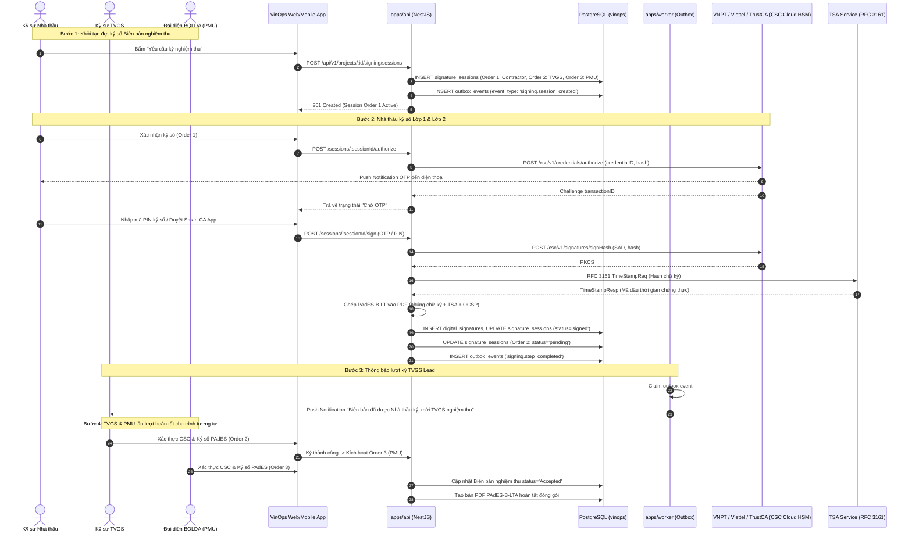
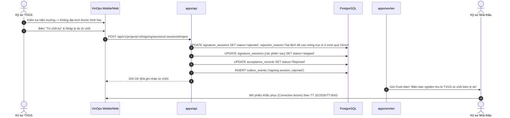
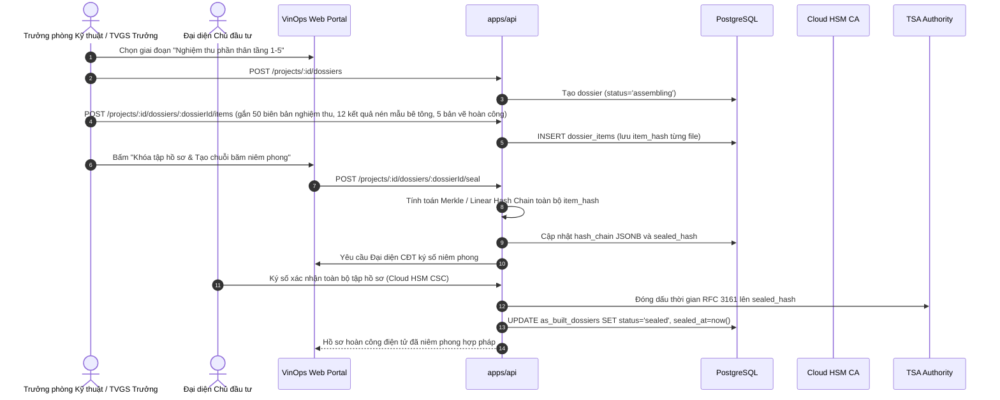
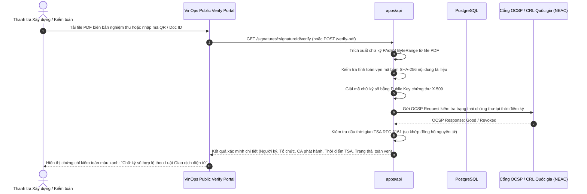

# ADR-015: Chữ ký số Pháp lý PKI / Remote Signing & TSA Timestamp

- Status: `PROPOSED`
- Effective date: 2026-09-07
- Decision owner: Principal Construction-Tech Enterprise Architect & Lead Security Engineer
- Scope: `apps/api`, `apps/worker`, `packages/database`, `packages/domain`, `packages/contracts`, `apps/web`
- Checkpoint: `VIN-MEGA-004`
- Migration reference: `packages/database/migrations/017_legal_pki_remote_signing.sql`

---

## 1. Context (Bối cảnh Pháp lý & Nghiệp vụ Xây dựng)

### 1.1 Khung pháp lý Việt Nam về Quản lý Chất lượng Công trình & Giao dịch Điện tử

Ngành xây dựng Việt Nam chuyển dịch số hóa toàn diện hồ sơ chất lượng công trình theo các văn bản quy phạm pháp luật trọng yếu:

1. **Luật Giao dịch điện tử số 20/2023/QH15** (hiệu lực từ ngày 01/07/2024): Quy định giá trị pháp lý tương đương văn bản giấy của thông điệp dữ liệu, chữ ký điện tử an toàn, chữ ký số chuyên dùng và dịch vụ tin cậy (dấu thời gian - TSA, dịch vụ chứng thực chữ ký số). Chữ ký số tạo bởi chứng thư chữ ký số công cộng được công nhận giá trị pháp lý đầy đủ và có tính chống chối bỏ (non-repudiation) trước tòa án và cơ quan thanh tra nhà nước.
2. **Nghị định 207/2026/NĐ-CP** (sửa đổi, bổ sung quy định về quản lý chất lượng, thi công xây dựng và bảo trì công trình xây dựng): Bắt buộc lưu trữ điện tử đối với hồ sơ quản lý chất lượng, nhật ký thi công xây dựng công trình, biên bản nghiệm thu công việc, giai đoạn và hoàn thành bàn giao.
3. **Thông tư 32/2026/TT-BXD** của Bộ Xây dựng: Quy định chi tiết định dạng, quy trình lập, ký duyệt, bàn giao nhật ký thi công điện tử và biên bản nghiệm thu điện tử. Quy định rõ ràng:
   - Các bên ký phải sử dụng chữ ký số cá nhân gắn liền thẩm quyền pháp lý của tổ chức tham gia hoạt động xây dựng (Nhà thầu thi công, Tư vấn giám sát, Ban quản lý dự án/Chủ đầu tư).
   - Hồ sơ hoàn công điện tử (As-Built Dossier) phải được đóng gói toàn vẹn, có dấu thời gian (TSA - Time-Stamping Authority) từ đơn vị cung cấp dịch vụ tin cậy được Bộ Thông tin & Truyền thông / Bộ KH&CN cấp phép, đảm bảo bất biến và có thể kiểm tra trực tuyến sau 10 - 50 năm lưu trữ công trình.

### 1.2 Yêu cầu nghiệp vụ VinOps

Hệ thống VinOps đang quản lý hàng triệu lượt tương tác hiện trường. Để hợp thức hóa pháp lý tài liệu kỹ thuật số, VinOps đòi hỏi:

- **Ký số đa bên tuần tự (Sequential Multi-party Signing):** Luồng nghiệm thu công việc hiện trường bắt buộc ký theo thứ tự nghiêm ngặt:
  1. _Kỹ sư Nhà thầu thi công (Contractor Representative)_: Xác nhận công tác thi công đạt chất lượng, ký lập biên bản nghiệm thu.
  2. _Tư vấn giám sát trưởng / Kỹ sư giám sát (TVGS Lead)_: Kiểm tra kích thước hình học, vật liệu, phiếu thí nghiệm, ký xác nhận nghiệm thu.
  3. _Chủ đầu tư / Ban quản lý dự án (PMU / Project Management Unit)_: Ký chấp thuận nghiệm thu chính thức để mở khối lượng thanh toán.
  - Nếu bất kỳ bên nào từ chối (Reject), luồng ký dừng lập tức, yêu cầu giải trình lý do và tạo chu trình khắc phục.
- **Tính khả thi ngoài công trường (Field Usability):** Kỹ sư hiện trường không thể mang laptop cắm USB Token để ký ngoài công trường đầy bụi bặm và nguy hiểm. Giải pháp bắt buộc là **Cloud HSM / Remote Signing** (ký số từ xa trên thiết bị di động thông qua ứng dụng PWA/Capacitor của VinOps kết hợp xác thực sinh trắc học hoặc thông báo đẩy Push Notification/OTP từ nhà cung cấp dịch vụ chứng thực chữ ký số công cộng).
- **Tính toàn vẹn & niêm phong hồ sơ hoàn thành công trình (As-Built Dossier Sealing):** Hồ sơ hoàn công bao gồm hàng nghìn biên bản nghiệm thu, nhật ký ngày, kết quả thí nghiệm, bản vẽ hoàn công và ảnh bằng chứng. Phải cung cấp giải pháp xâu chuỗi băm (Hash Chain) dạng Merkle Tree / cryptographic ledger và đóng dấu thời gian TSA niêm phong toàn bộ hồ sơ giai đoạn và bàn giao.
- **Khả năng xác minh pháp lý độc lập (Independent Verification):** Thanh tra xây dựng, kiểm toán độc lập và cơ quan chức năng có thể kiểm tra tính hợp lệ của tài liệu PDF có chữ ký PAdES offline (thông qua Adobe Acrobat / Foxit Reader nhờ cơ chế LTA nhúng sẵn OCSP/CRL/TSA) hoặc trực tuyến qua API verification công khai của VinOps.

---

## 2. Decision (Quyết định Kiến trúc)

### 2.1 Kiến trúc Ký số Từ xa Cloud HSM theo Tiêu chuẩn CSC (Cloud Signature Consortium)

VinOps không lưu trữ khóa bí mật (Private Key) của người dùng trên máy chủ ứng dụng. Thay vào đó, VinOps áp dụng kiến trúc **Remote Signing Client** chuẩn hóa theo đặc tả kỹ thuật **CSC v1.0.4.0 / PKCS#11**:

1. Tài liệu PDF biên bản nghiệm thu hoặc nhật ký thi công được tạo trên máy chủ VinOps (`apps/api`).
2. VinOps tính mã băm (Hash Digest) chuẩn `SHA-256` của vùng dữ liệu tài liệu PDF cần ký (Byte Range Hash).
3. VinOps gửi chuỗi băm kèm yêu cầu cấp quyền ký (Authorization) tới máy chủ ký số Cloud HSM của Nhà cung cấp dịch vụ chứng thực chữ ký số (CA Provider).
4. Nhà cung cấp CA gửi thông báo xác thực (Push OTP / Sinh trắc học qua Smart App của CA) trực tiếp đến điện thoại của người ký.
5. Người ký xác nhận trên thiết bị cá nhân -> CA thực hiện ký số bằng Private Key lưu trong phân vùng HSM chuyên dụng đạt chuẩn FIPS 140-2 Level 3 / EAL 4+.
6. CA trả về chữ ký số chuẩn `CAdES/CMS` dạng Base64.
7. VinOps nhúng chữ ký số, chứng thư X.509, phản hồi kiểm tra thu hồi (OCSP) và mã dấu thời gian (TSA Token) vào cấu trúc từ điển PDF (`/ByteRange`, `/Contents`).

### 2.2 Tích hợp Các Nhà Cung Cấp Chứng Thực Chữ Ký Số Việt Nam (Vietnamese CA Providers)

Hệ thống cung cấp tầng trừu tượng `SigningProviderService` tích hợp các đơn vị CA phổ biến tại Việt Nam hỗ trợ chuẩn CSC:

- **VNPT SmartCA** (Tập đoàn VNPT)
- **Viettel Cloud CA** (Tập đoàn Viettel)
- **TrustCA** (Công ty Cổ phần Thương mại Kỹ thuật SAVIS)

Mỗi dự án (`vinops.projects`) hoặc từng nhà thầu thành viên (`vinops.partner_organizations`) được cấu hình nhà cung cấp CA tương thích hoặc dùng định tuyến tập trung do Ban Quản lý Dự án chỉ định.

### 2.3 Cơ chế Xác thực 2 Lớp (2-Layer Authorization Protocol)

- **Lớp 1 (VinOps Session Auth):** Kỹ sư đăng nhập VinOps qua JWT Bearer Token, được cấp quyền truy cập theo vai trò dự án (`project_members.roles`). Khi kích hoạt phiên ký, hệ thống kiểm tra người ký có đúng thẩm quyền và đúng lượt ký tuần tự trong chuỗi (ví dụ: TVGS chỉ được ký khi Nhà thầu đã ký thành công).
- **Lớp 2 (CA Remote Signing Authorization):** VinOps gọi CSC `/credentials/authorize` với định danh chứng thư của người dùng. Nhà cung cấp CA sinh phiên giao dịch xác thực, gửi Push Notification hoặc SMS/App OTP đến điện thoại đã đăng ký của kỹ sư. Kỹ sư xác thực bằng mã PIN ký số + sinh trắc học trên ứng dụng của CA. Mã phiên ủy quyền (`sad` - Signature Activation Data) được gửi trả VinOps để ra lệnh ký trên HSM.

### 2.4 Tiêu chuẩn Ký PDF PAdES-B-LT / LTA (PDF Advanced Electronic Signatures)

Tài liệu nghiệm thu xây dựng phải có giá trị lưu trữ và đối soát từ 10 đến 50 năm theo vòng đời công trình. Do đó, VinOps áp dụng định dạng chữ ký **PAdES** (ETSI EN 319 142) cấp độ cao nhất:

- **PAdES-B-B:** Chữ ký cơ bản kèm chứng thư số người ký.
- **PAdES-B-T:** Bổ sung dấu thời gian TSA RFC 3161 nhúng trong chữ ký, chứng minh chữ ký tồn tại trước thời điểm thu hồi chứng thư.
- **PAdES-B-LT (Long-Term):** Bổ sung thông tin xác thực đầy đủ (DSS - Document Security Store) gồm chuỗi chứng thư CA gốc (Root CA, Intermediate CA), chứng thực trạng thái thu hồi OCSP response hoặc CRL snapshot tại thời điểm ký. Cho phép người đọc kiểm tra hợp lệ ngay cả khi CA ngừng hoạt động trong tương lai.
- **PAdES-B-LTA (Long-Term with Archive Time-stamp):** Áp dụng dấu thời gian lưu trữ định kỳ lên toàn bộ file PDF hoàn tất, bảo vệ tài liệu trước nguy cơ bẻ khóa thuật toán mật mã trong tương lai.

### 2.5 Dấu thời gian Tin cậy TSA (RFC 3161 Timestamping)

Tất cả các phiên ký số và gói niêm phong hồ sơ hoàn công đều gửi yêu cầu dấu thời gian (`Time-Stamp Protocol - TSP`) theo chuẩn RFC 3161 đến TSA Server của nhà cung cấp tin cậy được Bộ TTTT cấp phép (VNPT TSA, Viettel TSA, TrustCA TSA). Dấu thời gian chứa thời gian thực chuẩn quốc gia UTC+7 lấy từ đồng hồ nguyên tử, ngăn chặn hoàn toàn rủi ro can thiệp chỉnh sửa đồng hồ máy chủ ứng dụng để ký lùi ngày nghiệm thu.

### 2.6 Niêm phong Hồ sơ Hoàn công bằng Chuỗi Băm (As-Built Dossier Cryptographic Sealing)

Một hồ sơ hoàn thành giai đoạn / công trình (`vinops.as_built_dossiers`) quản lý danh sách các biên bản (`vinops.dossier_items`). Để ngăn ngừa việc bổ sung, tráo đổi hoặc xóa tài liệu sau khi nghiệm thu, VinOps thiết lập **Cryptographic Hash Chain**:
$$\text{Hash}_0 = \text{SHA256}(\text{dossier\_metadata})$$
$$\text{Hash}_i = \text{SHA256}(\text{Hash}_{i-1} \parallel \text{item\_id}_i \parallel \text{item\_hash}_i \parallel \text{sequence}_i)$$
Toàn bộ `hash_chain` được lưu dưới dạng JSONB. Sau khi duyệt hoàn tất, chuỗi băm tổng hợp cuối cùng (`sealed_hash`) được niêm phong bằng chữ ký số của Đại diện Chủ đầu tư kèm TSA timestamp độc lập, tạo thành một cuốn tài liệu hoàn công số hóa bất biến (Tamper-evident Digital Dossier).

---

## 3. Database Schema & Migration Specification

Mã nguồn migration: `packages/database/migrations/017_legal_pki_remote_signing.sql`. Tuân thủ tuyệt đối quy ước cơ sở dữ liệu VinOps: schema `vinops`, khóa ngoại tenant `(organization_id, project_id) REFERENCES vinops.projects (organization_id, id)`, khóa chính UUID do ứng dụng sinh, kiểm tra phiên bản lạc quan `version`, kích hoạt RLS bằng `vinops.can_access_project(project_id)`, và gắn bộ trigger `touch_updated_at()`, `increment_version()`, `prevent_delete()`.

```sql
-- ============================================================================
-- Migration: 017_legal_pki_remote_signing.sql
-- Description: Legal PKI Remote Signing (ND 207/2026, TT 32/2026, Luat GDDT 2023),
--              CSC Cloud HSM Integration, PAdES-LTA Signatures, TSA RFC 3161,
--              and As-Built Dossier Sealing Hash Chain.
-- ============================================================================

-- 1. CA Provider Configurations per Project
CREATE TABLE vinops.signing_provider_configs (
  id uuid PRIMARY KEY,
  organization_id uuid NOT NULL,
  project_id uuid NOT NULL,
  provider_code text NOT NULL CHECK (provider_code IN ('vnpt_smartca', 'viettel_cloud_ca', 'trust_ca')),
  display_name text NOT NULL,
  api_base_url text NOT NULL,
  csc_api_version text NOT NULL DEFAULT 'v1',
  client_id_encrypted text,
  client_secret_encrypted text,
  tsa_url text NOT NULL,
  tsa_auth_type text NOT NULL DEFAULT 'none' CHECK (tsa_auth_type IN ('none', 'basic', 'bearer')),
  tsa_credentials_encrypted text,
  status text NOT NULL DEFAULT 'active' CHECK (status IN ('active', 'inactive', 'maintenance')),
  is_default boolean NOT NULL DEFAULT false,
  created_by uuid NOT NULL REFERENCES vinops.users(id),
  version bigint NOT NULL DEFAULT 1 CHECK (version > 0),
  created_at timestamptz NOT NULL DEFAULT now(),
  updated_at timestamptz NOT NULL DEFAULT now(),
  archived_at timestamptz,
  FOREIGN KEY (organization_id, project_id) REFERENCES vinops.projects (organization_id, id),
  UNIQUE (project_id, provider_code),
  CHECK (length(trim(display_name)) BETWEEN 2 AND 200),
  CHECK (length(trim(api_base_url)) BETWEEN 8 AND 500),
  CHECK (length(trim(tsa_url)) BETWEEN 8 AND 500)
);

CREATE INDEX idx_signing_provider_configs_proj ON vinops.signing_provider_configs (project_id, status) WHERE archived_at IS NULL;

-- 2. User Signing Credentials Binding (Certificate mapping in Remote CA)
CREATE TABLE vinops.user_signing_credentials (
  id uuid PRIMARY KEY,
  organization_id uuid NOT NULL,
  project_id uuid NOT NULL,
  user_id uuid NOT NULL REFERENCES vinops.users(id),
  provider_config_id uuid NOT NULL REFERENCES vinops.signing_provider_configs(id),
  credential_id_encrypted text NOT NULL,
  certificate_serial text NOT NULL,
  certificate_subject_dn text NOT NULL,
  certificate_issuer_dn text NOT NULL,
  certificate_not_before timestamptz NOT NULL,
  certificate_not_after timestamptz NOT NULL,
  status text NOT NULL DEFAULT 'active' CHECK (status IN ('active', 'expired', 'revoked', 'suspended')),
  last_used_at timestamptz,
  created_at timestamptz NOT NULL DEFAULT now(),
  updated_at timestamptz NOT NULL DEFAULT now(),
  FOREIGN KEY (organization_id, project_id) REFERENCES vinops.projects (organization_id, id),
  UNIQUE (project_id, user_id, provider_config_id),
  CHECK (length(trim(certificate_serial)) BETWEEN 4 AND 128),
  CHECK (certificate_not_after > certificate_not_before)
);

CREATE INDEX idx_user_signing_credentials_user ON vinops.user_signing_credentials (project_id, user_id, status);

-- 3. Signature Sessions (Sequential multi-party signing workflow tracker)
CREATE TABLE vinops.signature_sessions (
  id uuid PRIMARY KEY,
  organization_id uuid NOT NULL,
  project_id uuid NOT NULL,
  signable_type text NOT NULL CHECK (signable_type IN ('acceptance_record', 'daily_log', 'as_built_dossier', 'document_transmittal')),
  signable_id uuid NOT NULL,
  signing_order integer NOT NULL CHECK (signing_order >= 1),
  required_signer_role text NOT NULL CHECK (required_signer_role IN ('contractor_rep', 'tvgs_lead', 'pmu_manager')),
  required_signer_user_id uuid NOT NULL REFERENCES vinops.users(id),
  status text NOT NULL DEFAULT 'pending' CHECK (status IN ('pending', 'otp_sent', 'signed', 'rejected', 'expired', 'skipped')),
  provider_config_id uuid REFERENCES vinops.signing_provider_configs(id),
  hash_algorithm text NOT NULL DEFAULT 'SHA-256' CHECK (hash_algorithm IN ('SHA-256', 'SHA-384', 'SHA-512')),
  document_hash char(64) NOT NULL,
  csc_transaction_id text,
  signed_hash text,
  signature_value text,
  tsa_token text,
  tsa_timestamp timestamptz,
  rejection_reason text,
  signed_at timestamptz,
  expires_at timestamptz NOT NULL,
  created_at timestamptz NOT NULL DEFAULT now(),
  updated_at timestamptz NOT NULL DEFAULT now(),
  FOREIGN KEY (organization_id, project_id) REFERENCES vinops.projects (organization_id, id),
  UNIQUE (project_id, signable_type, signable_id, signing_order),
  CHECK (expires_at > created_at)
);

CREATE INDEX idx_signature_sessions_signable ON vinops.signature_sessions (project_id, signable_type, signable_id, signing_order);
CREATE INDEX idx_signature_sessions_signer ON vinops.signature_sessions (required_signer_user_id, status);

-- 4. Completed Digital Signatures Archive
CREATE TABLE vinops.digital_signatures (
  id uuid PRIMARY KEY,
  organization_id uuid NOT NULL,
  project_id uuid NOT NULL,
  session_id uuid NOT NULL REFERENCES vinops.signature_sessions(id),
  signer_user_id uuid NOT NULL REFERENCES vinops.users(id),
  certificate_serial text NOT NULL,
  signature_algorithm text NOT NULL DEFAULT 'RSA-SHA256',
  signature_value_b64 text NOT NULL,
  signed_document_file_id uuid NOT NULL REFERENCES vinops.file_objects(id),
  pades_level text NOT NULL DEFAULT 'B-LT' CHECK (pades_level IN ('B-B', 'B-T', 'B-LT', 'B-LTA')),
  tsa_response_b64 text,
  tsa_timestamp timestamptz,
  ocsp_response_b64 text,
  crl_snapshot_b64 text,
  verification_status text NOT NULL DEFAULT 'valid' CHECK (verification_status IN ('valid', 'invalid', 'indeterminate')),
  verified_at timestamptz NOT NULL DEFAULT now(),
  created_at timestamptz NOT NULL DEFAULT now(),
  FOREIGN KEY (organization_id, project_id) REFERENCES vinops.projects (organization_id, id),
  UNIQUE (session_id)
);

CREATE INDEX idx_digital_signatures_signer ON vinops.digital_signatures (project_id, signer_user_id, verified_at);
CREATE INDEX idx_digital_signatures_file ON vinops.digital_signatures (signed_document_file_id);

-- 5. As-Built Dossiers (Electronic Dossier Sealing & Package Handover)
CREATE TABLE vinops.as_built_dossiers (
  id uuid PRIMARY KEY,
  organization_id uuid NOT NULL,
  project_id uuid NOT NULL,
  code text NOT NULL,
  name text NOT NULL,
  dossier_type text NOT NULL CHECK (dossier_type IN ('work_acceptance', 'stage_acceptance', 'completion_package', 'handover_package')),
  status text NOT NULL DEFAULT 'assembling' CHECK (status IN ('assembling', 'ready_for_signing', 'partially_signed', 'fully_signed', 'sealed', 'archived')),
  hash_chain jsonb NOT NULL DEFAULT '[]'::jsonb,
  sealed_document_file_id uuid REFERENCES vinops.file_objects(id),
  sealed_hash char(64),
  sealed_at timestamptz,
  created_by uuid NOT NULL REFERENCES vinops.users(id),
  version bigint NOT NULL DEFAULT 1 CHECK (version > 0),
  created_at timestamptz NOT NULL DEFAULT now(),
  updated_at timestamptz NOT NULL DEFAULT now(),
  archived_at timestamptz,
  FOREIGN KEY (organization_id, project_id) REFERENCES vinops.projects (organization_id, id),
  UNIQUE (project_id, code),
  CHECK (length(trim(code)) BETWEEN 1 AND 120),
  CHECK (length(trim(name)) BETWEEN 1 AND 300)
);

CREATE INDEX idx_as_built_dossiers_status ON vinops.as_built_dossiers (project_id, status) WHERE archived_at IS NULL;

-- 6. Dossier Items (Items included in As-Built Dossier)
CREATE TABLE vinops.dossier_items (
  id uuid PRIMARY KEY,
  organization_id uuid NOT NULL,
  project_id uuid NOT NULL,
  dossier_id uuid NOT NULL REFERENCES vinops.as_built_dossiers(id) ON DELETE CASCADE,
  item_type text NOT NULL CHECK (item_type IN ('acceptance_record', 'inspection', 'daily_log', 'test_report', 'material_certificate', 'drawing', 'photo_evidence')),
  item_entity_id uuid NOT NULL,
  item_file_id uuid NOT NULL REFERENCES vinops.file_objects(id),
  item_hash char(64) NOT NULL,
  sequence integer NOT NULL CHECK (sequence >= 1),
  included_at timestamptz NOT NULL DEFAULT now(),
  FOREIGN KEY (organization_id, project_id) REFERENCES vinops.projects (organization_id, id),
  UNIQUE (dossier_id, item_type, item_entity_id),
  UNIQUE (dossier_id, sequence)
);

CREATE INDEX idx_dossier_items_lookup ON vinops.dossier_items (dossier_id, sequence);

-- ============================================================================
-- Triggers: touch_updated_at, increment_version, prevent_delete
-- ============================================================================
CREATE TRIGGER trg_signing_provider_configs_touch BEFORE UPDATE ON vinops.signing_provider_configs FOR EACH ROW EXECUTE FUNCTION vinops.touch_updated_at();
CREATE TRIGGER trg_signing_provider_configs_version BEFORE UPDATE ON vinops.signing_provider_configs FOR EACH ROW EXECUTE FUNCTION vinops.increment_version();
CREATE TRIGGER trg_signing_provider_configs_no_delete BEFORE DELETE ON vinops.signing_provider_configs FOR EACH ROW EXECUTE FUNCTION vinops.prevent_delete();

CREATE TRIGGER trg_user_signing_credentials_touch BEFORE UPDATE ON vinops.user_signing_credentials FOR EACH ROW EXECUTE FUNCTION vinops.touch_updated_at();
CREATE TRIGGER trg_user_signing_credentials_no_delete BEFORE DELETE ON vinops.user_signing_credentials FOR EACH ROW EXECUTE FUNCTION vinops.prevent_delete();

CREATE TRIGGER trg_signature_sessions_touch BEFORE UPDATE ON vinops.signature_sessions FOR EACH ROW EXECUTE FUNCTION vinops.touch_updated_at();
CREATE TRIGGER trg_signature_sessions_no_delete BEFORE DELETE ON vinops.signature_sessions FOR EACH ROW EXECUTE FUNCTION vinops.prevent_delete();

CREATE TRIGGER trg_digital_signatures_no_delete BEFORE DELETE ON vinops.digital_signatures FOR EACH ROW EXECUTE FUNCTION vinops.prevent_delete();

CREATE TRIGGER trg_as_built_dossiers_touch BEFORE UPDATE ON vinops.as_built_dossiers FOR EACH ROW EXECUTE FUNCTION vinops.touch_updated_at();
CREATE TRIGGER trg_as_built_dossiers_version BEFORE UPDATE ON vinops.as_built_dossiers FOR EACH ROW EXECUTE FUNCTION vinops.increment_version();
CREATE TRIGGER trg_as_built_dossiers_no_delete BEFORE DELETE ON vinops.as_built_dossiers FOR EACH ROW EXECUTE FUNCTION vinops.prevent_delete();

-- Note: vinops.dossier_items allows CASCADE delete only when dossier is in 'assembling' state.

-- ============================================================================
-- Row Level Security (RLS) Configuration
-- ============================================================================
DO $$
DECLARE
  tbl text;
BEGIN
  FOR tbl IN SELECT unnest(ARRAY[
    'signing_provider_configs',
    'user_signing_credentials',
    'signature_sessions',
    'digital_signatures',
    'as_built_dossiers',
    'dossier_items'
  ]) LOOP
    EXECUTE format('ALTER TABLE vinops.%I ENABLE ROW LEVEL SECURITY', tbl);
  END LOOP;
END;
$$;

CREATE POLICY signing_provider_configs_tenant ON vinops.signing_provider_configs
  USING (vinops.can_access_project(project_id))
  WITH CHECK (vinops.can_access_project(project_id));

CREATE POLICY user_signing_credentials_tenant ON vinops.user_signing_credentials
  USING (vinops.can_access_project(project_id) AND (user_id = vinops.current_actor_id() OR vinops.is_system_admin()))
  WITH CHECK (vinops.can_access_project(project_id));

CREATE POLICY signature_sessions_tenant ON vinops.signature_sessions
  USING (vinops.can_access_project(project_id))
  WITH CHECK (vinops.can_access_project(project_id));

CREATE POLICY digital_signatures_tenant ON vinops.digital_signatures
  USING (vinops.can_access_project(project_id))
  WITH CHECK (vinops.can_access_project(project_id));

CREATE POLICY as_built_dossiers_tenant ON vinops.as_built_dossiers
  USING (vinops.can_access_project(project_id))
  WITH CHECK (vinops.can_access_project(project_id));

CREATE POLICY dossier_items_tenant ON vinops.dossier_items
  USING (vinops.can_access_project(project_id))
  WITH CHECK (vinops.can_access_project(project_id));

-- Role Grants
GRANT SELECT, INSERT, UPDATE ON vinops.signing_provider_configs TO vinops_app;
GRANT SELECT, INSERT, UPDATE ON vinops.user_signing_credentials TO vinops_app;
GRANT SELECT, INSERT, UPDATE ON vinops.signature_sessions TO vinops_app;
GRANT SELECT, INSERT ON vinops.digital_signatures TO vinops_app;
GRANT SELECT, INSERT, UPDATE ON vinops.as_built_dossiers TO vinops_app;
GRANT SELECT, INSERT, UPDATE, DELETE ON vinops.dossier_items TO vinops_app;

GRANT SELECT ON vinops.signature_sessions, vinops.digital_signatures, vinops.signing_provider_configs TO vinops_worker;
GRANT UPDATE ON vinops.signature_sessions TO vinops_worker;
```

---

## 4. Signing Flow Sequence Diagrams

### 4.1 Quy trình Ký số Tuần tự Đa bên (Sequential Signing Workflow)

Chuỗi ký: **Contractor Rep -> TVGS Lead -> PMU Manager**. Chỉ khi bên trước ký thành công, phiên ký của bên kế tiếp mới được kích hoạt sang trạng thái `pending`.



### 4.2 Quy trình Từ chối Ký số (Rejection & Remediation Workflow)



### 4.3 Quy trình Tập hợp & Niêm phong Hồ sơ Hoàn công (As-Built Dossier Sealing)



### 4.4 Quy trình Xác minh Chữ ký số Cho Kiểm toán & Cơ quan Quản lý Nhà nước



---

## 5. REST API Contracts & Realistic Domain Payload Examples

### 5.1 Khởi tạo Phiên Ký số Nghiệm thu

`POST /api/v1/projects/:projectId/signing/sessions`

**Request Payload:**

```json
{
  "signableType": "acceptance_record",
  "signableId": "8f3b1287-75d1-4bce-93ea-246d6b820991",
  "expiresInHours": 48,
  "signers": [
    {
      "signingOrder": 1,
      "role": "contractor_rep",
      "userId": "1b089c19-14a8-4eb7-a82f-bf11667d41a2"
    },
    {
      "signingOrder": 2,
      "role": "tvgs_lead",
      "userId": "2c190d20-25b9-4fc8-b930-cf22778e52b3"
    },
    {
      "signingOrder": 3,
      "role": "pmu_manager",
      "userId": "3d201e31-36ca-40d9-ca41-d033889f63c4"
    }
  ]
}
```

**Response Payload (`201 Created`):**

```json
{
  "success": true,
  "data": {
    "signableType": "acceptance_record",
    "signableId": "8f3b1287-75d1-4bce-93ea-246d6b820991",
    "currentOrder": 1,
    "totalSteps": 3,
    "sessions": [
      {
        "id": "e4450a8d-1927-41a3-832f-7643f87541d1",
        "signingOrder": 1,
        "requiredSignerRole": "contractor_rep",
        "requiredSignerUserId": "1b089c19-14a8-4eb7-a82f-bf11667d41a2",
        "status": "pending",
        "documentHash": "4a7d1ed414474e4033ac29ccb8653d9b12852eb3e4fb2d77d701aa80c47d337a",
        "expiresAt": "2026-09-09T13:44:24Z"
      },
      {
        "id": "f5561b9e-2038-42b4-9430-8754a98652e2",
        "signingOrder": 2,
        "requiredSignerRole": "tvgs_lead",
        "requiredSignerUserId": "2c190d20-25b9-4fc8-b930-cf22778e52b3",
        "status": "pending",
        "documentHash": "4a7d1ed414474e4033ac29ccb8653d9b12852eb3e4fb2d77d701aa80c47d337a",
        "expiresAt": "2026-09-09T13:44:24Z"
      },
      {
        "id": "a6672caf-3149-43c5-a541-9865ba9763f3",
        "signingOrder": 3,
        "requiredSignerRole": "pmu_manager",
        "requiredSignerUserId": "3d201e31-36ca-40d9-ca41-d033889f63c4",
        "status": "pending",
        "documentHash": "4a7d1ed414474e4033ac29ccb8653d9b12852eb3e4fb2d77d701aa80c47d337a",
        "expiresAt": "2026-09-09T13:44:24Z"
      }
    ]
  }
}
```

### 5.2 Yêu Cầu Cấp Quyền Ký Số Cloud HSM (Authorize CSC)

`POST /api/v1/projects/:projectId/signing/sessions/:sessionId/authorize`

**Request Payload:**

```json
{
  "providerCode": "vnpt_smartca",
  "authMode": "push_notification"
}
```

**Response Payload (`200 OK`):**

```json
{
  "success": true,
  "data": {
    "sessionId": "e4450a8d-1927-41a3-832f-7643f87541d1",
    "status": "otp_sent",
    "cscTransactionId": "VNPT-TXN-20260907-987123",
    "challengeType": "push_app",
    "message": "Vui lòng mở ứng dụng VNPT SmartCA trên thiết bị di động để xác thực yêu cầu ký số cho biên bản nghiệm thu công việc xây dựng.",
    "expiresInSeconds": 180
  }
}
```

### 5.3 Nộp Xác Thực & Hoàn Tất Ký Số PAdES

`POST /api/v1/projects/:projectId/signing/sessions/:sessionId/sign`

**Request Payload:**

```json
{
  "cscTransactionId": "VNPT-TXN-20260907-987123",
  "otpCode": "849201",
  "signerNote": "Đã kiểm tra cao độ đáy móng và kích thước đài cọc đạt tiêu chuẩn TCVN 9361:2012."
}
```

**Response Payload (`200 OK`):**

```json
{
  "success": true,
  "data": {
    "signatureId": "38a192bf-d68a-40dc-84c1-886f3b0c8976",
    "sessionId": "e4450a8d-1927-41a3-832f-7643f87541d1",
    "signerName": "Nguyễn Văn Tuấn",
    "signerRole": "contractor_rep",
    "organizationName": "Tổng Công ty Cổ phần Xuất nhập khẩu & Xây dựng Việt Nam (VINACONEX)",
    "certificateSerial": "54018293817264810293847261548291",
    "padesLevel": "B-LT",
    "tsaTimestamp": "2026-09-07T13:46:12.451+07:00",
    "verificationStatus": "valid",
    "signedDocumentUrl": "https://storage.vinops.app/files/projects/proj-01/acceptances/AC-2026-F1-0042_signed_v1.pdf",
    "nextSigningOrder": 2,
    "isProcessFinished": false
  }
}
```

### 5.4 Từ Chối Ký Số Kèm Biên Bản Giải Trình

`POST /api/v1/projects/:projectId/signing/sessions/:sessionId/reject`

**Request Payload:**

```json
{
  "reason": "Cốt thép dầm D1 trục 2-4 lắp đặt thiếu 2 thanh D22 lớp trên so với bản vẽ thiết kế phát hành số TD-04/KC.",
  "correctiveNoticeRequired": true,
  "attachedEvidenceFileIds": ["7a11883e-9081-4ef8-a28d-ec82736184a2"]
}
```

**Response Payload (`200 OK`):**

```json
{
  "success": true,
  "data": {
    "sessionId": "f5561b9e-2038-42b4-9430-8754a98652e2",
    "status": "rejected",
    "rejectedBy": "2c190d20-25b9-4fc8-b930-cf22778e52b3",
    "signableType": "acceptance_record",
    "signableId": "8f3b1287-75d1-4bce-93ea-246d6b820991",
    "rejectedAt": "2026-09-07T13:50:00Z",
    "actionNotice": "Quy trình ký số đã dừng. Nhà thầu cần cập nhật biện pháp sửa chữa và lập đợt nghiệm thu mới."
  }
}
```

### 5.5 Tạo & Niêm Phong Tập Hồ Sơ Hoàn Công (As-Built Dossier)

`POST /api/v1/projects/:projectId/dossiers`

**Request Payload:**

```json
{
  "code": "DOS-GD1-CT01",
  "name": "Hồ sơ Nghiệm thu Giai đoạn Hoàn thành Phần ngầm - Tháp A",
  "dossierType": "stage_acceptance"
}
```

`POST /api/v1/projects/:projectId/dossiers/:dossierId/items`

```json
{
  "items": [
    {
      "itemType": "acceptance_record",
      "itemEntityId": "8f3b1287-75d1-4bce-93ea-246d6b820991",
      "itemFileId": "4a189283-bcde-4123-9081-44778899aabb",
      "sequence": 1
    },
    {
      "itemType": "test_report",
      "itemEntityId": "5c229944-a1b2-4c3d-8e9f-0123456789ab",
      "itemFileId": "7d33aa55-b2c3-4d4e-9f0a-1234567890bc",
      "sequence": 2
    }
  ]
}
```

`POST /api/v1/projects/:projectId/dossiers/:dossierId/seal`

```json
{
  "signingProviderCode": "viettel_cloud_ca",
  "sealingNote": "Niêm phong chính thức hồ sơ pháp lý giai đoạn nghiệm thu kết cấu phần mầm phục vụ giải ngân đợt 3."
}
```

**Response Payload (`200 OK`):**

```json
{
  "success": true,
  "data": {
    "dossierId": "d981240a-56ef-43ab-8901-234567890cde",
    "code": "DOS-GD1-CT01",
    "status": "sealed",
    "totalItems": 2,
    "sealedHash": "b3e0c46a8d67280f9dbca973b5c1928374a56b2c8d9e0f123456789abcdef012",
    "tsaTimestamp": "2026-09-07T14:02:15.892+07:00",
    "sealedAt": "2026-09-07T14:02:16Z",
    "hashChain": [
      {
        "index": 0,
        "itemType": "metadata",
        "nodeHash": "e3b0c44298fc1c149afbf4c8996fb92427ae41e4649b934ca495991b7852b855"
      },
      {
        "index": 1,
        "itemType": "acceptance_record",
        "entityId": "8f3b1287-75d1-4bce-93ea-246d6b820991",
        "nodeHash": "71a2b3c4d5e6f708192a3b4c5d6e7f8091a2b3c4d5e6f7a8b9c0d1e2f3a4b5c6"
      },
      {
        "index": 2,
        "itemType": "test_report",
        "entityId": "5c229944-a1b2-4c3d-8e9f-0123456789ab",
        "nodeHash": "b3e0c46a8d67280f9dbca973b5c1928374a56b2c8d9e0f123456789abcdef012"
      }
    ]
  }
}
```

### 5.6 Thẩm tra Pháp lý Chữ ký số (Verification API)

`GET /api/v1/projects/:projectId/signatures/:signatureId/verify`

**Response Payload (`200 OK`):**

```json
{
  "success": true,
  "data": {
    "signatureId": "38a192bf-d68a-40dc-84c1-886f3b0c8976",
    "verificationStatus": "valid",
    "isIntegrityIntact": true,
    "documentModifiedSinceSigning": false,
    "certificate": {
      "subject": "CN=NGUYEN VAN TUAN, O=CONG TY CO PHAN XAY DUNG VINACONEX, C=VN",
      "issuer": "CN=VNPT-CA Cloud Signature Authority, O=TAP DOAN BUU CHINH VIEN THONG VIET NAM, C=VN",
      "serial": "54018293817264810293847261548291",
      "validFrom": "2025-05-01T00:00:00Z",
      "validTo": "2027-05-01T23:59:59Z",
      "revocationCheck": {
        "method": "OCSP",
        "status": "GOOD",
        "checkedAt": "2026-09-07T14:05:00Z"
      }
    },
    "timestamp": {
      "tsaProvider": "VNPT Time Stamping Authority",
      "timestamp": "2026-09-07T13:46:12.451+07:00",
      "accuracy": "10ms",
      "rfc3161Verified": true
    },
    "padesValidation": {
      "format": "PAdES-B-LT",
      "hasDssDictionary": true,
      "adobeReaderCompliant": true
    }
  }
}
```

---

## 6. Alternatives Considered (So sánh & Đánh giá Giải pháp)

| Tiêu chí Đánh giá                                    | Phương án 1: USB Token (Ký tại máy trạm cục bộ)                                            | Phương án 2: Self-hosted CA (Tự triển khai PKI nội bộ)                                             | Phương án 3 (ĐƯỢC CHỌN): Cloud HSM Remote Signing (VN CA CSC + RFC 3161)                                |
| :--------------------------------------------------- | :----------------------------------------------------------------------------------------- | :------------------------------------------------------------------------------------------------- | :------------------------------------------------------------------------------------------------------ |
| **Giá trị pháp lý theo Luật Giao dịch điện tử 2023** | Hợp lệ, nhưng phụ thuộc máy tính cá nhân cài Driver PKCS#11 plugin.                        | **KHÔNG HỢP LỆ** đối với hồ sơ xây dựng Nhà nước do không phải CA công cộng được Bộ TTTT cấp phép. | **HOÀN TOÀN HỢP LỆ**, được thừa nhận giá trị tương đương bản giấy có đóng dấu mộc đỏ.                   |
| **Tính khả dụng hiện trường (Mobile / Field PWA)**   | **Rất kém.** Kỹ sư hiện trường không thể cắm USB Token vào iPhone/Android hoặc tablet.     | Trung bình, đòi hỏi cài Root Certificate vào thiết bị di động.                                     | **Rất cao.** Ký trực tiếp trên điện thoại qua Smart CA Push Notification trong 5 giây.                  |
| **Độ an toàn khóa bí mật (Private Key Security)**    | Dễ mất, quên cắm, hoặc bị kỹ sư chia sẻ token kèm mật khẩu cho người khác ký hộ trái luật. | Rủi ro bảo mật máy chủ nội bộ cực lớn, gánh nặng tuân thủ FIPS 140-2.                              | **Chuẩn ngân hàng/Chính phủ.** Khóa bảo vệ trong Cloud HSM EAL4+, gắn sinh trắc học cá nhân.            |
| **Định dạng ký tài liệu (Standard Format)**          | Thường tạo file chữ ký rời (`.p7s`) hoặc CAdES đơn giản.                                   | Tùy biến, khó tương thích trình đọc PDF phổ biến.                                                  | **PAdES-B-LT / LTA** chuẩn quốc tế ETSI, mở bằng Adobe Acrobat hiển thị tích xanh tự động.              |
| **Chi phí & Độ phức tạp vận hành**                   | Thấp ban đầu nhưng chi phí hỗ trợ kỹ thuật cài driver rất cao.                             | Chi phí hạ tầng HSM phần cứng đắt đỏ, kiểm toán định kỳ nặng nề.                                   | Tối ưu hóa theo giao dịch (Pay-as-you-go per signature) hoặc gói dịch vụ dự án của nhà mạng viễn thông. |

---

## 7. Consequences and Safeguards (Hệ quả Kiến trúc & Biện pháp Đảm bảo An toàn)

### 7.1 Giám sát Vòng đời Chứng thư Số (Certificate Expiry & Revocation Monitoring)

- **Rủi ro:** Chứng thư số của kỹ sư hết hạn mà không hay biết dẫn đến biên bản không thể ký hoặc chữ ký bị từ chối.
- **Biện pháp:** `apps/worker` chạy tác vụ định kỳ mỗi 24 giờ quét bảng `vinops.user_signing_credentials`. Trước 30 ngày, 15 ngày và 3 ngày khi chứng thư hết hạn (`certificate_not_after`), hệ thống tự động gửi cảnh báo trên web và thông báo đẩy tới người dùng yêu cầu liên hệ CA gia hạn.

### 7.2 Cơ chế Dự phòng & Chuyển vùng Nhà cung cấp (CA Provider Failover)

- **Rủi ro:** Máy chủ ký số của một nhà mạng viễn thông (ví dụ VNPT) gặp sự cố mạng hoặc bảo trì, gây tắc nghẽn nghiệm thu trên đại công trường.
- **Biện pháp:** Bảng `vinops.signing_provider_configs` cho phép cấu hình song song nhiều nhà cung cấp (VNPT SmartCA, Viettel Cloud CA, TrustCA). Khi gọi API ký số thất bại liên tiếp 3 lần do timeout mạng CA, VinOps kích hoạt Fallback Provider thông báo cho người dùng chuyển đổi phương thức ký mà không làm gián đoạn tiến độ công trường.

### 7.3 Giá trị Chứng cứ Pháp lý Lâu dài (Long-Term Archival Safeguard)

- **Rủi ro:** 15 năm sau khi công trình hoàn thành, chứng thư số của kỹ sư đã hết hạn và nhà cung cấp CA ban đầu đã đổi thuật toán mã hóa, khiến tài liệu PDF bị báo lỗi đỏ khi thanh tra mở lại.
- **Biện pháp:** Áp dụng nghiêm ngặt chuẩn **PAdES-B-LT / LTA**. Tất cả thông tin giải mã (Root CA Certificates, OCSP Responses, CRL Snapshots) được đóng gói nguyên vẹn trong từ điển DSS (`Document Security Store`) của chính file PDF tại thời điểm ký cùng dấu thời gian TSA RFC 3161. Trình duyệt PDF không cần truy vấn mạng ra bên ngoài để xác minh tính hợp lệ của chữ ký tại thời điểm ký trong quá khứ.

### 7.4 Chính sách Quản lý Ủy quyền & Trách nhiệm Cá nhân (Non-Repudiation & Delegation Policy)

- Nghiêm cấm bàn giao tài khoản ký số. Mỗi thao tác ký đều ghi log chi tiết vào `vinops.audit_events` và `vinops.digital_signatures` gồm IP người ký, User Agent, ID phiên giao dịch CA, mã băm văn bản trước và sau khi ký.
- Trong trường hợp ủy quyền ký thay (khi Chỉ huy trưởng vắng mặt), hệ thống yêu cầu lập văn bản ủy quyền điện tử trên VinOps và kỹ sư được ủy quyền phải ký bằng chữ ký số cá nhân của chính mình kèm ghi chú vai trò "Người được ủy quyền" theo đúng quy định tại Điều 13 Nghị định 207/2026/NĐ-CP.
