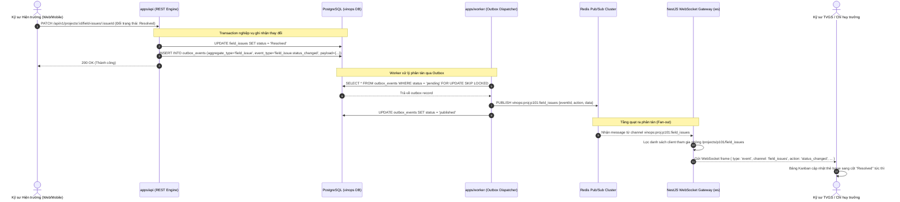
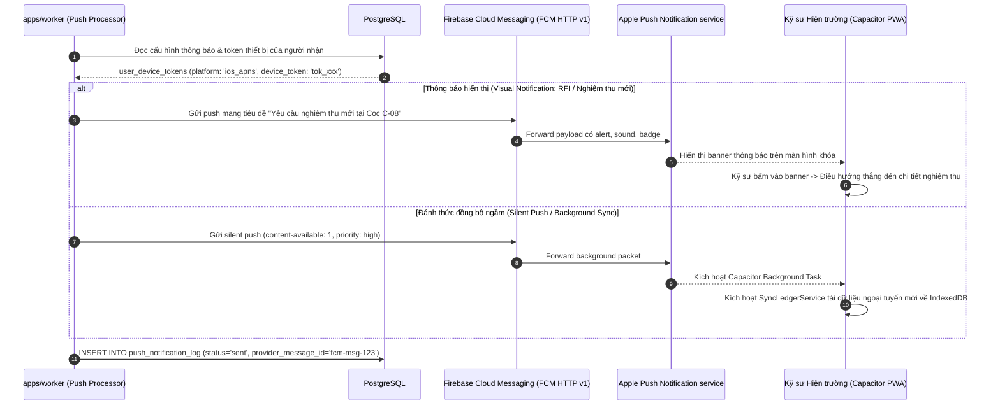
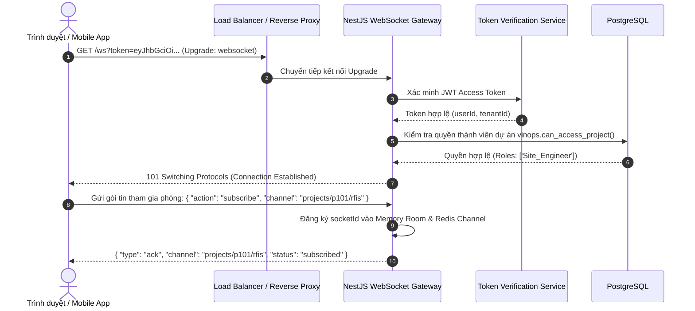
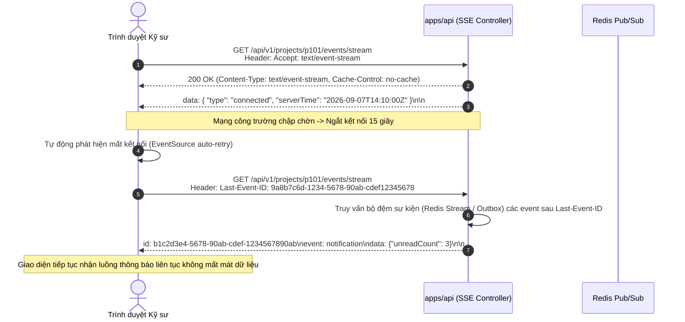
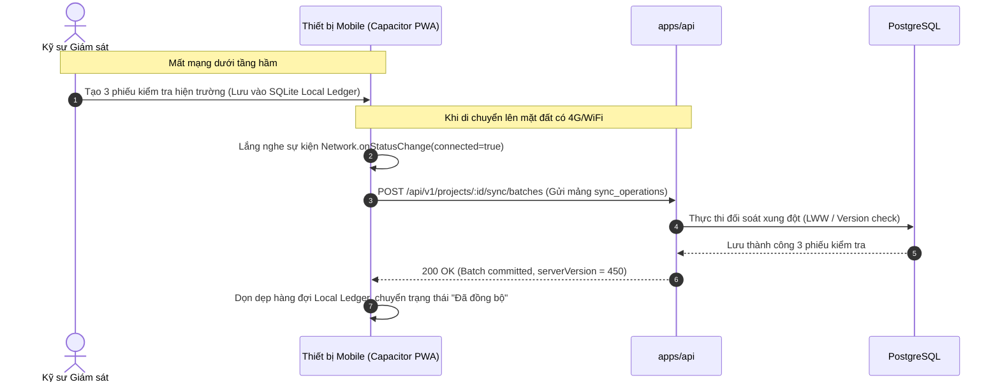

# ADR-016: Hạ tầng Thời gian thực (WebSockets / SSE & Capacitor FCM Push)

- Status: `PROPOSED`
- Effective date: 2026-09-07
- Decision owner: Principal Construction-Tech Enterprise Architect & Lead Realtime Infrastructure Engineer
- Scope: `apps/api`, `apps/worker`, `apps/web`, `packages/database`, `packages/observability`, `packages/contracts`
- Checkpoint: `VIN-MEGA-004`
- Migration reference: `packages/database/migrations/018_realtime_push_notification.sql`

---

## 1. Context (Bối cảnh Nghiệp vụ & Kỹ thuật)

### 1.1 Thách thức Tương tác Thời gian thực trên Đại Công trường

Trong môi trường quản lý xây dựng quy mô lớn (dự án khu đô thị, hạ tầng giao thông, nhà xưởng công nghiệp), hàng trăm kỹ sư, nhà thầu và tư vấn giám sát làm việc phân tán:

1. **Bảng điều phối trực quan (Kanban Boards) cần cập nhật tức thời:**
   - Khi kỹ sư hiện trường phát hiện sự cố an toàn/chất lượng (`field_issues`) và cập nhật trạng thái từ _Open_ sang _In Progress_, bảng Kanban tại văn phòng chỉ huy dự án cần phản ánh ngay lập tức mà không yêu cầu người dùng nhấn F5 tải lại trang.
   - Các yêu cầu thông tin làm rõ thiết kế (`rfi_requests`) và trình duyệt vật liệu (`submittals`) gắn liền với trạng thái **Ball-in-Court** (bên chịu trách nhiệm hành động kế tiếp: Nhà thầu $\leftrightarrow$ TVGS $\leftrightarrow$ Đơn vị Thiết kế $\leftrightarrow$ Chủ đầu tư). Khi quả bóng trách nhiệm chuyển đổi, thành viên liên quan phải nhận được tín hiệu cảnh báo thị giác ngay trên giao diện web/mobile.
2. **Cộng tác trực quan trên Bản vẽ Kỹ thuật số (Collaborative Review & Annotations):**
   - Khi các bên mở bản vẽ PDF/BIM trong phân hệ CDE (Common Data Environment - ISO 19650), việc vẽ khoanh mây (cloud markup), đo bóc kích thước hoặc cắm cờ bình luận đòi hỏi khả năng đồng bộ trạng thái con trỏ và chú thích theo thời gian thực giữa các thành viên đang cùng theo dõi bản vẽ.
3. **Môi trường Hiện trường Ngắt kết nối & Đánh thức Đồng bộ (Offline-first & Push Wake-up):**
   - Kỹ sư công trường thường xuyên di chuyển vào tầng hầm sâu, hầm metro hoặc khu vực sóng di động yếu chập chờn. Khi thiết bị di động (chạy Capacitor PWA trên Android/iOS) có kết nối trở lại hoặc đang chạy ở chế độ nền (background), hệ thống cần phát tín hiệu đánh thức ngầm (**Silent Push / Background Sync Wake-up**) để kích hoạt tiến trình đối soát đồng bộ dữ liệu ngoại tuyến (`vinops.sync_batches` / `sync_operations`).
4. **Mở rộng Mẫu Outbox Hiện hữu mà Không Phá vỡ Đảm bảo Giao dịch:**
   - VinOps đã xây dựng mẫu **Transactional Outbox** (`vinops.outbox_events`) tại lõi PostgreSQL để đảm bảo tính nhất quán dữ liệu (Atomicity & At-Least-Once Delivery). Yêu cầu kỹ thuật cốt lõi là mở rộng luồng outbox hiện có thành luồng phân phối thời gian thực (Real-time Broadcast) tới hàng nghìn client đang kết nối mà không gây khóa bảng cơ sở dữ liệu hoặc làm tăng độ trễ giao dịch nghiệp vụ.

---

## 2. Decision (Quyết định Kiến trúc)

### 2.1 Kiến trúc Phân tầng Thời gian thực Kết hợp (Hybrid Real-time Architecture)

VinOps áp dụng kiến trúc phân tầng kết hợp **WebSockets**, **Server-Sent Events (SSE)** và **Push Notifications**:

- **Bi-directional Real-time (Hai chiều) qua WebSockets:** Sử dụng `@nestjs/websockets` kết hợp thư viện `ws` chuẩn (loại bỏ chi phí thừa của Socket.IO). Phục vụ các tương tác hai chiều đòi hỏi độ trễ cực thấp: phòng cộng tác bản vẽ (drawing collaboration rooms), chia sẻ con trỏ chuột, chat trao đổi nhanh theo đầu việc, và luồng trạng thái Kanban tức thời.
- **Unidirectional Real-time (Một chiều) qua Server-Sent Events (SSE):** Tận dụng giao thức HTTP tiêu chuẩn cho các luồng thông tin một chiều từ máy chủ tới trình duyệt: luồng thông báo chuông (notification stream), tiến độ xử lý file nền (background file rendering / PDF flattening progress), và chỉ số giám sát trạng thái hệ thống. SSE tự động hỗ trợ cơ chế kết nối lại và kiểm soát header `Last-Event-ID`.
- **Thiết bị Di động Ngoại tuyến qua Push Notifications (FCM / APNs):** Tích hợp dịch vụ Firebase Cloud Messaging (FCM HTTP v1 API) cho thiết bị Android và Apple Push Notification service (APNs qua FCM) cho iOS thông qua plugin Capacitor Push Notifications.

### 2.2 Tầng Đệm Quạt Ra Phân Tán (Redis Pub/Sub Fan-out Layer)

Để tách rời máy chủ cơ sở dữ liệu và cho phép mở rộng ngang (Horizontal Scaling) các cụm máy chủ API:

- `apps/api` thực hiện nghiệp vụ và lưu bản ghi vào `vinops.outbox_events` trong cùng một transaction PostgreSQL.
- `apps/worker` quét và nhận diện bản ghi mới thông qua cơ chế Outbox Claim (`FOR UPDATE SKIP LOCKED`).
- Sau khi xử lý, Worker gửi bản tin tới **Redis Pub/Sub** theo kênh chuyên biệt dạng: `vinops:proj:{projectId}:{domain}` (ví dụ `vinops:proj:p101:issues`).
- Tất cả các instance `apps/api` (WebSocket Gateway và SSE Controllers) đăng ký (SUBSCRIBE) vào các kênh Redis liên quan và thực hiện phân phối (Broadcast) bản tin tới các kết nối client nội bộ đang hoạt động.
- Cơ chế này giúp giảm tải hoàn toàn cho PostgreSQL, đồng thời đảm bảo mở rộng không giới hạn số lượng WebSocket Gateway instances mà không lo mất đồng bộ.

### 2.3 Cơ chế Silent Push & Đánh thức Đồng bộ Nền (Capacitor Background Sync Wake-up)

- Khi có sự kiện quan trọng đối với kỹ sư hiện trường (ví dụ: Biên bản nghiệm thu được chỉ định lượt ký mới, hoặc Bản vẽ thi công cập nhật phiên bản phát hành), Worker gửi bản tin **Silent Push** đến thiết bị di động với cấu hình cờ đặc biệt:
  - iOS: `apns-priority: 5`, `content-available: 1`
  - Android: `priority: "high"`, `data-only message` (không chứa khối `notification` để không làm rung/sáng màn hình vô ích)
- Hệ điều hành di động đánh thức tiến trình ngầm của Capacitor ứng dụng VinOps. Ứng dụng tự động kích hoạt `SyncLedgerService` để tải các thay đổi mới nhất về SQLite/IndexedDB cục bộ, sẵn sàng để kỹ sư mở máy ra là dữ liệu đã hiển thị tức thì.

### 2.4 Khử trùng lặp phía Khách hàng (Client-Side De-duplication via Event ID)

Do cơ chế Transactional Outbox và Redis Pub/Sub đảm bảo chuyển giao ít nhất một lần (_At-Least-Once Delivery_), mạng di động có thể gây ra hiện tượng nhận lại sự kiện trùng. Mọi bản tin phát sóng đều mang theo `eventId` (chính là khóa chính UUID từ `vinops.outbox_events`). Client duy trì một hàng đợi vòng (Circular Buffer Ring) lưu trữ 500 `eventId` gần nhất; mọi bản tin có `eventId` đã xuất hiện sẽ bị hủy bỏ ngay lập tức mà không kích hoạt re-render giao diện.

---

## 3. Database Schema & Migration Specification

Mã nguồn migration: `packages/database/migrations/018_realtime_push_notification.sql`. Tuân thủ đầy đủ chuẩn VinOps: schema `vinops`, khóa ngoại tenant, UUID khóa chính, RLS, và triggers.

```sql
-- ============================================================================
-- Migration: 018_realtime_push_notification.sql
-- Description: Realtime Infrastructure, User Device Tokens, Push Notification Audit,
--              Notification Preferences, and Active Connection Subscriptions.
-- ============================================================================

-- 1. User Device Tokens (Capacitor FCM / APNs Push Endpoints)
CREATE TABLE vinops.user_device_tokens (
  id uuid PRIMARY KEY,
  organization_id uuid NOT NULL,
  user_id uuid NOT NULL REFERENCES vinops.users(id) ON DELETE CASCADE,
  platform text NOT NULL CHECK (platform IN ('android_fcm', 'ios_apns', 'web_push')),
  device_token text NOT NULL,
  device_name text NOT NULL DEFAULT '',
  device_model text NOT NULL DEFAULT '',
  app_version text NOT NULL DEFAULT '',
  os_version text NOT NULL DEFAULT '',
  status text NOT NULL DEFAULT 'active' CHECK (status IN ('active', 'expired', 'revoked')),
  last_active_at timestamptz NOT NULL DEFAULT now(),
  created_at timestamptz NOT NULL DEFAULT now(),
  updated_at timestamptz NOT NULL DEFAULT now(),
  UNIQUE (user_id, platform, device_token),
  CHECK (length(trim(device_token)) BETWEEN 10 AND 4096)
);

CREATE INDEX idx_user_device_tokens_lookup ON vinops.user_device_tokens (user_id, status, platform);

-- 2. Notification Preferences (Per-user, per-project notification fine-tuning)
CREATE TABLE vinops.notification_preferences (
  id uuid PRIMARY KEY,
  organization_id uuid NOT NULL,
  project_id uuid NOT NULL,
  user_id uuid NOT NULL REFERENCES vinops.users(id) ON DELETE CASCADE,
  event_category text NOT NULL CHECK (event_category IN ('field_issue', 'rfi', 'submittal', 'inspection', 'daily_log', 'document', 'system')),
  channel_web boolean NOT NULL DEFAULT true,
  channel_push boolean NOT NULL DEFAULT true,
  channel_email boolean NOT NULL DEFAULT false,
  quiet_hours_start time,
  quiet_hours_end time,
  created_at timestamptz NOT NULL DEFAULT now(),
  updated_at timestamptz NOT NULL DEFAULT now(),
  FOREIGN KEY (organization_id, project_id) REFERENCES vinops.projects (organization_id, id),
  UNIQUE (project_id, user_id, event_category)
);

CREATE INDEX idx_notif_prefs_lookup ON vinops.notification_preferences (project_id, user_id, event_category);

-- 3. Push Notification Delivery Audit Log
CREATE TABLE vinops.push_notification_log (
  id uuid PRIMARY KEY,
  organization_id uuid NOT NULL,
  project_id uuid NOT NULL,
  user_id uuid NOT NULL REFERENCES vinops.users(id),
  device_token_id uuid REFERENCES vinops.user_device_tokens(id) ON DELETE SET NULL,
  event_type text NOT NULL,
  event_id uuid NOT NULL,
  payload jsonb NOT NULL,
  status text NOT NULL DEFAULT 'queued' CHECK (status IN ('queued', 'sent', 'delivered', 'failed', 'expired')),
  provider_message_id text,
  failure_reason text,
  sent_at timestamptz,
  delivered_at timestamptz,
  created_at timestamptz NOT NULL DEFAULT now(),
  FOREIGN KEY (organization_id, project_id) REFERENCES vinops.projects (organization_id, id)
);

CREATE INDEX idx_push_notif_log_query ON vinops.push_notification_log (project_id, user_id, status, created_at DESC);
CREATE INDEX idx_push_notif_log_event ON vinops.push_notification_log (event_id);

-- 4. Realtime Subscriptions (Active WS / SSE Live Connections Tracker)
CREATE TABLE vinops.realtime_subscriptions (
  id uuid PRIMARY KEY,
  user_id uuid NOT NULL REFERENCES vinops.users(id) ON DELETE CASCADE,
  project_id uuid NOT NULL REFERENCES vinops.projects(id) ON DELETE CASCADE,
  channel text NOT NULL,
  transport text NOT NULL CHECK (transport IN ('websocket', 'sse')),
  server_instance text NOT NULL,
  last_event_id uuid,
  connected_at timestamptz NOT NULL DEFAULT now(),
  disconnected_at timestamptz,
  CHECK (length(trim(channel)) BETWEEN 2 AND 255),
  CHECK (length(trim(server_instance)) BETWEEN 2 AND 100)
);

CREATE INDEX idx_realtime_subs_active ON vinops.realtime_subscriptions (project_id, channel, disconnected_at) WHERE disconnected_at IS NULL;
CREATE INDEX idx_realtime_subs_user ON vinops.realtime_subscriptions (user_id, transport);

-- ============================================================================
-- Triggers
-- ============================================================================
CREATE TRIGGER trg_user_device_tokens_touch BEFORE UPDATE ON vinops.user_device_tokens FOR EACH ROW EXECUTE FUNCTION vinops.touch_updated_at();
CREATE TRIGGER trg_user_device_tokens_no_delete BEFORE DELETE ON vinops.user_device_tokens FOR EACH ROW EXECUTE FUNCTION vinops.prevent_delete();

CREATE TRIGGER trg_notification_preferences_touch BEFORE UPDATE ON vinops.notification_preferences FOR EACH ROW EXECUTE FUNCTION vinops.touch_updated_at();
CREATE TRIGGER trg_notification_preferences_no_delete BEFORE DELETE ON vinops.notification_preferences FOR EACH ROW EXECUTE FUNCTION vinops.prevent_delete();

CREATE TRIGGER trg_push_notification_log_no_delete BEFORE DELETE ON vinops.push_notification_log FOR EACH ROW EXECUTE FUNCTION vinops.prevent_delete();
CREATE TRIGGER trg_realtime_subscriptions_no_delete BEFORE DELETE ON vinops.realtime_subscriptions FOR EACH ROW EXECUTE FUNCTION vinops.prevent_delete();

-- ============================================================================
-- Row Level Security (RLS) Configuration
-- ============================================================================
DO $$
DECLARE
  tbl text;
BEGIN
  FOR tbl IN SELECT unnest(ARRAY[
    'user_device_tokens',
    'notification_preferences',
    'push_notification_log',
    'realtime_subscriptions'
  ]) LOOP
    EXECUTE format('ALTER TABLE vinops.%I ENABLE ROW LEVEL SECURITY', tbl);
  END LOOP;
END;
$$;

CREATE POLICY user_device_tokens_user_scoped ON vinops.user_device_tokens
  USING (user_id = vinops.current_actor_id() OR vinops.is_system_admin())
  WITH CHECK (user_id = vinops.current_actor_id() OR vinops.is_system_admin());

CREATE POLICY notification_preferences_tenant ON vinops.notification_preferences
  USING (vinops.can_access_project(project_id) AND (user_id = vinops.current_actor_id() OR vinops.is_system_admin()))
  WITH CHECK (vinops.can_access_project(project_id));

CREATE POLICY push_notification_log_tenant ON vinops.push_notification_log
  USING (vinops.can_access_project(project_id) AND (user_id = vinops.current_actor_id() OR vinops.is_system_admin()))
  WITH CHECK (vinops.can_access_project(project_id));

CREATE POLICY realtime_subscriptions_tenant ON vinops.realtime_subscriptions
  USING (vinops.can_access_project(project_id))
  WITH CHECK (vinops.can_access_project(project_id));

-- Role Grants
GRANT SELECT, INSERT, UPDATE, DELETE ON vinops.user_device_tokens TO vinops_app;
GRANT SELECT, INSERT, UPDATE, DELETE ON vinops.notification_preferences TO vinops_app;
GRANT SELECT, INSERT, UPDATE ON vinops.push_notification_log TO vinops_app;
GRANT SELECT, INSERT, UPDATE ON vinops.realtime_subscriptions TO vinops_app;

GRANT SELECT, INSERT, UPDATE ON vinops.push_notification_log TO vinops_worker;
GRANT SELECT ON vinops.user_device_tokens, vinops.notification_preferences TO vinops_worker;
```

---

## 4. Architecture Diagrams (Mermaid)

### 4.1 Luồng Phân Phối Sự Kiện Thời Gian Thực (Outbox -> Redis -> WebSocket Broadcast)



### 4.2 Luồng Đẩy Thông Báo Di Động (Push Notification & Silent Background Wake-up)



### 4.3 Quy trình Bắt tay & Xác thực WebSocket (WebSocket Handshake & Authentication)



### 4.4 Quy trình Kết nối & Phục hồi SSE với Last-Event-ID (SSE Stream & Resumption)



### 4.5 Quy trình Đánh Thức & Điều Hòa Dữ Liệu Ngoại Tuyến (Offline-Online Reconciliation)



---

## 5. WebSocket Protocol Specification

### 5.1 Cấu hình Kết nối & Handshake

- **Connection Endpoint:** `wss://api.vinops.app/ws?token=<ACCESS_TOKEN>&projectId=<PROJECT_ID>`
- **Giao thức cơ sở:** RFC 6455 chuẩn qua NestJS Gateway với thư viện `ws`.
- **Cơ chế Duy trì Kết nối (Heartbeat / Ping-Pong):**
  - Định kỳ mỗi 30 giây, Server gửi WebSocket ping frame (`0x9`).
  - Client tự động phản hồi pong frame (`0xA`) hoặc gửi gói tin ứng dụng `{ "type": "ping" }`.
  - Nếu sau 2 chu kỳ (60 giây) Server không nhận được phản hồi, kết nối bị đóng cưỡng bức (`code: 4001, reason: "Heartbeat timeout"`) để giải phóng tài nguyên bộ nhớ.

### 5.2 Cấu trúc Phân Vùng Phòng (Rooms & Namespaces)

Client tham gia các kênh chuyên đề bằng cách gửi thông điệp `subscribe`:

- `/projects/{projectId}/issues`: Biến động danh sách sự cố chất lượng, an toàn.
- `/projects/{projectId}/rfis`: Chuyển đổi trạng thái xử lý yêu cầu thông tin làm rõ thiết kế.
- `/projects/{projectId}/submittals`: Trình duyệt vật tư, mẫu vật liệu và bản vẽ thi công shop drawing.
- `/projects/{projectId}/inspections`: Cập nhật tiến độ kiểm tra nghiệm thu hiện trường.
- `/projects/{projectId}/drawings/{documentRevisionId}`: Phiên cộng tác trực tiếp trên bản vẽ kỹ thuật.

### 5.3 Định dạng Thông điệp Chuẩn (JSON Message Schema)

Tất cả các thông điệp trao đổi đều tuân thủ schema JSON thống nhất:

```json
{
  "eventId": "9a8b7c6d-5432-10fe-ba98-76543210fedc",
  "type": "event",
  "channel": "issues",
  "action": "status_changed",
  "timestamp": "2026-09-07T14:15:30.124Z",
  "data": {
    "issueId": "2c918084-82a1-43e5-8271-bf0912839218",
    "code": "ISS-B1-019",
    "previousStatus": "In Progress",
    "newStatus": "Resolved",
    "updatedBy": {
      "id": "1b089c19-14a8-4eb7-a82f-bf11667d41a2",
      "displayName": "Lê Hoàng Nam",
      "partnerRole": "Nhà thầu Cơ điện M&E"
    },
    "locationId": "7d219401-b2c3-4d4e-8f0a-1234567890ab",
    "resolutionNote": "Đã xử lý chống thấm cổ ống xuyên sàn tầng hầm B1 theo đúng biện pháp Sikaflex."
  }
}
```

### 5.4 Cơ chế Kết nối lại có Con trỏ Sự kiện (Reconnection with Event Cursor)

Khi mạng bị ngắt quãng, client tự động kết nối lại và gửi kèm mã `lastEventId` đã xử lý thành công gần nhất:

```json
{
  "action": "resume",
  "channel": "issues",
  "lastEventId": "9a8b7c6d-5432-10fe-ba98-76543210fedc"
}
```

Gateway sẽ đọc từ Redis Stream hoặc truy vấn PostgreSQL `outbox_events` để bù đắp các bản tin bị bỏ lỡ trong khoảng thời gian ngắt kết nối (Replay Buffer).

---

## 6. REST API Contracts & Realistic Domain Payload Examples

### 6.1 Đăng Ký Thiết Bị Nhận Push Notification (Device Token Registration)

`POST /api/v1/users/me/devices`

**Request Payload:**

```json
{
  "platform": "android_fcm",
  "deviceToken": "fK9L1xYz_sample_device_token_vinops_android_fcm_88321947219847291847",
  "deviceName": "Samsung Galaxy S24 Ultra",
  "deviceModel": "SM-S928B",
  "appVersion": "2.4.0-prod",
  "osVersion": "Android 15"
}
```

**Response Payload (`201 Created`):**

```json
{
  "success": true,
  "data": {
    "id": "4b8192ca-7281-42ab-9102-123456789abc",
    "platform": "android_fcm",
    "deviceName": "Samsung Galaxy S24 Ultra",
    "status": "active",
    "registeredAt": "2026-09-07T14:20:00Z"
  }
}
```

### 6.2 Hủy Đăng Ký Thiết Bị (Device Deregistration / Logout)

`DELETE /api/v1/users/me/devices/:deviceId`

**Response Payload (`200 OK`):**

```json
{
  "success": true,
  "data": {
    "id": "4b8192ca-7281-42ab-9102-123456789abc",
    "status": "revoked",
    "revokedAt": "2026-09-07T14:22:15Z"
  }
}
```

### 6.3 Danh Sách Thiết Bị Đang Đăng Ký Của Người Dùng

`GET /api/v1/users/me/devices`

**Response Payload (`200 OK`):**

```json
{
  "success": true,
  "data": [
    {
      "id": "4b8192ca-7281-42ab-9102-123456789abc",
      "platform": "android_fcm",
      "deviceName": "Samsung Galaxy S24 Ultra",
      "lastActiveAt": "2026-09-07T14:20:00Z",
      "status": "active"
    },
    {
      "id": "5c9203db-8392-43bc-a213-234567890bcd",
      "platform": "ios_apns",
      "deviceName": "iPad Pro 11-inch (M4)",
      "lastActiveAt": "2026-09-06T18:45:10Z",
      "status": "active"
    }
  ]
}
```

### 6.4 Cập Nhật Cấu Hình Thông Báo Cá Nhân (Notification Preferences)

`PUT /api/v1/projects/:projectId/notifications/preferences`

**Request Payload:**

```json
{
  "preferences": [
    {
      "eventCategory": "inspection",
      "channelWeb": true,
      "channelPush": true,
      "channelEmail": true,
      "quietHoursStart": "22:00:00",
      "quietHoursEnd": "06:00:00"
    },
    {
      "eventCategory": "field_issue",
      "channelWeb": true,
      "channelPush": true,
      "channelEmail": false
    },
    {
      "eventCategory": "daily_log",
      "channelWeb": true,
      "channelPush": false,
      "channelEmail": false
    }
  ]
}
```

**Response Payload (`200 OK`):**

```json
{
  "success": true,
  "data": {
    "projectId": "1a089c19-14a8-4eb7-a82f-bf11667d41a2",
    "updatedCount": 3,
    "updatedAt": "2026-09-07T14:25:00Z"
  }
}
```

### 6.5 Truy Vấn Cấu Hình Thông Báo Cá Nhân

`GET /api/v1/projects/:projectId/notifications/preferences`

**Response Payload (`200 OK`):**

```json
{
  "success": true,
  "data": [
    {
      "eventCategory": "inspection",
      "channelWeb": true,
      "channelPush": true,
      "channelEmail": true,
      "quietHoursStart": "22:00:00",
      "quietHoursEnd": "06:00:00"
    },
    {
      "eventCategory": "field_issue",
      "channelWeb": true,
      "channelPush": true,
      "channelEmail": false,
      "quietHoursStart": null,
      "quietHoursEnd": null
    }
  ]
}
```

### 6.6 Luồng Nhận Sự Kiện Trực Tiếp Qua SSE (Server-Sent Events Endpoint)

`GET /api/v1/projects/:projectId/events/stream`
_Headers: `Accept: text/event-stream`, `Authorization: Bearer <TOKEN>`, `Last-Event-ID: <UUID>`_

**Response Stream (`200 OK`, `Content-Type: text/event-stream`):**

```http
HTTP/1.1 200 OK
Content-Type: text/event-stream
Cache-Control: no-cache
Connection: keep-alive
X-Accel-Buffering: no

id: 8f3b1287-75d1-4bce-93ea-246d6b820991
event: submittal.ball_in_court_changed
data: {"submittalId":"sub-2026-004","code":"SUB-STR-014","title":"Thép dự ứng lực D15.2mm","currentBallInCourt":"Tư vấn Giám sát","deadline":"2026-09-10T17:00:00Z"}

id: 9a4c2398-86e2-4cdf-a4fb-357e7c931002
event: inspection.signed
data: {"inspectionId":"insp-2026-118","code":"INSP-COL-T3-01","status":"Accepted","signerRole":"tvgs_lead","signedAt":"2026-09-07T14:28:10Z"}
```

---

## 7. Alternatives Considered (So sánh & Đánh giá Giải pháp)

### 7.1 WebSocket Transport: Thư viện `ws` vs `Socket.IO`

- **Socket.IO:** Đóng gói nhiều tính năng (fallback polling, room management, automatic reconnection). Tuy nhiên, Socket.IO có định dạng frame độc quyền, thư viện client nặng (>60KB), tiêu tốn nhiều RAM và CPU khi duy trì hàng chục nghìn kết nối đồng thời trên NestJS cluster, và gây khó khăn khi tích hợp với các client chuyên dụng (như thiết bị IoT trắc địa hoặc cảm biến công trường).
- **Lựa chọn (ĐƯỢC CHỌN - `ws`):** Tiêu chuẩn RFC 6455 thuần túy, siêu nhẹ, hiệu năng cao nhất trên Node.js runtime, dễ dàng kiểm soát luồng nhị phân và tương thích trực tiếp với thư viện chuẩn trên trình duyệt web và Capacitor.

### 7.2 Message Broker / Fan-out Layer: `Redis Pub/Sub` vs `RabbitMQ` vs `NATS`

- **RabbitMQ:** Cung cấp định tuyến AMQP phức tạp, tính bền vững hàng đợi cao, nhưng tốn nhiều tài nguyên vận hành và độ trễ phân phối pub/sub cho hàng nghìn ephemeral client cao hơn Redis.
- **NATS:** Cực nhanh, chuyên dụng cho microservices. Tuy nhiên, hệ thống VinOps đã sử dụng Redis cho caching và rate-limiting; bổ sung thêm NATS sẽ làm tăng độ phức tạp hạ tầng và gánh nặng giám sát DevOps.
- **Lựa chọn (ĐƯỢC CHỌN - `Redis Pub/Sub & Redis Streams`):** Sẵn có trong stack hạ tầng VinOps, độ trễ phân phối dưới 2ms, hỗ trợ phân cụm (Redis Cluster), đáp ứng hoàn hảo vai trò tầng đệm quạt ra phân tán giữa Worker và API Gateway.

### 7.3 Real-time Data Push: `Polling` vs `SSE` vs `WebSockets`

- **Polling (Short/Long polling):** Gây lãng phí băng thông cực lớn do gửi liên tục hàng triệu HTTP headers rỗng, gây nghẽn database khi hàng nghìn công nhân cùng mở ứng dụng.
- **Lựa chọn Kết hợp (Hybrid SSE + WebSockets):** Dùng SSE cho các luồng dữ liệu 1 chiều (tiết kiệm tài nguyên socket hai chiều, tự tương thích tốt với HTTP/2 Multiplexing và proxy tường lửa công trường) và chỉ dùng WebSockets cho các phòng cộng tác tương tác 2 chiều (bản vẽ, chat, kanban).

---

## 8. Consequences and Safeguards (Hệ quả Kiến trúc & Biện pháp Đảm bảo)

### 8.1 Quản Lý Phụ Thuộc Redis (Redis Failure & Degradation Mode)

- **Rủi ro:** Cụm Redis gặp sự cố dẫn đến mất luồng thông báo thời gian thực giữa Worker và API Gateway.
- **Biện pháp:** Ứng dụng triển khai cơ chế **Graceful Degradation**: Nếu kết nối Redis Pub/Sub bị đứt, WebSocket Gateway gửi thông điệp cảnh báo tới client chuyển sang chế độ Polling thích ứng nhẹ (Adaptive Polling mỗi 15-30 giây) trực tiếp vào API REST. Toàn bộ tính nhất quán dữ liệu không bị ảnh hưởng vì bảng `vinops.outbox_events` trên PostgreSQL vẫn là nguồn chân lý duy nhất (Single Source of Truth). Khi Redis phục hồi, client tự động chuyển trở lại WebSocket/SSE stream.

### 8.2 Mở Rộng Ngang & Cân Bằng Tải (Horizontal Scaling with Sticky Sessions)

- **Rủi ro:** Các kết nối WebSocket duy trì trạng thái kết nối lâu dài (Stateful). Khi người dùng kết nối qua Load Balancer (Nginx / AWS ALB), các gói tin có thể bị phân bổ sai instance nếu không cấu hình đúng.
- **Biện pháp:**
  - Nginx ingress controller cấu hình cơ chế Sticky Cookie (`vinops_ws_affinity`) cho đường dẫn `/ws` trong quá trình nâng cấp HTTP Upgrade.
  - Sau khi kết nối thành lập, trạng thái phòng được phân phối liên instance thông qua Redis Pub/Sub, cho phép Người dùng A ở Server 1 và Người dùng B ở Server 2 trao đổi tin nhắn trong cùng một phòng hoàn toàn trơn tru.

### 8.3 Kiểm Soát Hạn Mức Đẩy FCM / APNs (Push Quotas & Rate-limiting)

- **Rủi ro:** Một dự án có hàng nghìn tác vụ cập nhật đồng thời có thể gây tràn hạn mức (Quota Throttling) của Google FCM hoặc Apple APNs, dẫn đến tin nhắn bị trễ hoặc rớt.
- **Biện pháp:**
  - `apps/worker` triển khai hàng đợi gộp thông báo (Notification Throttling & Batching Buffer): Nếu trong vòng 2 phút một người dùng có hơn 5 cập nhật cùng danh mục (ví dụ nhiều ảnh mới trên cùng 1 Issue), hệ thống gộp thành 1 thông báo tổng hợp: _"Dự án Tháp A có 5 cập nhật mới về Sự cố thi công"_.
  - Bảng `vinops.notification_preferences` cho phép người dùng cấu hình khung giờ yên tĩnh (`quiet_hours_start` $\rightarrow$ `quiet_hours_end`). Trong khung giờ này, các thông báo thông thường được hoãn và chỉ đẩy các cảnh báo An toàn Khẩn cấp (Critical Safety Alerts).
