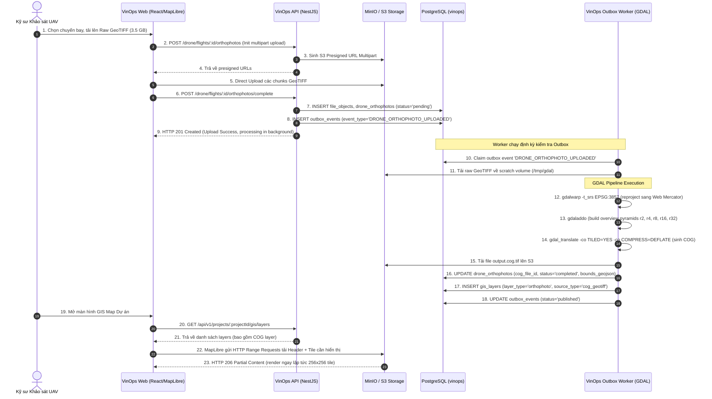
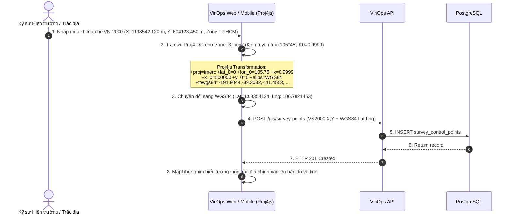
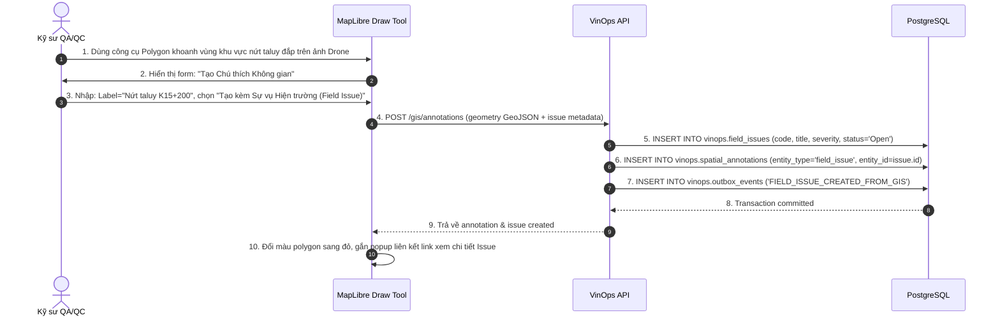

# ADR-017: Bản đồ GIS Công trình & Phân lớp Ảnh Drone UAV Orthophoto

- Status: `PROPOSED`
- Effective date: 2026-09-07
- Decision owner: Principal Enterprise Architect & Geomatics Lead
- Scope: GIS Engine, Drone UAV Processing Pipeline, COG Tile Server, MapLibre Web/Mobile Viewer, CAD/BIM Overlay

---

## 1. Context (Bối cảnh Nghiệp vụ & Kỹ thuật)

### 1.1. Thách thức Quản lý Mặt bằng Dự án Hạ tầng Quy mô lớn

Nền tảng VinOps phục vụ quản lý các dự án xây dựng hạ tầng kỹ thuật và công trình dân dụng quy mô lớn tại Việt Nam (cao tốc Bắc - Nam, khu đô thị Vinhomes, cảng biển, nhà máy công nghiệp tổ hợp). Đặc thù của các dự án này:

- Chiều dài tuyến trải dài hàng chục km hoặc diện tích mặt bằng lên tới hàng trăm hecta.
- Cần quan sát tổng thể tiến độ giải phóng mặt bằng (GPMB), đào đắp đất đá (earthwork cut/fill), thi công kết cấu theo tọa độ địa lý thực tế.
- Khảo sát trắc địa truyền thống bằng máy toàn đạc (Total Station) hoặc GNSS RTK mất nhiều ngày, dữ liệu rời rạc, khó trực quan hóa tình trạng thực địa theo thời gian thực cho Ban Quản lý Dự án (PMU) và Tư vấn Giám sát (TVGS).

### 1.2. Khảo sát Drone UAV & Dữ liệu Ảnh Trực giao (Orthophoto)

Các nhà thầu và đơn vị khảo sát hiện bay chụp định kỳ (hàng tuần/hàng tháng) bằng thiết bị bay không người lái (UAV/Drone như DJI Matrice 350 RTK, Phantom 4 RTK, WingtraOne) thu về hàng nghìn ảnh chụp trên không (aerial photos). Dữ liệu sau khi bình sai nội suy qua Pix4D, Agisoft Metashape hoặc WebODM tạo ra:

- Ảnh trực giao trực diện (Orthomosaic / Orthophoto) định dạng GeoTIFF kích thước từ 2 GB đến 20 GB mỗi lần bay, độ phân giải mặt đất (GSD - Ground Sampling Distance) từ 1 cm đến 5 cm/pixel.
- Mô hình số độ cao (DEM/DSM) phục vụ tính toán khối lượng đào đắp san nền.
- Đám mây điểm 3D (Point Cloud LAS/LAZ).

**Vấn đề kỹ thuật:** Trình duyệt web và ứng dụng di động không thể tải trực tiếp file GeoTIFF 5-10 GB vào bộ nhớ RAM thiết bị để hiển thị. Cần một cơ chế phân mảnh trực tiếp (dynamic tiling / tile pyramid) hiệu quả, không tốn chi phí render lưu trữ trước hàng triệu file tile raster PNG tĩnh (pre-rendered tile explosion).

### 1.3. Hệ Quy chiếu Tọa độ Quốc gia VN-2000 và Xung đột với Web Map

Theo Luật Đo đạc và Bản đồ Việt Nam cùng Thông tư 25/2014/TT-BTNMT, hồ sơ khảo sát, thiết kế quy hoạch, giải phóng mặt bằng bắt buộc sử dụng **Hệ quy chiếu và Hệ tọa độ Quốc gia VN-2000** (ellipsoid WGS-84 tham chiếu dời trục, phép chiếu UTM/Transverse Mercator với kinh tuyến trục địa phương 3° hoặc 6° cho từng tỉnh thành như TP.HCM: 105°45', Hà Nội: 105°00', Đà Nẵng: 107°45').

Trong khi đó:

- Tất cả các nền tảng bản đồ web hiện đại (MapLibre, Mapbox, Google Maps, OpenStreetMap) chuẩn hóa trên **WGS84 Web Mercator (EPSG:3857)** cho hiển thị và **WGS84 (EPSG:4326)** cho tọa độ GPS di động.
- Nếu không chuyển đổi tham số 7 thông số (7-parameter Bursa-Wolf Helmert transformation) chính xác giữa VN-2000 và WGS84, độ lệch vị trí thực tế trên bản đồ công trình sẽ từ **15 mét đến hơn 300 mét**, dẫn đến sai lệch hoàn toàn tim tuyến thi công, ranh giới cọc mốc GPMB và vị trí lỗi hiện trường (Field Issues).

### 1.4. Yêu cầu Đối soát Thời gian (Time-lapse) và Chồng lớp Thiết kế CAD

- Kỹ sư hiện trường cần công cụ thanh trượt đối chiếu (Swipe / Split-screen slider) so sánh:
  1. Ảnh chụp hiện trạng Drone tuần này so với Drone tuần trước (đánh giá tiến độ đào đất, san lấp).
  2. Ảnh chụp Drone thực tế so với bản vẽ quy hoạch thiết kế CAD (DXF/DWG chuyển đổi sang GIS GeoJSON) để phát hiện lấn ranh, sai tim móng, thi công lệch cao độ.

---

## 2. Decision (Quyết định Kiến trúc)

1. **Thư viện Web GIS Client:**
   - Chuẩn hóa trên **MapLibre GL JS** (v4.x, fork mã nguồn mở không phụ thuộc Mapbox token bản quyền, hiệu năng WebGL 2.0 cao, hỗ trợ Vector Tiles, Raster Tiles, GeoJSON và Swipe Control plugin).
   - Thiết bị di động (Capacitor PWA/Android/iOS) tích hợp MapLibre Native qua Capacitor WebView với caching offline thông minh cho vector tile base map.

2. **Chuyển đổi Hệ tọa độ Động (Dynamic Coordinate Transformation):**
   - Tích hợp thư viện **Proj4js** trên Client và **GDAL/PROJ** trên Worker.
   - Thiết lập bảng tham số chuyển đổi 7 thông số tiêu chuẩn Bộ Tài nguyên & Môi trường cho 63 tỉnh thành Việt Nam (Kinh tuyến trục 3° và 6°, tỷ lệ K0=0.9999 / K0=0.9996).
   - Cho phép nhập tọa độ trắc địa mốc khống chế VN-2000 (X, Y, H) và tự động chuyển đổi hiển thị tức thì trên nền WGS84 với sai số < 0.05 m (5 cm).

3. **Định dạng Lưu trữ & Phân phối Ảnh Drone - Cloud Optimized GeoTIFF (COG):**
   - Toàn bộ ảnh trực giao drone GeoTIFF sau khi xử lý bình sai sẽ được đóng gói thành chuẩn **Cloud Optimized GeoTIFF (COG)** theo quy cách OGC.
   - COG chứa sẵn cấu trúc phân mảnh bên trong (internal tiling: 256x256 hoặc 512x512 pixels, nén LZW hoặc DEFLATE) kết hợp kim tự tháp đa độ phân giải (overview pyramids r2, r4, r8, r16, r32).
   - Client hoặc Edge Tile Gateway sử dụng **HTTP Range Requests (RFC 7233)** để chỉ đọc đúng các byte dữ liệu của vùng nhìn (viewport) và zoom level tương ứng từ Object Storage (S3/MinIO), loại bỏ hoàn toàn yêu cầu render trước hàng triệu file tile raster PNG tĩnh.

4. **Đường ống Xử lý Dữ liệu trên Worker (GDAL Worker Pipeline):**
   - Đóng gói container Worker với **GDAL 3.9+** (Geospatial Data Abstraction Library) kèm PROJ 9+.
   - Pipeline tự động kích hoạt khi có sự kiện Outbox `DRONE_ORTHOPHOTO_UPLOADED`:
     1. `gdalinfo`: Trích xuất metadata (CRS gốc, bounding box, resolution, GSD, bands).
     2. `gdalwarp`: Tái chiếu (reproject) từ CRS gốc (VN-2000 hoặc UTM WGS84) sang WGS84 Web Mercator (`EPSG:3857`) với phép nội suy đa thức bậc hai (cubic resample).
     3. `gdaladdo`: Khởi tạo overview pyramids nội bộ.
     4. `gdal_translate`: Xuất ra file chuẩn COG (`-co TILED=YES -co COPY_SRC_OVERVIEWS=YES -co COMPRESS=DEFLATE -co PREDICTOR=2`).
     5. Lưu trữ COG vào MinIO/S3, sinh bản ghi `vinops.drone_orthophotos` và kích hoạt layer bản đồ `vinops.gis_layers`.

5. **Tính năng Swipe / Time-lapse Comparison:**
   - Tích hợp plugin MapLibre Compare (Swipe Control), render đồng thời 2 bản đồ WebGL độc lập đồng bộ hóa camera (pitch, bearing, zoom, center).
   - Hỗ trợ so sánh giữa 2 chuyến bay Drone khác ngày hoặc giữa chuyến bay Drone và phân lớp CAD GeoJSON.

6. **Chồng lớp Thiết kế CAD (CAD to GIS Pipeline):**
   - Hỗ trợ chuyển đổi bản vẽ thi công AutoCAD DXF (R2018+) sang chuẩn GeoJSON có gán thuộc tính layer/block/level.
   - Áp dụng hệ tọa độ VN-2000 của dự án để nắn chỉnh tọa độ vector CAD khớp tuyệt đối với vị trí thực tế trên ảnh vệ tinh/ảnh drone.

---

## 3. Complete PostgreSQL DDL (Migration `019_gis_drone_orthophoto.sql`)

```sql
-- =============================================================================
-- Migration: 019_gis_drone_orthophoto.sql
-- Description: GIS Project Settings, Layers, Drone Flights, Orthophotos (COG),
--              Spatial Annotations, and Geodetic Survey Control Points.
-- Schema: vinops
-- Standards: ISO 19115, OGC COG, VN-2000 (TT 25/2014/TT-BTNMT)
-- =============================================================================

-- -----------------------------------------------------------------------------
-- 1. Table: vinops.gis_project_settings
-- Per-project GIS configuration (CRS, default center, base map style)
-- -----------------------------------------------------------------------------
CREATE TABLE vinops.gis_project_settings (
  id uuid PRIMARY KEY,
  organization_id uuid NOT NULL,
  project_id uuid NOT NULL,
  default_crs_epsg integer NOT NULL DEFAULT 4326 CHECK (default_crs_epsg IN (4326, 3857, 3405, 3406, 9208, 9209)),
  vn2000_zone text CHECK (vn2000_zone IN (
    'zone_3_hcm', 'zone_3_hanoi', 'zone_3_danang', 'zone_3_haiphong', 'zone_3_cantho',
    'zone_3_dongnai', 'zone_3_binhduong', 'zone_3_quangninh', 'zone_3_khanhhoa',
    'zone_6_48', 'zone_6_49'
  )),
  vn2000_central_meridian numeric(6, 2),
  project_center_lat numeric(10, 7) CHECK (project_center_lat BETWEEN -90.0 AND 90.0),
  project_center_lng numeric(10, 7) CHECK (project_center_lng BETWEEN -180.0 AND 180.0),
  default_zoom_level integer NOT NULL DEFAULT 15 CHECK (default_zoom_level BETWEEN 1 AND 24),
  base_map_style text NOT NULL DEFAULT 'satellite' CHECK (base_map_style IN ('satellite', 'streets', 'topo', 'dark', 'hybrid')),
  enable_cad_overlay boolean NOT NULL DEFAULT true,
  enable_drone_overlay boolean NOT NULL DEFAULT true,
  created_by uuid NOT NULL REFERENCES vinops.users(id),
  version bigint NOT NULL DEFAULT 1 CHECK (version > 0),
  created_at timestamptz NOT NULL DEFAULT now(),
  updated_at timestamptz NOT NULL DEFAULT now(),
  FOREIGN KEY (organization_id, project_id) REFERENCES vinops.projects (organization_id, id),
  UNIQUE (project_id)
);

CREATE INDEX gis_project_settings_tenant_idx ON vinops.gis_project_settings (organization_id, project_id);

-- -----------------------------------------------------------------------------
-- 2. Table: vinops.gis_layers
-- Multi-purpose Map Layers (CAD, GeoJSON, COG Orthophoto, Vector Tiles)
-- -----------------------------------------------------------------------------
CREATE TABLE vinops.gis_layers (
  id uuid PRIMARY KEY,
  organization_id uuid NOT NULL,
  project_id uuid NOT NULL,
  code text NOT NULL,
  name text NOT NULL,
  layer_type text NOT NULL CHECK (layer_type IN (
    'project_boundary', 'site_plan', 'cad_overlay', 'orthophoto',
    'point_cloud', 'survey_control', 'utility_network', 'earthwork_zone'
  )),
  source_type text NOT NULL CHECK (source_type IN ('geojson', 'cog_geotiff', 'vector_tile', 'wms')),
  source_file_id uuid REFERENCES vinops.file_objects(id),
  source_url text,
  crs_epsg integer NOT NULL DEFAULT 3857,
  opacity numeric(3, 2) NOT NULL DEFAULT 1.00 CHECK (opacity BETWEEN 0.00 AND 1.00),
  z_order integer NOT NULL DEFAULT 0 CHECK (z_order BETWEEN -100 AND 100),
  visible_by_default boolean NOT NULL DEFAULT true,
  min_zoom integer CHECK (min_zoom BETWEEN 0 AND 24),
  max_zoom integer CHECK (max_zoom BETWEEN 0 AND 24),
  style_config jsonb NOT NULL DEFAULT '{}'::jsonb,
  status text NOT NULL DEFAULT 'draft' CHECK (status IN ('draft', 'processing', 'ready', 'failed', 'archived')),
  created_by uuid NOT NULL REFERENCES vinops.users(id),
  version bigint NOT NULL DEFAULT 1 CHECK (version > 0),
  created_at timestamptz NOT NULL DEFAULT now(),
  updated_at timestamptz NOT NULL DEFAULT now(),
  archived_at timestamptz,
  FOREIGN KEY (organization_id, project_id) REFERENCES vinops.projects (organization_id, id),
  UNIQUE (project_id, code),
  CHECK (length(trim(code)) BETWEEN 2 AND 80),
  CHECK (length(trim(name)) BETWEEN 2 AND 255)
);

CREATE INDEX gis_layers_project_idx ON vinops.gis_layers (project_id, status, z_order);
CREATE INDEX gis_layers_source_file_idx ON vinops.gis_layers (source_file_id) WHERE source_file_id IS NOT NULL;

-- -----------------------------------------------------------------------------
-- 3. Table: vinops.drone_flights
-- UAV Survey Mission Records
-- -----------------------------------------------------------------------------
CREATE TABLE vinops.drone_flights (
  id uuid PRIMARY KEY,
  organization_id uuid NOT NULL,
  project_id uuid NOT NULL,
  code text NOT NULL,
  name text NOT NULL,
  flight_date date NOT NULL,
  pilot_name text NOT NULL,
  drone_model text NOT NULL,
  camera_model text NOT NULL,
  gsd_cm numeric(6, 2) CHECK (gsd_cm > 0),
  altitude_m numeric(8, 2) CHECK (altitude_m > 0),
  overlap_pct integer CHECK (overlap_pct BETWEEN 20 AND 95),
  sidelap_pct integer CHECK (sidelap_pct BETWEEN 20 AND 95),
  area_covered_sqm numeric(14, 2) CHECK (area_covered_sqm > 0),
  photo_count integer CHECK (photo_count > 0),
  raw_data_size_bytes bigint CHECK (raw_data_size_bytes > 0),
  processing_software text NOT NULL DEFAULT 'WebODM' CHECK (processing_software IN ('Pix4D', 'Agisoft Metashape', 'WebODM', 'DJI Terra', 'ContextCapture', 'Other')),
  crs_epsg integer NOT NULL DEFAULT 4326,
  flight_boundary jsonb NOT NULL,
  status text NOT NULL DEFAULT 'planned' CHECK (status IN ('planned', 'uploaded', 'processing', 'ready', 'failed')),
  notes text NOT NULL DEFAULT '',
  created_by uuid NOT NULL REFERENCES vinops.users(id),
  version bigint NOT NULL DEFAULT 1 CHECK (version > 0),
  created_at timestamptz NOT NULL DEFAULT now(),
  updated_at timestamptz NOT NULL DEFAULT now(),
  FOREIGN KEY (organization_id, project_id) REFERENCES vinops.projects (organization_id, id),
  UNIQUE (project_id, code),
  CHECK (length(trim(code)) BETWEEN 2 AND 80),
  CHECK (length(trim(name)) BETWEEN 2 AND 255),
  CHECK (length(trim(pilot_name)) BETWEEN 2 AND 150),
  CHECK (length(trim(drone_model)) BETWEEN 2 AND 100),
  CHECK (length(trim(camera_model)) BETWEEN 2 AND 100)
);

CREATE INDEX drone_flights_project_date_idx ON vinops.drone_flights (project_id, flight_date DESC, status);

-- -----------------------------------------------------------------------------
-- 4. Table: vinops.drone_orthophotos
-- Processed Cloud-Optimized GeoTIFF (COG) records linked to UAV flights
-- -----------------------------------------------------------------------------
CREATE TABLE vinops.drone_orthophotos (
  id uuid PRIMARY KEY,
  organization_id uuid NOT NULL,
  project_id uuid NOT NULL,
  flight_id uuid NOT NULL REFERENCES vinops.drone_flights(id) ON DELETE CASCADE,
  source_file_id uuid NOT NULL REFERENCES vinops.file_objects(id),
  cog_file_id uuid REFERENCES vinops.file_objects(id),
  file_size_bytes bigint NOT NULL CHECK (file_size_bytes > 0),
  cog_size_bytes bigint CHECK (cog_size_bytes > 0),
  crs_epsg integer NOT NULL DEFAULT 3857,
  bounds_geojson jsonb NOT NULL,
  resolution_m numeric(8, 4) CHECK (resolution_m > 0),
  band_count integer NOT NULL DEFAULT 3 CHECK (band_count IN (1, 3, 4)),
  bit_depth integer NOT NULL DEFAULT 8 CHECK (bit_depth IN (8, 16, 32)),
  processing_status text NOT NULL DEFAULT 'pending' CHECK (processing_status IN ('pending', 'processing', 'completed', 'failed')),
  processing_error text,
  processing_duration_ms integer,
  created_at timestamptz NOT NULL DEFAULT now(),
  FOREIGN KEY (organization_id, project_id) REFERENCES vinops.projects (organization_id, id)
);

CREATE INDEX drone_orthophotos_flight_idx ON vinops.drone_orthophotos (flight_id, processing_status);
CREATE INDEX drone_orthophotos_project_idx ON vinops.drone_orthophotos (project_id, created_at DESC);
CREATE INDEX drone_orthophotos_cog_file_idx ON vinops.drone_orthophotos (cog_file_id) WHERE cog_file_id IS NOT NULL;

-- -----------------------------------------------------------------------------
-- 5. Table: vinops.spatial_annotations
-- Map annotations linked to field issues, inspections, or survey notes
-- -----------------------------------------------------------------------------
CREATE TABLE vinops.spatial_annotations (
  id uuid PRIMARY KEY,
  organization_id uuid NOT NULL,
  project_id uuid NOT NULL,
  geometry_type text NOT NULL CHECK (geometry_type IN ('point', 'linestring', 'polygon', 'circle')),
  geometry_geojson jsonb NOT NULL,
  properties jsonb NOT NULL DEFAULT '{}'::jsonb,
  layer_id uuid REFERENCES vinops.gis_layers(id) ON DELETE SET NULL,
  entity_type text CHECK (entity_type IN ('field_issue', 'inspection', 'survey_point', 'measurement', 'note')),
  entity_id uuid,
  label text NOT NULL,
  color text NOT NULL DEFAULT '#FF0000' CHECK (color ~ '^#([A-Fa-f0-9]{6}|[A-Fa-f0-9]{3})$'),
  created_by uuid NOT NULL REFERENCES vinops.users(id),
  created_at timestamptz NOT NULL DEFAULT now(),
  FOREIGN KEY (organization_id, project_id) REFERENCES vinops.projects (organization_id, id),
  CHECK (length(trim(label)) BETWEEN 1 AND 255)
);

CREATE INDEX spatial_annotations_project_idx ON vinops.spatial_annotations (project_id, entity_type, entity_id);
CREATE INDEX spatial_annotations_layer_idx ON vinops.spatial_annotations (layer_id) WHERE layer_id IS NOT NULL;

-- -----------------------------------------------------------------------------
-- 6. Table: vinops.survey_control_points
-- Geodetic Benchmark & Survey Stakes (Mốc khống chế trắc địa)
-- -----------------------------------------------------------------------------
CREATE TABLE vinops.survey_control_points (
  id uuid PRIMARY KEY,
  organization_id uuid NOT NULL,
  project_id uuid NOT NULL,
  code text NOT NULL,
  name text NOT NULL,
  point_type text NOT NULL CHECK (point_type IN ('benchmark', 'control_horizontal', 'control_vertical', 'boundary_marker', 'reference_stake')),
  latitude numeric(12, 9) NOT NULL CHECK (latitude BETWEEN -90.0 AND 90.0),
  longitude numeric(12, 9) NOT NULL CHECK (longitude BETWEEN -180.0 AND 180.0),
  elevation_m numeric(10, 4) NOT NULL,
  vn2000_x numeric(14, 4),
  vn2000_y numeric(14, 4),
  crs_epsg integer NOT NULL DEFAULT 4326,
  accuracy_h_mm numeric(8, 2) NOT NULL DEFAULT 5.0 CHECK (accuracy_h_mm >= 0),
  accuracy_v_mm numeric(8, 2) NOT NULL DEFAULT 5.0 CHECK (accuracy_v_mm >= 0),
  survey_date date NOT NULL DEFAULT CURRENT_DATE,
  surveyor_name text NOT NULL,
  instrument_type text NOT NULL DEFAULT 'GNSS_RTK' CHECK (instrument_type IN ('GNSS_RTK', 'Total_Station', 'Digital_Level', 'Drone_GCP')),
  status text NOT NULL DEFAULT 'active' CHECK (status IN ('active', 'superseded', 'destroyed')),
  created_by uuid NOT NULL REFERENCES vinops.users(id),
  version bigint NOT NULL DEFAULT 1 CHECK (version > 0),
  created_at timestamptz NOT NULL DEFAULT now(),
  updated_at timestamptz NOT NULL DEFAULT now(),
  FOREIGN KEY (organization_id, project_id) REFERENCES vinops.projects (organization_id, id),
  UNIQUE (project_id, code),
  CHECK (length(trim(code)) BETWEEN 2 AND 80),
  CHECK (length(trim(name)) BETWEEN 2 AND 255),
  CHECK (length(trim(surveyor_name)) BETWEEN 2 AND 150)
);

CREATE INDEX survey_control_points_project_idx ON vinops.survey_control_points (project_id, status, point_type);

-- -----------------------------------------------------------------------------
-- Row Level Security (RLS) Policies
-- Multi-tenant isolation using vinops.current_organization_id() and vinops.current_project_id()
-- -----------------------------------------------------------------------------
ALTER TABLE vinops.gis_project_settings ENABLE ROW LEVEL SECURITY;
CREATE POLICY gis_project_settings_tenant_isolation ON vinops.gis_project_settings
  FOR ALL USING (
    organization_id = vinops.current_organization_id()
    AND project_id = vinops.current_project_id()
  );

ALTER TABLE vinops.gis_layers ENABLE ROW LEVEL SECURITY;
CREATE POLICY gis_layers_tenant_isolation ON vinops.gis_layers
  FOR ALL USING (
    organization_id = vinops.current_organization_id()
    AND project_id = vinops.current_project_id()
  );

ALTER TABLE vinops.drone_flights ENABLE ROW LEVEL SECURITY;
CREATE POLICY drone_flights_tenant_isolation ON vinops.drone_flights
  FOR ALL USING (
    organization_id = vinops.current_organization_id()
    AND project_id = vinops.current_project_id()
  );

ALTER TABLE vinops.drone_orthophotos ENABLE ROW LEVEL SECURITY;
CREATE POLICY drone_orthophotos_tenant_isolation ON vinops.drone_orthophotos
  FOR ALL USING (
    organization_id = vinops.current_organization_id()
    AND project_id = vinops.current_project_id()
  );

ALTER TABLE vinops.spatial_annotations ENABLE ROW LEVEL SECURITY;
CREATE POLICY spatial_annotations_tenant_isolation ON vinops.spatial_annotations
  FOR ALL USING (
    organization_id = vinops.current_organization_id()
    AND project_id = vinops.current_project_id()
  );

ALTER TABLE vinops.survey_control_points ENABLE ROW LEVEL SECURITY;
CREATE POLICY survey_control_points_tenant_isolation ON vinops.survey_control_points
  FOR ALL USING (
    organization_id = vinops.current_organization_id()
    AND project_id = vinops.current_project_id()
  );

-- -----------------------------------------------------------------------------
-- Triggers: touch_updated_at, increment_version, prevent_delete
-- -----------------------------------------------------------------------------
-- gis_project_settings
CREATE TRIGGER gis_project_settings_touch BEFORE UPDATE ON vinops.gis_project_settings
  FOR EACH ROW EXECUTE FUNCTION vinops.touch_updated_at();
CREATE TRIGGER gis_project_settings_version BEFORE UPDATE ON vinops.gis_project_settings
  FOR EACH ROW EXECUTE FUNCTION vinops.increment_version();
CREATE TRIGGER gis_project_settings_no_delete BEFORE DELETE ON vinops.gis_project_settings
  FOR EACH ROW EXECUTE FUNCTION vinops.prevent_delete();

-- gis_layers
CREATE TRIGGER gis_layers_touch BEFORE UPDATE ON vinops.gis_layers
  FOR EACH ROW EXECUTE FUNCTION vinops.touch_updated_at();
CREATE TRIGGER gis_layers_version BEFORE UPDATE ON vinops.gis_layers
  FOR EACH ROW EXECUTE FUNCTION vinops.increment_version();
CREATE TRIGGER gis_layers_no_delete BEFORE DELETE ON vinops.gis_layers
  FOR EACH ROW EXECUTE FUNCTION vinops.prevent_delete();

-- drone_flights
CREATE TRIGGER drone_flights_touch BEFORE UPDATE ON vinops.drone_flights
  FOR EACH ROW EXECUTE FUNCTION vinops.touch_updated_at();
CREATE TRIGGER drone_flights_version BEFORE UPDATE ON vinops.drone_flights
  FOR EACH ROW EXECUTE FUNCTION vinops.increment_version();
CREATE TRIGGER drone_flights_no_delete BEFORE DELETE ON vinops.drone_flights
  FOR EACH ROW EXECUTE FUNCTION vinops.prevent_delete();

-- drone_orthophotos (immutable processing record; prevent delete)
CREATE TRIGGER drone_orthophotos_no_delete BEFORE DELETE ON vinops.drone_orthophotos
  FOR EACH ROW EXECUTE FUNCTION vinops.prevent_delete();

-- spatial_annotations (allow soft delete or direct delete if transient note, but protect core with prevent_delete)
CREATE TRIGGER spatial_annotations_no_delete BEFORE DELETE ON vinops.spatial_annotations
  FOR EACH ROW EXECUTE FUNCTION vinops.prevent_delete();

-- survey_control_points
CREATE TRIGGER survey_control_points_touch BEFORE UPDATE ON vinops.survey_control_points
  FOR EACH ROW EXECUTE FUNCTION vinops.touch_updated_at();
CREATE TRIGGER survey_control_points_version BEFORE UPDATE ON vinops.survey_control_points
  FOR EACH ROW EXECUTE FUNCTION vinops.increment_version();
CREATE TRIGGER survey_control_points_no_delete BEFORE DELETE ON vinops.survey_control_points
  FOR EACH ROW EXECUTE FUNCTION vinops.prevent_delete();
```

---

## 4. Sequence Diagrams (Luồng Nghiệp vụ & Kỹ thuật)

### 4.1. Luồng Tải Ảnh Drone -> GDAL Worker -> COG -> Đăng ký Layer Bản đồ



### 4.2. Luồng Chuyển đổi Tọa độ VN-2000 <-> WGS84



### 4.3. Luồng So sánh Đối soát Tiến độ Thời gian (Swipe / Split-Screen Time-lapse)

```mermaid
sequenceDiagram
    autonumber
    actor PM as Giám đốc Dự án (PM)
    participant UI as MapLibre Compare Viewport
    participant LeftMap as Map Instance A (Drone T08/2026)
    participant RightMap as Map Instance B (Drone T09/2026)
    participant Edge as Edge Tile / Range Request Proxy

    PM->>UI: 1. Chọn tính năng "So sánh Mặt bằng Đối soát"
    PM->>UI: 2. Chọn Layer Trái: Drone 15/08/2026; Layer Phải: Drone 05/09/2026
    UI->>LeftMap: 3. Kích hoạt viewport trái với source COG A
    UI->>RightMap: 4. Kích hoạt viewport phải với source COG B
    UI->>UI: 5. Đồng bộ hóa sự kiện: Pan / Zoom / Pitch giữa 2 Map Instances
    LeftMap->>Edge: 6. Range Request bytes COG A (Zoom 17, Center)
    RightMap->>Edge: 7. Range Request bytes COG B (Zoom 17, Center)
    Edge-->>LeftMap: 8. Raster Tile T08
    Edge-->>RightMap: 9. Raster Tile T09
    PM->>UI: 10. Kéo thanh trượt Split-Screen từ trái sang phải
    UI->>UI: 11. MapLibre cắt mask stencil WebGL theo vị trí thanh trượt
    Note over PM,UI: PM trực quan thấy rõ cao độ san nền và tiến độ đổ móng bê tông
```

### 4.4. Luồng Tạo Chú thích Không gian (Spatial Annotation) Liên kết Field Issue



---

## 5. API Contracts (Chi tiết Yêu cầu/Phản hồi với Tọa độ Việt Nam)

### 5.1. Thiết lập GIS Dự án (`POST & GET /gis/settings`)

#### POST `/api/v1/projects/:projectId/gis/settings`

**Request Payload:**

```json
{
  "defaultCrsEpsg": 4326,
  "vn2000Zone": "zone_3_hcm",
  "vn2000CentralMeridian": 105.75,
  "projectCenterLat": 10.8354124,
  "projectCenterLng": 106.7821453,
  "defaultZoomLevel": 16,
  "baseMapStyle": "satellite",
  "enableCadOverlay": true,
  "enableDroneOverlay": true
}
```

**Response (200 OK):**

```json
{
  "data": {
    "id": "7a8b9c0d-1111-4000-8000-000000000001",
    "organizationId": "a1b2c3d4-e5f6-4a5b-8c9d-0e1f2a3b4c5d",
    "projectId": "e2f3a4b5-c6d7-4e8f-9a0b-1c2d3e4f5a6b",
    "defaultCrsEpsg": 4326,
    "vn2000Zone": "zone_3_hcm",
    "vn2000CentralMeridian": "105.75",
    "projectCenterLat": "10.8354124",
    "projectCenterLng": "106.7821453",
    "defaultZoomLevel": 16,
    "baseMapStyle": "satellite",
    "enableCadOverlay": true,
    "enableDroneOverlay": true,
    "version": 1,
    "createdAt": "2026-09-07T08:00:00.000Z",
    "updatedAt": "2026-09-07T08:00:00.000Z"
  }
}
```

### 5.2. Quản lý Phân lớp GIS (`POST & GET /gis/layers`)

#### POST `/api/v1/projects/:projectId/gis/layers`

**Request Payload:**

```json
{
  "code": "CAD-TKTC-PHAN-KHU-A",
  "name": "Bản vẽ Quy hoạch Tổng mặt bằng Phân khu A",
  "layerType": "cad_overlay",
  "sourceType": "geojson",
  "sourceFileId": "3fa85f64-5717-4562-b3fc-2c963f66afa6",
  "crsEpsg": 3857,
  "opacity": 0.85,
  "zOrder": 10,
  "visibleByDefault": true,
  "minZoom": 14,
  "maxZoom": 22,
  "styleConfig": {
    "lineColor": "#00FF66",
    "lineWidth": 2,
    "fillColor": "#00FF66",
    "fillOpacity": 0.15
  }
}
```

**Response (201 Created):**

```json
{
  "data": {
    "id": "8b9c0d1e-2222-4000-8000-000000000002",
    "organizationId": "a1b2c3d4-e5f6-4a5b-8c9d-0e1f2a3b4c5d",
    "projectId": "e2f3a4b5-c6d7-4e8f-9a0b-1c2d3e4f5a6b",
    "code": "CAD-TKTC-PHAN-KHU-A",
    "name": "Bản vẽ Quy hoạch Tổng mặt bằng Phân khu A",
    "layerType": "cad_overlay",
    "sourceType": "geojson",
    "sourceFileId": "3fa85f64-5717-4562-b3fc-2c963f66afa6",
    "crsEpsg": 3857,
    "opacity": "0.85",
    "zOrder": 10,
    "visibleByDefault": true,
    "status": "ready",
    "version": 1,
    "createdAt": "2026-09-07T08:15:00.000Z",
    "updatedAt": "2026-09-07T08:15:00.000Z"
  }
}
```

### 5.3. Đăng ký Chuyến bay Drone (`POST /drone/flights`)

#### POST `/api/v1/projects/:projectId/drone/flights`

**Request Payload:**

```json
{
  "code": "FLIGHT-2026-09-05-SEC-A",
  "name": "Khảo sát Bay chụp Đo đạc Mặt bằng Đợt 18 - Gói thầu XL-01",
  "flightDate": "2026-09-05",
  "pilotName": "Nguyễn Văn Hùng (Chứng chỉ UAV 2024/CCT)",
  "droneModel": "DJI Matrice 350 RTK",
  "cameraModel": "Zenmuse P1 (Full Frame 45MP)",
  "gsdCm": 2.5,
  "altitudeM": 120.0,
  "overlapPct": 80,
  "sidelapPct": 70,
  "areaCoveredSqm": 450000.0,
  "photoCount": 850,
  "rawDataSizeBytes": 18253611008,
  "processingSoftware": "WebODM",
  "crsEpsg": 4326,
  "flightBoundary": {
    "type": "Polygon",
    "coordinates": [
      [
        [106.78012, 10.8341],
        [106.7845, 10.8341],
        [106.7845, 10.8378],
        [106.78012, 10.8378],
        [106.78012, 10.8341]
      ]
    ]
  },
  "notes": "Bay bù vùng khu vực trạm trộn bê tông do vướng cẩu tháp trong đợt 17"
}
```

**Response (201 Created):**

```json
{
  "data": {
    "id": "9c0d1e2f-3333-4000-8000-000000000003",
    "organizationId": "a1b2c3d4-e5f6-4a5b-8c9d-0e1f2a3b4c5d",
    "projectId": "e2f3a4b5-c6d7-4e8f-9a0b-1c2d3e4f5a6b",
    "code": "FLIGHT-2026-09-05-SEC-A",
    "name": "Khảo sát Bay chụp Đo đạc Mặt bằng Đợt 18 - Gói thầu XL-01",
    "flightDate": "2026-09-05",
    "pilotName": "Nguyễn Văn Hùng (Chứng chỉ UAV 2024/CCT)",
    "status": "uploaded",
    "gsdCm": "2.50",
    "version": 1,
    "createdAt": "2026-09-07T08:30:00.000Z"
  }
}
```

### 5.4. Đăng ký Tải lên Ảnh Trực giao Orthophoto (`POST /drone/flights/:flightId/orthophotos`)

#### POST `/api/v1/projects/:projectId/drone/flights/9c0d1e2f-3333-4000-8000-000000000003/orthophotos`

**Request Payload:**

```json
{
  "sourceFileId": "c4d5e6f7-aaaa-4000-8000-000000000004",
  "fileSizeBytes": 4294967296,
  "crsEpsg": 3405,
  "boundsGeojson": {
    "type": "Polygon",
    "coordinates": [
      [
        [106.78012, 10.8341],
        [106.7845, 10.8341],
        [106.7845, 10.8378],
        [106.78012, 10.8378],
        [106.78012, 10.8341]
      ]
    ]
  },
  "resolutionM": 0.025,
  "bandCount": 3,
  "bitDepth": 8
}
```

**Response (202 Accepted):**

```json
{
  "data": {
    "id": "0d1e2f3a-4444-4000-8000-000000000005",
    "flightId": "9c0d1e2f-3333-4000-8000-000000000003",
    "sourceFileId": "c4d5e6f7-aaaa-4000-8000-000000000004",
    "processingStatus": "pending",
    "message": "Drone orthophoto queued for GDAL Cloud-Optimized GeoTIFF (COG) conversion"
  }
}
```

### 5.5. COG Tile Dynamic Gateway Endpoint

`GET /api/v1/projects/:projectId/drone/flights/:flightId/orthophotos/:orthoId/tiles/{z}/{x}/{y}.png`

- Nhận request từ MapLibre tile raster source.
- Trích xuất pixel tương ứng với tile `{z}/{x}/{y}` thông qua HTTP Range Request tới file S3 `.cog.tif`.
- Header trả về: `Content-Type: image/png`, `Cache-Control: public, max-age=31536000, immutable`.

### 5.6. Chú thích Không gian Map Annotation (`POST & GET /gis/annotations`)

#### POST `/api/v1/projects/:projectId/gis/annotations`

**Request Payload:**

```json
{
  "geometryType": "polygon",
  "geometryGeojson": {
    "type": "Polygon",
    "coordinates": [
      [
        [106.7815, 10.8352],
        [106.7822, 10.8352],
        [106.7822, 10.8359],
        [106.7815, 10.8359],
        [106.7815, 10.8352]
      ]
    ]
  },
  "properties": {
    "severity": "High",
    "contractor": "Vinaconex",
    "affectedWorkNode": "WBN-K15-MONG-TRU"
  },
  "entityType": "field_issue",
  "entityId": "5e6f7a8b-5555-4000-8000-000000000006",
  "label": "Hiện tượng nứt sụt trượt taluy âm móng mố M1",
  "color": "#E63946"
}
```

**Response (201 Created):**

```json
{
  "data": {
    "id": "1e2f3a4b-6666-4000-8000-000000000007",
    "organizationId": "a1b2c3d4-e5f6-4a5b-8c9d-0e1f2a3b4c5d",
    "projectId": "e2f3a4b5-c6d7-4e8f-9a0b-1c2d3e4f5a6b",
    "geometryType": "polygon",
    "label": "Hiện tượng nứt sụt trượt taluy âm móng mố M1",
    "entityType": "field_issue",
    "entityId": "5e6f7a8b-5555-4000-8000-000000000006",
    "color": "#E63946",
    "createdAt": "2026-09-07T09:00:00.000Z"
  }
}
```

### 5.7. Mốc Khống chế Trắc địa (`POST & GET /gis/survey-points`)

#### POST `/api/v1/projects/:projectId/gis/survey-points`

**Request Payload:**

```json
{
  "code": "GPS-MOC-01-VIN",
  "name": "Mốc khống chế cơ sở hạng IV - Cột cờ Cổng số 1",
  "pointType": "benchmark",
  "latitude": 10.8354124,
  "longitude": 106.7821453,
  "elevationM": 14.852,
  "vn2000X": 1198542.12,
  "vn2000Y": 604123.45,
  "crsEpsg": 3405,
  "accuracyHMm": 3.5,
  "accuracyVMm": 4.2,
  "surveyDate": "2026-09-01",
  "surveyorName": "Lê Hoàng Quân (Kỹ sư Trắc địa)",
  "instrumentType": "GNSS_RTK"
}
```

**Response (201 Created):**

```json
{
  "data": {
    "id": "2f3a4b5c-7777-4000-8000-000000000008",
    "organizationId": "a1b2c3d4-e5f6-4a5b-8c9d-0e1f2a3b4c5d",
    "projectId": "e2f3a4b5-c6d7-4e8f-9a0b-1c2d3e4f5a6b",
    "code": "GPS-MOC-01-VIN",
    "name": "Mốc khống chế cơ sở hạng IV - Cột cờ Cổng số 1",
    "pointType": "benchmark",
    "latitude": "10.835412400",
    "longitude": "106.782145300",
    "elevationM": "14.8520",
    "vn2000X": "1198542.1200",
    "vn2000Y": "604123.4500",
    "status": "active",
    "version": 1,
    "createdAt": "2026-09-07T09:10:00.000Z"
  }
}
```

---

## 6. Alternatives Considered (Các Giải pháp Thay thế Đã Đánh giá)

| Phương án                                               | Ưu điểm                                                                                                                                              | Nhược điểm                                                                                                                                                          | Kết luận                                                                                               |
| :------------------------------------------------------ | :--------------------------------------------------------------------------------------------------------------------------------------------------- | :------------------------------------------------------------------------------------------------------------------------------------------------------------------ | :----------------------------------------------------------------------------------------------------- |
| **Mapbox GL JS v2+**                                    | Render bản đồ mượt mà, nhiều tài liệu                                                                                                                | Yêu cầu License thương mại (trả phí theo lượt xem bản đồ), phụ thuộc Mapbox Account token, vi phạm quyền tự chủ hạ tầng on-premise                                  | **LOẠI BỎ**                                                                                            |
| **Leaflet JS**                                          | Nhẹ, dễ học, tương thích trình duyệt cũ                                                                                                              | Hiệu năng render Canvas 2D/DOM rất yếu khi tải ảnh Drone độ phân giải cao và hàng nghìn vector annotations; không hỗ trợ WebGL xoay góc nghiêng 3D (pitch/bearing)  | **LOẠI BỎ**                                                                                            |
| **OpenLayers**                                          | Hỗ trợ cực mạnh các chuẩn OGC và hệ tọa độ tùy biến                                                                                                  | Kích thước bundle quá nặng (> 1MB), API phức tạp, hỗ trợ 3D hạn chế so với MapLibre                                                                                 | **LOẠI BỎ**                                                                                            |
| **MapLibre GL JS v4**                                   | Mã nguồn mở hoàn toàn (BSD), hiệu năng WebGL 2.0 đỉnh cao, hỗ trợ Vector Tiles, GeoJSON, COG plugin, Swipe Comparison, tự chủ máy chủ bản đồ         | Cần tự quản lý tile basemap hoặc dùng OpenMapTiles/OSM                                                                                                              | **CHỌN**                                                                                               |
| **Pre-rendered Raster Tiles (XYZ PNGs)**                | Trình duyệt chỉ việc tải ảnh tĩnh chuẩn                                                                                                              | Bùng nổ số lượng file (1 file GeoTIFF sinh 500.000 - 2.000.000 files nhỏ), tốn hàng giờ xử lý `gdal2tiles.py`, lãng phí dung lượng S3                               | **LOẠI BỎ**                                                                                            |
| **GeoServer / MapServer Dynamic WMS**                   | Chuẩn công nghiệp GIS                                                                                                                                | Kiến trúc Java cồng kềnh, tốn nhiều CPU/RAM server để render ảnh động mỗi khi người dùng pan/zoom                                                                   | **LOẠI BỎ**                                                                                            |
| **Cloud Optimized GeoTIFF (COG) + HTTP Range Requests** | Chỉ sinh đúng 1 file `.cog.tif`, client chỉ đọc đúng các byte của vùng nhìn qua HTTP Range Request, tiết kiệm 85% chi phí lưu trữ và thời gian xử lý | Cần cấu hình S3 hỗ trợ CORS và Range header chính xác                                                                                                               | **CHỌN**                                                                                               |
| **PostGIS Extension trong PostgreSQL**                  | Hỗ trợ hàm không gian trực tiếp trong SQL (`ST_Intersects`, `ST_Transform`)                                                                          | Tăng tải và độ phức tạp backup cho cơ sở dữ liệu chính của VinOps; khó duy trì tính đồng nhất với môi trường Node pg runner nếu chưa cài extension cấp hệ điều hành | **TẠM HOÃN** (Dùng Proj4js + JSONB GeoJSON cho giai đoạn hiện tại, xem xét PostGIS ở Phase 2 nâng cao) |

---

## 7. Consequences and Safeguards (Tác động & Biện pháp Đảm bảo)

### 7.1. Kích thước Container Image của Worker (GDAL)

- **Tác động:** Image `apps/worker` khi cài đặt bộ thư viện C++ `gdal-bin`, `libgdal-dev`, `proj-bin` có thể tăng kích thước từ 250 MB lên 1.2 GB.
- **Biện pháp đảm bảo:**
  - Áp dụng Multi-stage Docker build với base image Alpine Linux hoặc Debian Slim tối giản, loại bỏ các driver không dùng (chỉ giữ lại GeoTIFF, PNG, JPEG, VRT, PDF).
  - Tách riêng worker chuyên dụng: `apps/worker-gis` độc lập với outbox notification worker thông thường để không làm phình to image worker chính.

### 7.2. Dung lượng Lưu trữ S3/MinIO & Băng thông Mạng

- **Tác động:** Mỗi chuyến bay Drone sinh ra từ 2 GB - 10 GB ảnh gốc và 1.5 GB - 8 GB COG phái sinh. Dự án bay 4 lần/tháng tiêu tốn ~40 GB/tháng.
- **Biện pháp đảm bảo:**
  - Thiết lập S3 Lifecycle Policy: Ảnh raw GeoTIFF gốc sau khi chuyển đổi thành COG thành công sẽ được chuyển sang Glacier / Cold Storage sau 30 ngày.
  - File COG phục vụ hiển thị web được nén thuật toán DEFLATE với predictor=2 (giảm 40-50% dung lượng mà không suy hao chất lượng ảnh).
  - Thiết lập Cloudflare / Fastly CDN caching phía trước S3 cho các Range Requests của COG tiles.

### 7.3. Độ phức tạp Quản lý Hệ tọa độ VN-2000

- **Tác động:** Kỹ sư hiện trường chọn nhầm kinh tuyến trục (ví dụ dùng zone Đồng Nai 107°45' cho dự án tại TP.HCM 105°45') sẽ khiến bản đồ lệch hàng chục km.
- **Biện pháp đảm bảo:**
  - Bảng `vinops.gis_project_settings` khóa chặt cấu hình kinh tuyến trục VN-2000 ngay khi khởi tạo dự án dựa theo địa bàn hành chính tỉnh/thành.
  - Hệ thống tự động kiểm tra bounding box của file tải lên: nếu tâm tọa độ sau khi transform lệch quá 50 km so với `project_center_lat/lng` đã cấu hình, hệ thống lập tức từ chối file và cảnh báo lỗi CRS mismatch.
