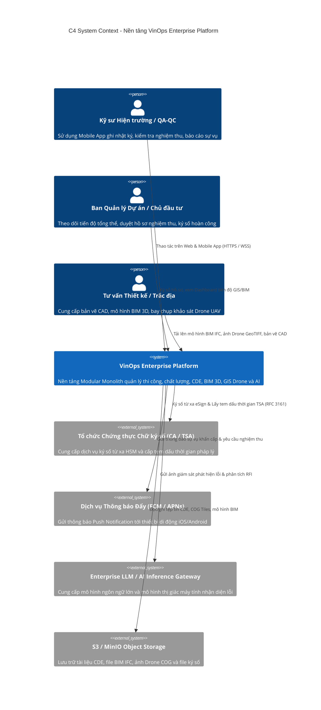
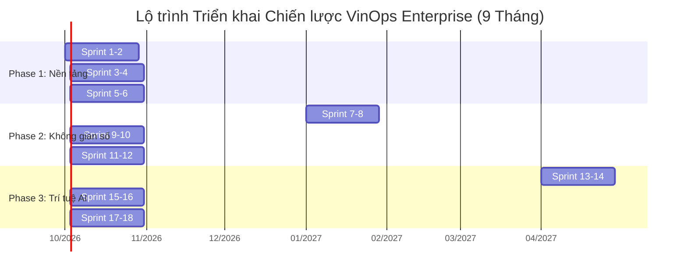

# Kế hoạch Chiến lược Mở rộng Enterprise VinOps - Lộ trình 3 Giai đoạn (9 Tháng)

- Tài liệu: `docs/roadmap/ENTERPRISE_STRATEGIC_EXPANSION_PLAN.md`
- Trạng thái: `APPROVED_FOR_EXECUTION`
- Phiên bản: 1.0.0
- Ngày hiệu lực: 2026-09-07
- Chủ trì kỹ thuật: Principal Enterprise Architect & Head of Engineering

---

## 1. Executive Summary / Tổng quan Kiến trúc Hệ thống Mục tiêu

### 1.1. Bối cảnh Hiện tại (Current State Baseline)

VinOps được thiết kế và vận hành theo mô hình **Modular Monolith** vững chắc:

- **apps/api** (NestJS): REST API gateway, authentication, RBAC, tenant isolation qua PostgreSQL Row Level Security (RLS).
- **apps/worker** (Node.js): Tiến trình nền tiêu thụ hàng đợi transactional outbox (`vinops.outbox_events`).
- **apps/web** (React + Capacitor): Ứng dụng web đáp ứng đa thiết bị (Web & Mobile PWA) với cơ chế offline-sync SQLite/IndexedDB.
- **packages/database**: Hệ thống SQL migrations thủ công, không ORM, kiểm soát nghiêm ngặt qua SHA-256 checksums, schema `vinops`.
- **Nghiệp vụ cốt lõi hiện hữu:** Quản lý Hồ sơ chất lượng theo Nghị định 207/2026/NĐ-CP & Thông tư 32/2026/TT-BXD, Nhật ký thi công điện tử (Daily Logs), Nghiệm thu công việc (Acceptance Records), Quản lý sai lỗi (Field Issues), Quản lý tài liệu dự án CDE theo chuẩn ISO 19650.

### 1.2. Mục tiêu Kiến trúc Mở rộng Enterprise (Target State)

Chuyển đổi VinOps từ nền tảng quản lý tài liệu và nhật ký hiện trường thành **Nền tảng Quản trị Vận hành Dự án Xây dựng Toàn diện (Construction-Tech Enterprise Platform)** thế hệ mới:

1. **Không gian số (Spatial & BIM):** Xem mô hình thông tin công trình BIM 3D (IFC/BCF) trực tiếp trên Web/Mobile, tích hợp bản đồ trắc địa GIS công trình và lớp phủ không ảnh Drone UAV trực giao (Cloud-Optimized GeoTIFF - COG).
2. **Hạ tầng Thời gian thực (Realtime Core):** WebSocket Gateway kết nối 10.000+ kỹ sư hiện trường đồng thời, nhận thông báo đẩy tức thì và phối hợp kiểm tra nghiệm thu trực tuyến.
3. **Pháp lý Số Toàn vẹn (Legal PKI):** Ký số từ xa (Remote Signing), dấu thời gian pháp lý TSA (RFC 3161), đóng dấu niêm phong điện tử bộ hồ sơ hoàn công theo chuẩn Luật Giao dịch điện tử số 20/2023/QH15.
4. **Trí tuệ Nhân tạo & Thị giác Máy tính (AI & Computer Vision):** Tự động phát hiện lỗi chất lượng (nứt bê tông, rỗ mặt, lộ cốt thép, thiếu bảo hộ lao động PPE) từ camera hiện trường; Trợ lý ảo AI Copilot tra cứu quy chuẩn kỹ thuật và soạn thảo RFI tự động.

---

### 1.3. Sơ đồ C4 System Context Diagram (Ngữ cảnh Hệ thống)



---

### 1.4. Sơ đồ C4 Container Diagram (Các Khối Thành phần Kiến trúc)

```mermaid
C4Container
    title C4 Container - Cấu trúc Kỹ thuật Nền tảng VinOps

    Person(user, "Người dùng VinOps", "Kỹ sư, Trưởng ban, Tư vấn, Nhà thầu")

    Container(web_app, "Web & Mobile PWA", "React 19, Vite, Capacitor, MapLibre GL JS, Three.js / Web-IFC", "Giao diện người dùng đa nền tảng, hỗ trợ offline ledger")

    Container_Boundary(vinops_backend, "VinOps Backend Services")
        Container(api_gateway, "API Gateway / Core App", "NestJS, Node.js 22", "REST API, Authentication, Tenant RBAC, RLS context, WebSocket Gateway")
        Container(redis_broker, "Redis Cluster", "Redis 7.4", "Pub/Sub message broker cho WebSocket clustering, Cache, Rate limiting")
        Container(worker_engine, "Outbox & Processing Worker", "Node.js 22, GDAL 3.9, Web-IFC", "Tiến trình nền xử lý Outbox, chuyển đổi COG Orthophoto, phân rã mô hình BIM")
        Container(ai_service, "AI Inference Micro-worker", "Python 3.11, FastAPI, ONNX Runtime, PyTorch", "Dịch vụ thị giác máy tính phát hiện nứt/PPE, trích xuất văn bản RAG")
    Container_Boundary_End()

    ContainerDb(postgres_db, "PostgreSQL Database", "PostgreSQL 16, pg driver", "Lưu trữ quan hệ, schema vinops, Row Level Security, transactional outbox")
    ContainerDb(minio_storage, "Object Storage", "MinIO / Cloudflare R2 / AWS S3", "Lưu trữ tài liệu CDE, tệp tin BIM, COG Orthophotos, Dossier PDFs")

    Rel(user, web_app, "Tương tác giao diện", "HTTPS")
    Rel(web_app, api_gateway, "Gọi REST APIs", "JSON / HTTPS")
    Rel(web_app, api_gateway, "Đăng ký nhận sự kiện realtime", "WSS (WebSocket)")
    Rel(web_app, minio_storage, "Đọc COG GeoTIFF tiles & tải tài liệu", "HTTP Range Requests / S3 Presigned URLs")

    Rel(api_gateway, postgres_db, "Truy vấn & Giao dịch nghiệp vụ (SET LOCAL ROLE vinops_app)", "TCP / SQL")
    Rel(api_gateway, redis_broker, "Publish sự kiện realtime ra Redis Channels", "TCP / RESP")
    Rel(api_gateway, redis_broker, "Subscribe WebSocket rooms", "TCP / RESP")

    Rel(worker_engine, postgres_db, "Claim & Mark Outbox events (ROLE vinops_worker)", "TCP / SQL")
    Rel(worker_engine, minio_storage, "Đọc file gốc GeoTIFF/IFC, ghi file COG/BIM-Geometry", "S3 API")
    Rel(worker_engine, ai_service, "Gửi hình ảnh nghiệm thu yêu cầu suy luận thị giác", "gRPC / HTTP")

    Rel(ai_service, minio_storage, "Tải ảnh hiện trường & lưu trữ heatmaps", "S3 API")
```

---

## 2. Phân kỳ Lộ trình 3 Giai đoạn (3-Phase Roadmap - 9 Tháng)



---

### GIAI ĐOẠN 1 (Tháng 1 - Tháng 3): Hạ tầng Nền tảng - Realtime & Legal PKI

Tập trung thiết lập kênh giao tiếp tức thì cho công trường và giá trị pháp lý tuyệt đối cho dữ liệu nghiệm thu số.

- **Quy mô đội ngũ:** 2 Backend Engineers, 1 Mobile/PWA Engineer, 1 DevOps Engineer.
- **Mục tiêu chính:** Đáp ứng yêu cầu chuyển đổi số toàn diện theo Nghị định 207/2026/NĐ-CP và Luật Giao dịch điện tử số 20/2023/QH15.

#### Sprint 1 (Tuần 1-2): Kiến trúc WebSocket Gateway & Redis Adapter

- **Nhiệm vụ:**
  - Tích hợp `@nestjs/websockets` và `@socket.io/redis-adapter` vào `apps/api`.
  - Thiết lập kênh chứng thực WebSocket qua token xác thực truy cập hiện có của VinOps.
  - Phân vùng Room theo ngữ cảnh: `project:{projectId}`, `inspection:{inspectionId}`, `issue:{issueId}`.
- **Deliverables:** Kết nối WSS ổn định, heartbeat ping/pong, kiểm thử tải 5.000 socket connections đồng thời trên môi trường staging.

#### Sprint 2 (Tuần 3-4): Đồng bộ Trạng thái Thời gian thực & In-app Presence

- **Nhiệm vụ:**
  - Định nghĩa bộ sự kiện chuẩn: `INSPECTION_STATUS_CHANGED`, `DAILY_LOG_SUBMITTED`, `FIELD_ISSUE_ASSIGNED`.
  - Xây dựng giao diện Client React cập nhật Realtime Toast và thanh chỉ báo người đang cùng xem biên bản (User Presence indicator).
- **Deliverables:** Kiểm thử E2E: Khi kỹ sư A cập nhật kết quả kiểm tra trên Mobile, màn hình kỹ sư B và Trưởng ban lập tức nhảy trạng thái không cần F5.

#### Sprint 3 (Tuần 5-6): Hạ tầng Thông báo Đẩy Tập trung (FCM / APNs)

- **Nhiệm vụ:**
  - Thiết lập bảng cơ sở dữ liệu `vinops.user_device_tokens` hỗ trợ đa thiết bị trên mỗi tài khoản.
  - Xây dựng dịch vụ Push Notification trung tâm, điều phối qua Firebase Cloud Messaging (FCM HTTP v1) và Apple Push Notification service (APNs qua HTTP/2).
- **Deliverables:** Thông báo gửi tới điện thoại kỹ sư chỉ trong vòng < 500ms kể từ khi phát sinh lỗi vi phạm an toàn lao động mức Critical.

#### Sprint 4 (Tuần 7-8): Cơ chế Offline Queuing & Thông báo Dự phòng

- **Nhiệm vụ:**
  - Xây dựng hàng đợi thông báo trên Worker phòng khi mất kết nối mạng.
  - Logic gộp thông báo (Notification batching/throttling) để tránh spam người dùng khi có nhiều cập nhật liên tiếp.
- **Deliverables:** Kiểm thử rớt mạng trên thiết bị di động, tự động nhận bù thông báo khi có kết nối trở lại.

#### Sprint 5 (Tuần 9-10): Tích hợp Ký số Từ xa HSM (Remote Signing PKI - ADR-015)

- **Nhiệm vụ:**
  - Xây dựng Migration `017_pki_digital_signatures.sql` (bảng `digital_certificates`, `document_signatures`).
  - Tích hợp API chuẩn Cloud Signature Consortium (CSC API) với nhà cung cấp chứng thư số quốc gia (VNPT SmartCA, Viettel CA).
  - Quy trình xác thực ký: Ký số không làm lộ khóa bí mật người dùng, hash dữ liệu PDF SHA-256 được gửi lên HSM ký và trả về chữ ký CAdES/PAdES-B-LT.
- **Deliverables:** Ký số thành công biên bản nghiệm thu công việc xây dựng, chữ ký hợp lệ khi mở trên Adobe Acrobat Reader (hiển thị tick xanh).

#### Sprint 6 (Tuần 11-12): Đóng dấu Thời gian TSA & Niêm phong Hồ sơ Hoàn công

- **Nhiệm vụ:**
  - Tích hợp chuẩn RFC 3161 Time-Stamp Protocol với Timestamp Authority (TSA) nhà nước.
  - Đóng gói toàn bộ tập hợp hồ sơ nghiệm thu, nhật ký, bản vẽ hoàn công thành một file nén PDF/A-1b có kèm chứng thư số niêm phong điện tử của Chủ đầu tư (Electronic Dossier Sealing).
- **Deliverables:** Xuất bộ hồ sơ nghiệm thu hoàn chỉnh có dấu thời gian không thể chối bỏ, sẵn sàng nộp cơ quan chuyên môn về xây dựng thẩm tra.

---

### GIAI ĐOẠN 2 (Tháng 4 - Tháng 6): Không gian Số - BIM 3D & GIS Drone

Đưa toàn bộ dữ liệu hiện trường và mô hình thiết kế vào không gian số tọa độ thực tế.

- **Quy mô đội ngũ:** 2 Backend Engineers, 2 Frontend/3D Engineers, 1 DevOps Engineer.

#### Sprint 7 (Tuần 13-14): Pipeline Xử lý Mô hình BIM IFC trên Worker (ADR-013)

- **Nhiệm vụ:**
  - Xây dựng Migration `018_bim_spatial_models.sql`.
  - Tích hợp `web-ifc` vào tiến trình nền `apps/worker`: Đọc file IFC dung lượng 200MB - 1GB, bóc tách cây cấu trúc không gian (Spatial Hierarchy: Site -> Building -> Storey -> Space -> Element).
  - Tối ưu chuyển đổi hình học sang định dạng binary glTF/draco hoặc custom binary format nén nhỏ 85%.
- **Deliverables:** Xử lý file IFC 500MB trong thời gian < 90 giây trên Worker node 4 CPU / 8GB RAM.

#### Sprint 8 (Tuần 15-16): Trình xem BIM 3D Trọng lượng nhẹ trên Web & Mobile

- **Nhiệm vụ:**
  - Xây dựng module `@vinops/bim-viewer` sử dụng Three.js và WebGL 2.0.
  - Hỗ trợ cắt mặt phẳng (section planes), đo khoảng cách 3D, bóc tách cấu kiện (ghost/isolate/hide).
  - Tích hợp viewport trực quan trên trình duyệt di động mà không gây giật lag FPS (duy trì tối thiểu 30 FPS trên iPad và điện thoại).
- **Deliverables:** Kỹ sư hiện trường chạm vào cây cột bê tông 3D trên màn hình, xem được ngay mã cấu kiện, mác bê tông và ngày nghiệm thu.

#### Sprint 9 (Tuần 17-18): Phối hợp Sự vụ BIM theo Chuẩn BCF (BIM Collaboration Format)

- **Nhiệm vụ:**
  - Hỗ trợ chuẩn BCF 2.1 / 3.0 (bảng `bim_viewpoints`, `bcf_topics`, `bcf_comments`).
  - Gắn liên kết trực tiếp giữa Sự vụ Hiện trường (`field_issues`) và tọa độ camera 3D kèm viewpoint GUID của cấu kiện trong mô hình.
- **Deliverables:** Xuất/nhập file BCF-ZIP đồng bộ với Autodesk Revit, Navisworks và Solibri.

#### Sprint 10 (Tuần 19-20): Bản đồ GIS Công trình & Chuyển đổi VN-2000 (ADR-017)

- **Nhiệm vụ:**
  - Triển khai Migration `019_gis_drone_orthophoto.sql`.
  - Tích hợp MapLibre GL JS vào Web App.
  - Cấu hình bảng tham số chuyển đổi 7 thông số VN-2000 qua Proj4js cho 63 tỉnh thành Việt Nam.
- **Deliverables:** Nhập tọa độ mốc khống chế trắc địa (X, Y) VN-2000, hiển thị chính xác sai số < 5 cm trên ảnh vệ tinh nền MapLibre.

#### Sprint 11 (Tuần 21-22): Pipeline Ảnh Drone Trực giao Cloud-Optimized GeoTIFF (COG)

- **Nhiệm vụ:**
  - Đóng gói container GDAL 3.9+ cho Worker xử lý ảnh Drone GeoTIFF 5-10 GB.
  - Pipeline tự động: Reproject sang Web Mercator EPSG:3857, sinh overview pyramids r2, r4, r8, r16, sinh file COG với nén Deflate.
  - Viết endpoint HTTP Range Request tile gateway trên API.
- **Deliverables:** Tải và duyệt siêu tốc ảnh Drone diện tích 100 ha ở độ phân giải 2 cm/pixel chỉ mất < 200ms tải mỗi tile.

#### Sprint 12 (Tuần 23-24): So sánh Đối soát Tiến độ Thời gian (Swipe / Time-lapse) & Chồng lớp CAD

- **Nhiệm vụ:**
  - Tích hợp MapLibre Compare slider: So sánh ảnh chụp Drone giữa các mốc thời gian.
  - Chuyển đổi bản vẽ thiết kế AutoCAD DXF sang lớp phủ GIS GeoJSON hiển thị đè lên ảnh Drone thực tế.
- **Deliverables:** PMU nhìn thấy rõ độ lệch tim móng và ranh giới đào đất giữa bản vẽ thiết kế và ảnh bay chụp UAV thực địa.

---

### GIAI ĐOẠN 3 (Tháng 7 - Tháng 9): Trí tuệ - AI/Computer Vision & RFI Copilot

Ứng dụng trí tuệ nhân tạo giảm thiểu lao động thủ công và nâng cao kiểm soát an toàn chất lượng.

- **Quy mô đội ngũ:** 1 Machine Learning Engineer, 2 Backend Engineers, 1 Frontend Engineer, 1 Construction Domain Expert.

#### Sprint 13 (Tuần 25-26): Pipeline Thu thập & Gán nhãn Dữ liệu Thị giác Công trường

- **Nhiệm vụ:**
  - Thiết lập quy trình thu thập ảnh hiện trường từ module `vinops.inspections` và `vinops.daily_logs`.
  - Xây dựng công cụ gán nhãn chuyên ngành: Nứt kết cấu (Crack), Rỗ bê tông (Honeycombing), Lộ cốt thép (Exposed Rebar), Thiếu mũ bảo hộ / Áo phản quang (PPE violation).
- **Deliverables:** Tập dữ liệu huấn luyện chuẩn gồm 30.000 ảnh công trường xây dựng Việt Nam.

#### Sprint 14 (Tuần 27-28): Đóng gói & Tích hợp Mô hình Computer Vision Inference

- **Nhiệm vụ:**
  - Fine-tune mô hình YOLOv10/YOLOv11 trên tập dữ liệu công trường.
  - Đóng gói microservice suy luận bằng Python FastAPI + ONNX Runtime tối ưu hóa cho CPU/GPU.
  - Worker tự động gửi ảnh chụp nghiệm thu qua dịch vụ AI, sinh heatmap và hộp bao (bounding boxes) lỗi.
- **Deliverables:** Tự động phát hiện lỗi với độ chính xác mAP@50 > 88%, thời gian suy luận < 300ms/ảnh.

#### Sprint 15 (Tuần 29-30): Hệ thống Trích xuất & Vector Embeddings CDE (RAG Database)

- **Nhiệm vụ:**
  - Xây dựng pipeline bóc tách tài liệu CDE: Tiêu chuẩn Việt Nam (TCVN), Quy chuẩn Xây dựng (QCVN), Chỉ dẫn kỹ thuật dự án (Specs) định dạng PDF/DOCX.
  - Băm nhỏ văn bản (semantic chunking) và tạo vector embeddings (sử dụng mô hình multilingual như `text-embedding-3-small` hoặc `bge-m3`).
  - Lưu trữ và đánh chỉ mục vector HNSW trên PostgreSQL (pgvector).
- **Deliverables:** Tìm kiếm ngữ nghĩa tài liệu kỹ thuật dự án với thời gian phản hồi < 150ms.

#### Sprint 16 (Tuần 31-32): Trợ lý AI Copilot Tra cứu Quy chuẩn Kỹ thuật

- **Nhiệm vụ:**
  - Tích hợp LLM (Claude 3.5 Sonnet / GPT-4o) thông qua API Gateway an toàn.
  - Prompt Engineering chuyên sâu kết hợp RAG: Trả lời các thắc mắc kỹ thuật của kỹ sư dựa trên tài liệu pháp lý và hồ sơ thiết kế cụ thể của dự án (kèm trích dẫn điều khoản chính xác).
- **Deliverables:** Kỹ sư hỏi: "Độ sụt bê tông dầm sàn B30 theo chỉ dẫn gói thầu XL-02 là bao nhiêu?", AI trích xuất chính xác trang và bảng trong Specs dự án.

#### Sprint 17 (Tuần 33-34): Tự động Soạn thảo & Thẩm tra Yêu cầu Thông tin (RFI Copilot)

- **Nhiệm vụ:**
  - Tự động sinh nội dung phiếu RFI khi phát hiện xung đột giữa bản vẽ CAD/BIM và thực tế hiện trường.
  - Gợi ý giải pháp xử lý kỹ thuật kèm trích dẫn điều khoản hợp đồng FIDIC / mẫu hợp đồng Bộ Xây dựng.
- **Deliverables:** Giảm 70% thời gian soạn thảo một phiếu RFI kỹ thuật cho nhà thầu.

#### Sprint 18 (Tuần 35-36): Đánh giá Tổng thể, Tối ưu Hiệu năng & Bàn giao Enterprise Ready

- **Nhiệm vụ:**
  - Kiểm thử tải toàn hệ thống (Stress test / Soak test) với 100 dự án hoạt động cùng lúc.
  - Đánh giá tuân thủ an toàn thông tin theo ISO 27001 và quy chế bảo vệ dữ liệu.
  - Hoàn thiện tài liệu vận hành và bàn giao cho khách hàng Enterprise.
- **Deliverables:** Báo cáo nghiệm thu kỹ thuật toàn bộ 3 giai đoạn đạt 100% tiêu chí chấp thuận.

---

## 3. Ma trận Tác động Cơ sở dữ liệu (Schema Impact Matrix)

| Migration # | Tên Migration                         | Số Bảng Mới | Số Indexes Mới |         Dự kiến Số Bản ghi (1 Năm, 100 Dự án)          | Ước tính Dung lượng DB | Đánh giá Tác động Hiệu năng & Biện pháp                                                                                                        |
| :---------- | :------------------------------------ | :---------: | :------------: | :----------------------------------------------------: | :--------------------: | :--------------------------------------------------------------------------------------------------------------------------------------------- |
| **015**     | `bim_space_model_and_spatial_linking` |   6 bảng    |   14 indexes   |      ~15.000.000 records (cấu kiện BIM elements)       |         8.5 GB         | **Trung bình:** Cần đánh index hỗn hợp `(model_id, category)` và phân vùng bảng `bim_elements` theo `project_id` nếu dự án > 100.000 cấu kiện. |
| **016**     | `realtime_websocket_presence`         |   3 bảng    |   6 indexes    |     ~50.000 records (thiết bị token, kênh kết nối)     |         120 MB         | **Thấp:** Dữ liệu sự kiện tức thời đẩy qua Redis Pub/Sub, chỉ lưu trữ session và device tokens trên DB.                                        |
| **017**     | `pki_digital_signatures`              |   4 bảng    |   10 indexes   | ~500.000 records (lượt ký số biên bản & dấu thời gian) |         2.1 GB         | **Rất thấp:** Chủ yếu lưu chuỗi băm Base64 và Metadata chữ ký, không lưu file PDF trực tiếp trong DB.                                          |
| **018**     | `ai_inspection_defects`               |   5 bảng    |   12 indexes   | ~2.000.000 records (hộp bao phát hiện lỗi, độ tin cậy) |         3.2 GB         | **Thấp:** Vector embeddings được lưu bằng kiểu dữ liệu vector tối ưu của pgvector, kèm chỉ mục HNSW.                                           |
| **019**     | `gis_drone_orthophoto`                |   6 bảng    |   15 indexes   | ~200.000 records (chuyến bay, phân lớp, mốc trắc địa)  |         850 MB         | **Thấp:** Tệp ảnh COG nặng 2-10GB lưu trên Object Storage S3; DB chỉ lưu GeoJSON metadata và Bounding Box.                                     |

---

## 4. Ước lượng Tải Hạ tầng (Capacity & Sizing Sizing Analysis)

```
+-------------------------------------------------------------------------------+
|                      ƯỚC TÍNH TÀI NGUYÊN CHO 100 DỰ ÁN ENTERPRISE             |
|                               (Quy mô: 1 Năm Vận hành)                        |
+------------------------------------+------------------------------------------+
| HẠ TẦNG / TÀI NGUYÊN               | CẤU HÌNH ĐỀ XUẤT & DUNG LƯỢNG MỤC TIÊU   |
+------------------------------------+------------------------------------------+
| PostgreSQL Database (Primary/Repl) | 8 vCPU, 32 GB RAM, 500 GB NVMe Storage   |
| Connection Pool (PgBouncer)        | Max Connections: 1,500; Pool Size: 120   |
| Redis Cluster (Realtime Pub/Sub)   | 3 Nodes x (2 vCPU, 8 GB RAM)             |
| Object Storage (S3 / MinIO)        | 45 TB Dung lượng (BIM, Drone COG, PDFs)  |
| Worker Nodes (BIM + GDAL GIS)      | 4 Nodes x (8 vCPU, 16 GB RAM, 100GB SSD) |
| AI Inference Worker (GPU Node)     | 2 Nodes x (4 vCPU, 16 GB RAM, 1x RTX4090)|
| Băng thông Mạng (Egress Bandwidth) | Đỉnh điểm: 850 Mbps; Trung bình: 120 Mbps|
+------------------------------------+------------------------------------------+
```

### 4.1. Cơ sở Dữ liệu PostgreSQL

- **Connection Pool Sizing:**
  - 100 dự án hoạt động, trung bình 20 kỹ sư online mỗi dự án = 2.000 người dùng đồng thời.
  - Sử dụng PgBouncer ở chế độ Transaction Pooling: duy trì pool 120 active connections tới PostgreSQL engine để tránh lãng phí RAM và overhead tiến trình.
- **Tăng trưởng Lưu trữ DB:** ~15 GB/năm cho dữ liệu bảng thuần túy.

### 4.2. Redis Cluster (Realtime & Pub/Sub)

- **RAM Sizing:** Dự kiến lưu trữ 10.000 active WebSocket socket descriptors, presence maps và rate-limiting buckets: tiêu tốn ~2.5 GB RAM. Cấu hình cluster 3 nodes 8 GB RAM đảm bảo dự phòng N+1.

### 4.3. Object Storage (S3 / MinIO)

- **Mô hình BIM (IFC + glTF):** 100 dự án x 15 công trình x 250 MB = 375 GB.
- **Ảnh Trực giao Drone UAV (Raw + COG):** 100 dự án x 24 đợt bay/năm x 15 GB/đợt = 36 TB. Áp dụng S3 Lifecycle đẩy raw sang Cold Storage sau 30 ngày.
- **Hồ sơ Nghiệm thu Ký số PDF/A:** 100 dự án x 5.000 biên bản x 3 MB = 1.5 TB.

### 4.4. Đội ngũ Worker Nodes

- **BIM Parser:** Cần CPU mạnh (xử lý đơn luồng bóc tách IFC geometry). Cấu hình 8 vCPU để chạy 4-6 jobs phân rã song song.
- **GDAL COG Pipeline:** Tốn tài nguyên RAM và I/O khi chạy `gdalwarp` nội suy ảnh 5-10GB. Worker cần tối thiểu 16 GB RAM và ổ đĩa đệm scratch SSD NVMe 100 GB.
- **AI Inference:** Triển khai GPU Worker chuyên dụng (NVIDIA T4 hoặc RTX 4090) chạy mô hình thị giác máy tính phát hiện khuyết tật hiện trường theo mẻ (batching).

---

## 5. Kế hoạch Quản trị Rủi ro Kỹ thuật (Technical Risk Matrix)

|  Risk ID   | Danh mục Rủi ro               | Mô tả Chi tiết Rủi ro                                                                                                                                                     |  Xác suất (P)  |   Tác động (I)   | Chiến lược Giảm thiểu (Mitigation Strategy)                                                                                                                                                                                                                                                                                                                                  | Chủ trì (Owner)               |    Trạng thái     |
| :--------: | :---------------------------- | :------------------------------------------------------------------------------------------------------------------------------------------------------------------------ | :------------: | :--------------: | :--------------------------------------------------------------------------------------------------------------------------------------------------------------------------------------------------------------------------------------------------------------------------------------------------------------------------------------------------------------------------- | :---------------------------- | :---------------: |
| **RSK-01** | Mobile Performance            | Thiết bị di động hiện trường (iPhone cũ, Android tầm trung) bị treo đơ hoặc sập trình duyệt do tràn RAM khi hiển thị mô hình BIM 3D lớn hoặc phân lớp Drone.              |    **Cao**     | **Nghiêm trọng** | 1. Giới hạn số lượng đa giác render (Mesh LOD - Level of Detail).<br/>2. Áp dụng Frustum Culling không render cấu kiện ngoài vùng nhìn.<br/>3. Đặt ngưỡng bộ nhớ WebGL: Tự động chuyển sang chế độ Wireframe 2D nếu RAM thiết bị < 3 GB.                                                                                                                                     | Lead Frontend / 3D            |      `OPEN`       |
| **RSK-02** | Legal PKI Compliance          | Chữ ký số từ xa hoặc con dấu thời gian bị các cơ quan thanh tra xây dựng từ chối do không tuân thủ chặt chẽ định dạng theo Nghị định 130/2018/NĐ-CP và TT 32/2026/TT-BXD. |    **Thấp**    | **Nghiêm trọng** | 1. Chỉ tích hợp với các nhà cung cấp chứng thư số quốc gia được Bộ Thông tin & Truyền thông cấp phép (VNPT-CA, Viettel-CA).<br/>2. Đảm bảo chuẩn PAdES-LTV (Long Term Validation) nhúng kèm đầy đủ chứng chỉ gốc (Root CA) và bằng chứng kiểm tra chứng chỉ còn hiệu lực (OCSP/CRL).                                                                                         | Solution Architect & Pháp chế |    `MONITORED`    |
| **RSK-03** | Geodetic Accuracy             | Sai lệch tọa độ VN-2000 và WGS84 do cấu hình sai kinh tuyến trục địa phương hoặc thông số dời trục 7 tham số, dẫn đến định vị sai mốc thi công.                           | **Trung bình** |     **Cao**      | 1. Khóa cứng cấu hình kinh tuyến trục theo tỉnh thành trong DB.<br/>2. Bắt buộc nhập 3 điểm mốc khống chế kiểm chứng (Control Stakes) để tự động đối soát sai số trước khi duyệt chuyến bay Drone.<br/>3. Giới hạn cảnh báo nếu sai lệch > 5 cm.                                                                                                                             | Geomatics Lead                |      `OPEN`       |
| **RSK-04** | AI Liability & Hallucination  | Trí tuệ nhân tạo phát hiện sót lỗi nứt bê tông nguy hiểm hoặc AI Copilot trích dẫn sai tiêu chuẩn kỹ thuật dẫn đến sự cố công trình.                                      | **Trung bình** | **Nghiêm trọng** | 1. Quy định rõ ràng trong SLA: AI chỉ đóng vai trò Trợ lý khuyến nghị (Advisory), không có quyền tự động phê duyệt biên bản.<br/>2. Mọi kết quả phát hiện lỗi đều bắt buộc phải qua bước ký xác nhận của Kỹ sư QA/QC người thật.<br/>3. Thiết lập chế độ RAG nghiêm ngặt: Nếu độ tương đồng văn bản < 80%, AI bắt buộc trả lời "Không tìm thấy căn cứ trong tài liệu dự án". | AI/ML Lead                    |      `OPEN`       |
| **RSK-05** | Redis Single Point of Failure | Cụm Redis gặp sự cố dẫn đến mất toàn bộ kênh kết nối WebSocket và ngưng trệ thông báo thời gian thực toàn hệ thống.                                                       |    **Thấp**    |     **Cao**      | 1. Triển khai Redis Sentinel hoặc AWS ElastiCache Multi-AZ với cơ chế tự động chuyển vùng (auto-failover).<br/>2. Thiết kế API Fallback: Nếu WebSocket đứt kết nối, Client tự động chuyển về cơ chế HTTP Long-polling với chu kỳ 10 giây.                                                                                                                                    | DevOps Lead                   | `RESOLVED_DESIGN` |
| **RSK-06** | CA Provider Downtime          | Dịch vụ HSM/API của nhà mạng viễn thông (VNPT/Viettel) bảo trì hoặc chập chờn, khiến kỹ sư không thể ký nghiệm thu công việc tại công trường.                             | **Trung bình** |     **Cao**      | 1. Thiết lập hàng đợi ký bất đồng bộ (Asynchronous Signing Queue).<br/>2. Kỹ sư xác nhận lệnh ký tại hiện trường; hệ thống tự động thử lại (retry with exponential backoff) khi API CA hoạt động trở lại và gửi thông báo xác nhận thành công.                                                                                                                               | Lead Backend                  |      `OPEN`       |
| **RSK-07** | GDAL Worker Bottleneck        | Hàng loạt nhà thầu tải lên nhiều file Drone GeoTIFF 10GB cùng một thời điểm gây nghẽn toàn bộ hàng đợi Worker và cạn kiệt đĩa cứng đệm.                                   | **Trung bình** |  **Trung bình**  | 1. Tách biệt hoàn toàn `worker-gis` độc lập với worker xử lý nghiệp vụ thông thường.<br/>2. Áp dụng cơ chế giới hạn dung lượng hàng đợi (Queue concurrency throttling = 2 jobs đồng thời).<br/>3. Tự động dọn dẹp scratch volume sau mỗi lần render.                                                                                                                         | DevOps Lead                   |      `OPEN`       |
| **RSK-08** | CDE Concurrent Edits          | Nhiều bên cùng thao tác chỉnh sửa tài liệu hoặc biên bản nghiệm thu cùng thời điểm dẫn đến ghi đè mất dữ liệu.                                                            |    **Cao**     |  **Trung bình**  | 1. Kiểm soát khóa lạc quan nghiêm ngặt bằng cột `version bigint` trên mọi bảng nghiệp vụ.<br/>2. Áp dụng cơ chế WebSocket Document Locking: Thông báo cho các người dùng khác khi có người đang mở chế độ chỉnh sửa.                                                                                                                                                         | Lead Backend                  | `RESOLVED_DESIGN` |

---

## 6. Micro-task Breakdown cho Flash Agent

Dưới đây là danh sách phân rã nhiệm vụ nguyên tử (Atomic Micro-tasks) cho các Flash-tier Agent thực thi độc lập.

---

### 6.1. ADR-013 Micro-tasks (Mô hình BIM 3D & BCF)

1. **[S] ADR013-DB-01: Tạo migration file `015_bim_space_model_and_spatial_linking.sql`**
   - _Input:_ DDL đặc tả bảng `vinops.bim_models` và `vinops.bim_elements`.
   - _Output:_ File migration SQL chuẩn tại `packages/database/migrations/015_bim_space_model_and_spatial_linking.sql`.
   - _Tiêu chuẩn:_ Chạy thành công qua migration runner, vượt qua typecheck, đầy đủ triggers version & prevent_delete.

2. **[S] ADR013-DB-02: Bổ sung bảng `vinops.bim_viewpoints` và `vinops.bcf_topics`**
   - _Input:_ DDL BCF 2.1 mapping với `vinops.field_issues`.
   - _Output:_ Cập nhật DDL vào migration 015.
   - _Tiêu chuẩn:_ RLS policy cách ly tenant chuẩn, foreign keys liên kết bảng `vinops.field_issues`.

3. **[M] ADR013-DOM-03: Xây dựng State Machine chuyển đổi trạng thái BIM Model**
   - _Input:_ Trạng thái `uploaded` -> `processing` -> `ready` | `failed`.
   - _Output:_ File `packages/domain/src/bim/bim-model-state-machine.ts`.
   - _Tiêu chuẩn:_ Hàm thuần túy (pure function), không phụ thuộc framework, độ bao phủ Unit Test 100%.

4. **[M] ADR013-DOM-04: Xây dựng Schema Validation cho BCF Viewpoint JSON**
   - _Input:_ Cấu trúc camera position, target, component selection, clipping planes.
   - _Output:_ File `packages/domain/src/bim/bcf-viewpoint-schema.ts` (sử dụng Zod).
   - _Tiêu chuẩn:_ Validate chính xác tọa độ 3D vector và component GUIDs.

5. **[M] ADR013-API-05: Viết DTO và Contracts cho API Quản lý Mô hình BIM**
   - _Input:_ Đặc tả API upload model, list models, get element metadata.
   - _Output:_ File `packages/contracts/src/bim/bim.contract.ts`.
   - _Tiêu chuẩn:_ Đầy đủ TypeScript types và OpenAPI decorators.

6. **[L] ADR013-WRK-06: Tích hợp Web-IFC Parser vào Worker Job**
   - _Input:_ Job data `{ modelId, sourceFileId, projectId }` từ Outbox.
   - _Output:_ File `apps/worker/src/jobs/process-bim-model.job.ts`.
   - _Tiêu chuẩn:_ Đọc file IFC từ MinIO qua stream, trích xuất cấu trúc tầng/cấu kiện, sinh file nhị phân glTF.

7. **[M] ADR013-WRK-07: Viết logic bóc tách thuộc tính IFC Property Sets (Psets)**
   - _Input:_ Thực thể IFC (IfcWall, IfcBeam, IfcColumn) trong Web-IFC.
   - _Output:_ Hàm trích xuất thuộc tính chuẩn sang dạng JSONB.
   - _Tiêu chuẩn:_ Bóc tách chính xác mác bê tông, chiều dài, diện tích, thể tích.

8. **[M] ADR013-API-08: Xây dựng `BimModelController` trong `apps/api`**
   - _Input:_ Endpoint `POST /projects/:projectId/bim/models` và `GET /projects/:projectId/bim/models/:id`.
   - _Output:_ Controller & Service trong module `apps/api/src/modules/bim/`.
   - _Tiêu chuẩn:_ RLS actor context được thiết lập đúng, trả về mã HTTP chuẩn.

9. **[M] ADR013-API-09: Xây dựng API Đồng bộ BCF Issue Viewpoints**
   - _Input:_ Endpoint `POST /projects/:projectId/bim/models/:id/bcf-topics`.
   - _Output:_ Endpoint lưu viewpoint và tự động liên kết với `field_issues`.
   - _Tiêu chuẩn:_ Ghi audit event và outbox event khi có sự vụ BIM mới.

10. **[L] ADR013-WEB-10: Xây dựng React Hook `useBimViewer` tích hợp Three.js**
    - _Input:_ Canvas DOM element, model glTF URL.
    - _Output:_ Hook quản lý nạp mô hình, camera controls, raycasting chọn vật thể tại `apps/web/src/features/bim/use-bim-viewer.ts`.
    - _Tiêu chuẩn:_ Tải mô hình bất đồng bộ, hiển thị loading indicator, đạt 60 FPS trên máy tính thông thường.

11. **[M] ADR013-WEB-11: Xây dựng Component Hiển thị Thuộc tính Cấu kiện (Property Panel)**
    - _Input:_ Dữ liệu IFC Property Sets từ cấu kiện được bấm chọn.
    - _Output:_ Component `apps/web/src/features/bim/BimPropertyPanel.tsx`.
    - _Tiêu chuẩn:_ Trình bày dạng bảng nhóm theo Pset, hỗ trợ tìm kiếm nhanh thuộc tính.

12. **[M] ADR013-WEB-12: Xây dựng Công cụ Đo đạc 3D Hiện trường (Measurement Tool)**
    - _Input:_ Tọa độ 2 điểm raycast trên bề mặt 3D.
    - _Output:_ Hiển thị đường gióng khoảng cách và số đo kích thước (mét) trên viewport.
    - _Tiêu chuẩn:_ Sai số đo đạc trên giao diện < 1mm theo tỷ lệ mô hình.

13. **[S] ADR013-TST-13: Viết Unit Tests cho Web-IFC Worker Parser**
    - _Input:_ File mẫu IFC nhỏ `sample-cube.ifc`.
    - _Output:_ Test suite `apps/worker/test/bim-parser.spec.ts`.
    - _Tiêu chuẩn:_ Kiểm tra trích xuất đúng 1 building, 1 storey, 6 faces.

14. **[M] ADR013-TST-14: Viết Integration Tests cho BIM API Endpoints**
    - _Input:_ NestJS Supertest testing module.
    - _Output:_ Test file `apps/api/test/bim.e2e-spec.ts`.
    - _Tiêu chuẩn:_ Đạt chuẩn kiểm thử RLS phân quyền đa dự án (tenant isolation).

15. **[S] ADR013-DOC-15: Viết Hướng dẫn Cấu hình Docker Worker hỗ trợ Web-IFC WebAssembly**
    - _Input:_ Dockerfile hiện tại của Worker.
    - _Output:_ File cấu hình multi-stage Dockerfile có bổ sung cấp quyền thực thi WASM memory.
    - _Tiêu chuẩn:_ Image build thành công, dung lượng tối ưu < 400 MB.

---

### 6.2. ADR-014 Micro-tasks (AI Computer Vision & RAG Copilot)

1. **[S] ADR014-DB-01: Tạo migration file `018_ai_inspection_defects.sql`**
   - _Input:_ DDL các bảng `vinops.ai_defect_detections`, `vinops.ai_copilot_conversations`.
   - _Output:_ File migration SQL tại `packages/database/migrations/018_ai_inspection_defects.sql`.
   - _Tiêu chuẩn:_ Đầy đủ khóa ngoại liên kết `inspections` và `file_objects`, RLS tenant isolation.

2. **[M] ADR014-DB-02: Kích hoạt extension `pgvector` và tạo bảng `vinops.document_chunks`**
   - _Input:_ Cột `embedding vector(1536)` cho tìm kiếm ngữ nghĩa tài liệu CDE.
   - _Output:_ Bổ sung DDL index HNSW vào migration 018.
   - _Tiêu chuẩn:_ Tạo index `USING hnsw (embedding vector_cosine_ops)`.

3. **[M] ADR014-DOM-03: Định nghĩa Mô hình Dữ liệu Phát hiện Lỗi Thị giác (Defect Schema)**
   - _Input:_ Danh mục lỗi: nứt, rỗ mặt, lộ thép, không đội mũ bảo hộ; cấu trúc bounding box `[ymin, xmin, ymax, xmax]`.
   - _Output:_ File `packages/domain/src/ai/defect-detection-types.ts`.
   - _Tiêu chuẩn:_ Hỗ trợ tính toán diện tích vết nứt và độ tin cậy confidence threshold.

4. **[M] ADR014-API-04: Xây dựng Contracts cho AI Inspection API**
   - _Input:_ Request gửi ảnh phân tích, response trả về danh sách khuyết tật.
   - _Output:_ File `packages/contracts/src/ai/ai-inspection.contract.ts`.
   - _Tiêu chuẩn:_ Khớp chuẩn RESTful của VinOps.

5. **[L] ADR014-SVC-05: Viết Dịch vụ Gọi Mô hình AI Inference trong Worker**
   - _Input:_ Job Outbox `INSPECTION_PHOTO_ATTACHED`.
   - _Output:_ File `apps/worker/src/jobs/run-cv-defect-detection.job.ts`.
   - _Tiêu chuẩn:_ Gọi gRPC/HTTP tới microservice Python, bắt timeout, ghi log lỗi an toàn.

6. **[M] ADR014-SVC-06: Xây dựng Trình Bóc tách Văn bản CDE (PDF Chunking Service)**
   - _Input:_ File tài liệu tiêu chuẩn PDF (TCVN) từ CDE.
   - _Output:_ File `apps/worker/src/services/document-chunking.service.ts`.
   - _Tiêu chuẩn:_ Cắt đoạn văn bản thông minh theo tiêu đề/mục lục, giữ nguyên ngữ cảnh ngữ nghĩa (overlap 100 từ).

7. **[M] ADR014-API-07: Xây dựng Dịch vụ Tạo Vector Embeddings**
   - _Input:_ Mảng các văn bản chunk.
   - _Output:_ Gọi Embedding API (OpenAI/Local Embedding Model) và lưu trữ vector vào DB.
   - _Tiêu chuẩn:_ Batching 50 chunks mỗi request để tối ưu thời gian mạng.

8. **[L] ADR014-API-08: Xây dựng AI Copilot Controller & Retrieval Augmented Generation (RAG)**
   - _Input:_ Câu hỏi của kỹ sư hiện trường qua endpoint `POST /projects/:projectId/ai/copilot/ask`.
   - _Output:_ Module `apps/api/src/modules/ai-copilot/`.
   - _Tiêu chuẩn:_ Thực hiện tìm kiếm vector cosine, ghép top 3 kết quả vào System Prompt, stream câu trả lời qua Server-Sent Events (SSE).

9. **[M] ADR014-API-09: Xây dựng API Xác nhận/Bác bỏ Khuyết tật do AI Phát hiện**
   - _Input:_ Kỹ sư QA/QC bấm xác nhận "Lỗi thực tế" hoặc "Báo sai (False Positive)".
   - _Output:_ Endpoint `PUT /projects/:projectId/inspections/:id/defects/:defectId/review`.
   - _Tiêu chuẩn:_ Cập nhật trạng thái và ghi nhận dữ liệu phục vụ huấn luyện cải tiến mô hình.

10. **[M] ADR014-WEB-10: Xây dựng Giao diện Hiển thị Hộp bao Lỗi (AI Defect Bounding Box Viewer)**
    - _Input:_ Ảnh chụp nghiệm thu kèm mảng bounding boxes và labels.
    - _Output:_ Component `apps/web/src/features/inspections/AiDefectImageViewer.tsx`.
    - _Tiêu chuẩn:_ Vẽ canvas đè lên ảnh, tô màu đỏ cho nứt nguy hiểm, màu vàng cho rỗ mặt, popup hiển thị % tin cậy.

11. **[M] ADR014-WEB-11: Xây dựng Khung Chat AI Copilot Hiện trường trên Mobile PWA**
    - _Input:_ Giao diện trò chuyện tương tác với LLM.
    - _Output:_ Component `apps/web/src/features/ai-copilot/ChatCopilotDrawer.tsx`.
    - _Tiêu chuẩn:_ Hỗ trợ hiển thị Markdown, khối trích dẫn điều khoản TCVN, sao chép nội dung nhanh.

12. **[S] ADR014-TST-12: Viết Unit Tests cho Logic Lọc Bounding Box NMS (Non-Maximum Suppression)**
    - _Input:_ Danh sách các hộp bao chồng lấn nhau.
    - _Output:_ Test suite `packages/domain/test/nms-filter.spec.ts`.
    - _Tiêu chuẩn:_ Loại bỏ chính xác các hộp bao trùng lặp có IoU > 0.45.

13. **[M] ADR014-TST-13: Viết Integration Tests cho RAG Vector Search**
    - _Input:_ Dữ liệu vector giả lập trong test database.
    - _Output:_ Test file `apps/api/test/rag-retrieval.e2e-spec.ts`.
    - _Tiêu chuẩn:_ Kiểm tra độ chính xác xếp hạng kết quả và cô lập dữ liệu giữa 2 tenant khác nhau.

14. **[S] ADR014-PY-14: Tạo Dockerfile Microservice Python Inference (ONNX)**
    - _Input:_ Mã nguồn FastAPI suy luận mô hình CV.
    - _Output:_ File `deploy/docker/ai-inference.Dockerfile`.
    - _Tiêu chuẩn:_ Khởi động dưới 5 giây, hỗ trợ healthcheck `/healthz`.

---

### 6.3. ADR-015 Micro-tasks (PKI Remote Signing & TSA Legal Dossier)

1. **[S] ADR015-DB-01: Tạo migration file `017_pki_digital_signatures.sql`**
   - _Input:_ DDL các bảng `vinops.digital_certificates`, `vinops.document_signatures`, `vinops.dossier_packages`.
   - _Output:_ File migration tại `packages/database/migrations/017_pki_digital_signatures.sql`.
   - _Tiêu chuẩn:_ Chuẩn hóa cột lưu chuỗi chữ ký Base64, mã hash SHA-256, RLS tenant isolation.

2. **[M] ADR015-DOM-03: Xây dựng Module Băm Dữ liệu Tài liệu (Document Hasher)**
   - _Input:_ Stream nội dung file PDF biên bản nghiệm thu.
   - _Output:_ File `packages/domain/src/pki/document-hasher.ts`.
   - _Tiêu chuẩn:_ Tính toán băm chuẩn SHA-256 / SHA-384, không đọc toàn bộ file lớn vào RAM.

3. **[M] ADR015-DOM-04: Xây dựng State Machine Quy trình Trình Ký Điện tử Đa cấp**
   - _Input:_ Luồng ký 3 bên: Kỹ sư nhà thầu -> Tư vấn giám sát trưởng -> Giám đốc Ban QLDA.
   - _Output:_ File `packages/domain/src/pki/signing-workflow-state-machine.ts`.
   - _Tiêu chuẩn:_ Xử lý đầy đủ các trạng thái từ chối ký, ủy quyền ký, hoàn tất niêm phong.

4. **[M] ADR015-API-05: Xây dựng CSC (Cloud Signature Consortium) Client Adapter**
   - _Input:_ Đặc tả chuẩn kết nối ký số từ xa CSC v1.0.4.
   - _Output:_ File `apps/api/src/modules/pki/adapters/csc-client.adapter.ts`.
   - _Tiêu chuẩn:_ Hỗ trợ các hàm `credentials/info`, `signatures/signHash`, quản lý refresh token an toàn.

5. **[L] ADR015-API-06: Xây dựng Dịch vụ Nhúng Chữ ký PDF (PAdES PDF Signer)**
   - _Input:_ File PDF gốc và chữ ký số trả về từ HSM.
   - _Output:_ File `apps/api/src/modules/pki/services/pdf-pades-signer.service.ts` (sử dụng `pdf-lib` và `node-forge`).
   - _Tiêu chuẩn:_ Tạo vùng chữ ký số trực quan (Visual Signature Box) hiển thị con dấu điện tử, tên người ký, chức danh và ngày ký.

6. **[M] ADR015-SVC-07: Tích hợp Dịch vụ Đóng Dấu Thời gian TSA (RFC 3161 Timestamp)**
   - _Input:_ Hash của chữ ký số PDF.
   - _Output:_ File `apps/api/src/modules/pki/services/tsa-client.service.ts`.
   - _Tiêu chuẩn:_ Gửi TimeStampReq qua giao thức HTTP binary, phân tích TimeStampResp, nhúng token dấu thời gian vào cấu trúc PDF.

7. **[M] ADR015-API-08: Xây dựng `SigningController` trong `apps/api`**
   - _Input:_ Endpoints `POST /pki/signing/init`, `POST /pki/signing/authorize`, `POST /pki/signing/complete`.
   - _Output:_ Controller & DTOs tại `apps/api/src/modules/pki/signing.controller.ts`.
   - _Tiêu chuẩn:_ Xác thực OTP hai lớp trước khi kích hoạt ký số từ xa HSM.

8. **[L] ADR015-WRK-09: Xây dựng Job Niêm phong Toàn bộ Hồ sơ Hoàn công (Dossier Package Sealer)**
   - _Input:_ Danh sách 100+ biên bản nghiệm thu cần đóng gói thành hồ sơ hoàn công.
   - _Output:_ File `apps/worker/src/jobs/seal-dossier-package.job.ts`.
   - _Tiêu chuẩn:_ Gộp các file PDF/A, đánh số trang liên tục, tạo mục lục tự động, ký số niêm phong cấp Ban QLDA.

9. **[M] ADR015-WEB-10: Xây dựng Modal Xác nhận Ký số Từ xa trên Web & Mobile**
   - _Input:_ Thông tin văn bản cần ký, lựa chọn nhà mạng CA (SmartCA / ViettelCA).
   - _Output:_ Component `apps/web/src/features/pki/RemoteSigningModal.tsx`.
   - _Tiêu chuẩn:_ Gửi thông báo xác nhận về ứng dụng SmartCA trên điện thoại người dùng, hiển thị đếm ngược OTP.

10. **[M] ADR015-WEB-11: Xây dựng Trình Kiểm tra Tính Toàn vẹn Chữ ký Số (Signature Validator Badge)**
    - _Input:_ Trạng thái xác thực chữ ký của văn bản.
    - _Output:_ Component hiển thị Huy hiệu Xanh "Chữ ký số Pháp lý Hợp lệ" hoặc Cảnh báo Đỏ "Văn bản đã bị sửa đổi".
    - _Tiêu chuẩn:_ Hiển thị chi tiết thời gian ký, cơ quan cấp chứng thư số và thời hạn hiệu lực.

11. **[S] ADR015-TST-12: Viết Unit Tests cho Module Tính toán Băm SHA-256 PDF**
    - _Input:_ File PDF mẫu.
    - _Output:_ Test suite `packages/domain/test/document-hasher.spec.ts`.
    - _Tiêu chuẩn:_ Khớp 100% mã băm với lệnh `sha256sum` của Linux.

12. **[M] ADR015-TST-13: Viết Integration Tests cho Luồng Ký số Hoàn tất**
    - _Input:_ Mock máy chủ CSC và TSA.
    - _Output:_ Test file `apps/api/test/pki-signing.e2e-spec.ts`.
    - _Tiêu chuẩn:_ Xác nhận bản ghi `document_signatures` được lưu đúng và file PDF đích có cấu trúc hợp lệ.

13. **[S] ADR015-DOC-14: Viết Tài liệu Quy trình Ký số Pháp lý Hướng dẫn Người dùng**
    - _Input:_ Quy trình vận hành thực tế tại hiện trường.
    - _Output:_ File `docs/user-guides/HUONG_DAN_KY_SO_DIEN_TU.md`.
    - _Tiêu chuẩn:_ Hình ảnh trực quan, hướng dẫn cài đặt SmartCA và quy định trách nhiệm pháp lý.

---

### 6.4. ADR-016 Micro-tasks (WebSocket Gateway & Realtime Engine)

1. **[S] ADR016-DB-01: Tạo migration file `016_realtime_websocket_presence.sql`**
   - _Input:_ DDL các bảng `vinops.user_device_tokens`, `vinops.user_presence_states`.
   - _Output:_ File migration tại `packages/database/migrations/016_realtime_websocket_presence.sql`.
   - _Tiêu chuẩn:_ Tạo chỉ mục nhanh trên `(user_id, platform)` và ràng buộc xóa token khi đăng xuất.

2. **[M] ADR016-CFG-02: Cấu hình Kết nối Redis Pub/Sub Cluster trong `packages/config`**
   - _Input:_ Biến môi trường `REDIS_HOSTS`, `REDIS_PASSWORD`, `REDIS_TLS`.
   - _Output:_ Cập nhật cấu hình tại `packages/config/src/redis.config.ts`.
   - _Tiêu chuẩn:_ Hỗ trợ cơ chế tự động kết nối lại (auto-reconnect) và exponential backoff.

3. **[M] ADR016-API-03: Cài đặt `@nestjs/platform-socket.io` và Xây dựng WebSocket Gateway**
   - _Input:_ Module `RealtimeGateway` trong `apps/api/src/modules/realtime/`.
   - _Output:_ Gateway lắng nghe kết nối WSS, bắt sự kiện connection/disconnection.
   - _Tiêu chuẩn:_ Tích hợp `@socket.io/redis-adapter` để sẵn sàng mở rộng multi-instance.

4. **[M] ADR016-API-04: Xây dựng Middleware Xác thực Token cho WebSocket Connection**
   - _Input:_ Header `Authorization: Bearer <token>` hoặc query params khi thiết lập kết nối socket.
   - _Output:_ Guard xác thực token trong `apps/api/src/modules/realtime/guards/ws-auth.guard.ts`.
   - _Tiêu chuẩn:_ Từ chối kết nối ngay lập tức nếu token hết hạn; gán thông tin `userId` và `organizationId` vào socket instance.

5. **[M] ADR016-DOM-05: Định nghĩa Danh mục Kênh (Rooms) và Sự kiện Realtime Chuẩn**
   - _Input:_ Danh sách sự kiện: thay đổi trạng thái nghiệm thu, giao việc sự vụ, ký số thành công.
   - _Output:_ File `packages/domain/src/realtime/realtime-events.ts`.
   - _Tiêu chuẩn:_ Đảm bảo kiểu dữ liệu TypeScript nghiêm ngặt (Type-safe events).

6. **[L] ADR016-SVC-06: Xây dựng Trình Điều phối Thông báo Đẩy FCM HTTP v1**
   - _Input:_ Payload thông báo sự vụ khẩn cấp.
   - _Output:_ Service `apps/api/src/modules/notifications/fcm-push.service.ts`.
   - _Tiêu chuẩn:_ Sử dụng giao thức mới Google OAuth2 FCM v1, xử lý tự động thu hồi device token không hợp lệ.

7. **[M] ADR016-SVC-07: Xây dựng Trình Điều phối Thông báo Apple Push Notification (APNs)**
   - _Input:_ Token thiết bị iOS và file chứng chỉ Apple `.p8`.
   - _Output:_ Service `apps/api/src/modules/notifications/apns-push.service.ts`.
   - _Tiêu chuẩn:_ Kết nối HTTP/2 chuyên dụng, hỗ trợ âm thanh chuông cảnh báo khẩn cấp hiện trường.

8. **[M] ADR016-WRK-08: Xây dựng Outbox Consumer Đẩy Sự kiện sang Redis Channel**
   - _Input:_ Tiến trình Worker quét bản ghi sự kiện `vinops.outbox_events`.
   - _Output:_ File `apps/worker/src/consumers/realtime-event-publisher.ts`.
   - _Tiêu chuẩn:_ Publish sự kiện sang Redis channel tương ứng với độ trễ < 50ms sau khi DB transaction commit.

9. **[M] ADR016-WEB-09: Xây dựng Socket Client Context Provider trên React App**
   - _Input:_ Thư viện `socket.io-client`.
   - _Output:_ File `apps/web/src/providers/RealtimeSocketProvider.tsx`.
   - _Tiêu chuẩn:_ Tự động kết nối lại khi rớt mạng, tự động join lại các rooms dự án hiện tại.

10. **[M] ADR016-WEB-10: Xây dựng Hệ thống Chuông & Toast Thông báo Realtime Hiện trường**
    - _Input:_ Sự kiện nhận được từ WebSocket.
    - _Output:_ Component `apps/web/src/components/notifications/RealtimeNotificationBell.tsx`.
    - _Tiêu chuẩn:_ Phát âm thanh chuông thông báo nhẹ, cập nhật số badge chưa đọc tức thì.

11. **[S] ADR016-CAP-11: Cấu hình Plugin `@capacitor/push-notifications` trên Mobile App**
    - _Input:_ Dự án Capacitor iOS/Android trong `apps/web`.
    - _Output:_ Cập nhật cấu hình `capacitor.config.json` và đăng ký quyền nhận notification trên thiết bị di động.
    - _Tiêu chuẩn:_ Lấy được Device Token khi người dùng chấp thuận quyền thông báo.

12. **[S] ADR016-TST-12: Viết Unit Tests cho Logic Phân phối Room WebSocket**
    - _Input:_ Danh sách user roles và project membership.
    - _Output:_ Test suite `apps/api/src/modules/realtime/test/room-dispatcher.spec.ts`.
    - _Tiêu chuẩn:_ Ngăn chặn tuyệt đối người dùng nhận nhầm sự kiện từ dự án họ không tham gia.

13. **[M] ADR016-TST-13: Kiểm thử Tải WebSocket Gateway (Load Testing)**
    - _Input:_ Kịch bản kiểm thử bằng công cụ `Artillery` hoặc `k6`.
    - _Output:_ Kịch bản test `tests/load/websocket-stress.yml`.
    - _Tiêu chuẩn:_ Giữ vững 5.000 kết nối đồng thời với mức sử dụng CPU < 40%.

---

### 6.5. ADR-017 Micro-tasks (GIS Bản đồ Công trình & Phân lớp Drone Orthophoto)

1. **[S] ADR017-DB-01: Tạo migration file `019_gis_drone_orthophoto.sql`**
   - _Input:_ DDL chi tiết các bảng từ ADR-017 Section 3 (`gis_project_settings`, `gis_layers`, `drone_flights`, `drone_orthophotos`, `spatial_annotations`, `survey_control_points`).
   - _Output:_ File `packages/database/migrations/019_gis_drone_orthophoto.sql`.
   - _Tiêu chuẩn:_ Khởi tạo thành công, đầy đủ ràng buộc CHECK, triggers touch_updated_at/increment_version/prevent_delete và RLS policies.

2. **[M] ADR017-DOM-02: Xây dựng Module Chuyển đổi Tọa độ VN-2000 <-> WGS84 qua Proj4js**
   - _Input:_ Tọa độ X, Y VN-2000 và danh mục kinh tuyến trục 63 tỉnh thành Việt Nam.
   - _Output:_ File `packages/domain/src/gis/vn2000-converter.ts`.
   - _Tiêu chuẩn:_ Chuyển đổi hai chiều chính xác với sai số < 5 cm so với mốc trắc địa thực tế.

3. **[M] ADR017-DOM-03: Xây dựng Schema GeoJSON Validation cho Lớp Bản đồ Công trình**
   - _Input:_ Dữ liệu ranh giới dự án, tim tuyến, vùng đào đắp.
   - _Output:_ File `packages/domain/src/gis/geojson-validator.ts`.
   - _Tiêu chuẩn:_ Kiểm tra tính hợp lệ của Polygons, LineStrings và MultiPolygons theo chuẩn RFC 7946.

4. **[M] ADR017-API-04: Xây dựng DTOs và Contracts cho GIS Module**
   - _Input:_ Đặc tả API cấu hình GIS dự án, upload chuyến bay, tạo chú thích không gian.
   - _Output:_ File `packages/contracts/src/gis/gis.contract.ts`.
   - _Tiêu chuẩn:_ Khớp hoàn toàn với các schema JSON trong ADR-017 Section 5.

5. **[L] ADR017-WRK-05: Xây dựng Tiến trình Chuyển đổi Drone GeoTIFF sang COG (GDAL Worker Job)**
   - _Input:_ File ảnh trực giao GeoTIFF gốc từ MinIO/S3.
   - _Output:_ File `apps/worker/src/jobs/process-drone-orthophoto-cog.job.ts`.
   - _Tiêu chuẩn:_ Thực thi các bước `gdalinfo`, `gdalwarp` sang EPSG:3857, `gdaladdo` pyramids, và `gdal_translate` sinh file COG nén Deflate.

6. **[M] ADR017-API-06: Xây dựng Dynamic COG Tile Gateway Endpoint**
   - _Input:_ Yêu cầu tile raster `GET /drone/flights/:flightId/orthophotos/:orthoId/tiles/{z}/{x}/{y}.png`.
   - _Output:_ Controller endpoint đọc byte range từ file COG trên S3 và trả về PNG tile tương ứng.
   - _Tiêu chuẩn:_ Trả về mã HTTP 200/206 kèm header caching immutable, độ trễ phản hồi < 150ms.

7. **[M] ADR017-API-07: Xây dựng `GisProjectSettingsController` và `GisLayersController`**
   - _Input:_ Endpoints quản lý thiết lập GIS và các phân lớp bản đồ dự án.
   - _Output:_ Controllers và Services tại `apps/api/src/modules/gis/`.
   - _Tiêu chuẩn:_ Tuân thủ RLS tenant isolation, kiểm tra quyền hạn thành viên dự án.

8. **[M] ADR017-API-08: Xây dựng API Quản lý Mốc Khống chế Trắc địa (Survey Control Points)**
   - _Input:_ Endpoint `POST & GET /projects/:projectId/gis/survey-points`.
   - _Output:_ Controller lưu tọa độ X, Y VN-2000, cao độ H và vĩ độ/kinh độ WGS84.
   - _Tiêu chuẩn:_ Ghi audit log khi có mốc bị đánh dấu "destroyed" hoặc "superseded".

9. **[L] ADR017-WEB-09: Xây dựng MapLibre Map Container Component trên Web**
   - _Input:_ Cấu hình GIS dự án (center lat/lng, zoom, base map style).
   - _Output:_ Component `apps/web/src/features/gis/MapLibreContainer.tsx`.
   - _Tiêu chuẩn:_ Render mượt mà bản đồ WebGL, hỗ trợ xoay góc nghiêng 3D, điều khiển phóng to/thu nhỏ.

10. **[L] ADR017-WEB-10: Xây dựng Trình So sánh Đối soát Phân lớp Bản đồ (Map Swipe Comparison)**
    - _Input:_ Hai phân lớp COG Orthophoto ở hai thời điểm khác nhau.
    - _Output:_ Component `apps/web/src/features/gis/MapSwipeCompare.tsx`.
    - _Tiêu chuẩn:_ Đồng bộ hóa camera giữa 2 khung nhìn, thanh trượt kéo mượt mà chia đôi màn hình.

11. **[M] ADR017-WEB-11: Xây dựng Công cụ Vẽ Chú thích Không gian Liên kết Field Issues**
    - _Input:_ MapLibre Draw plugin.
    - _Output:_ Component cho phép kỹ sư khoanh vùng vị trí nứt sụt trên ảnh Drone và mở form tạo Issue.
    - _Tiêu chuẩn:_ Gửi GeoJSON polygon chính xác lên API, hiển thị ghim biểu tượng issue trên bản đồ.

12. **[M] ADR017-CAD-12: Xây dựng Trình Chuyển đổi Bản vẽ AutoCAD DXF sang GIS GeoJSON**
    - _Input:_ File thiết kế thi công DXF từ CDE.
    - _Output:_ Service `apps/worker/src/services/dxf-to-geojson.service.ts`.
    - _Tiêu chuẩn:_ Trích xuất đúng các layer cốt lõi (ranh giới GPMB, tim đường, hố móng), áp dụng ma trận nắn tọa độ VN-2000.

13. **[S] ADR017-TST-13: Viết Unit Tests cho Module Chuyển đổi VN-2000**
    - _Input:_ Bộ số liệu mốc chuẩn quốc gia tại TP.HCM, Hà Nội, Đà Nẵng.
    - _Output:_ Test suite `packages/domain/test/vn2000-converter.spec.ts`.
    - _Tiêu chuẩn:_ Độ lệch kết quả so với số liệu chuẩn của Cục Đo đạc & Bản đồ < 0.0001 độ.

14. **[M] ADR017-TST-14: Viết Integration Tests cho Quy trình Tải lên & Đăng ký Orthophoto**
    - _Input:_ File GeoTIFF test kích thước nhỏ.
    - _Output:_ Test file `apps/api/test/gis-drone.e2e-spec.ts`.
    - _Tiêu chuẩn:_ Kiểm tra đúng luồng tạo record DB, outbox event và trả về URL tile hợp lệ.

15. **[S] ADR017-DOC-15: Viết Hướng dẫn Cài đặt Thư viện C++ GDAL trong Docker Image Worker**
    - _Input:_ Worker Dockerfile hiện hữu.
    - _Output:_ File tài liệu hướng dẫn và cập nhật file `deploy/docker/worker-gis.Dockerfile`.
    - _Tiêu chuẩn:_ Hướng dẫn cài đặt `gdal-bin`, `libgdal-dev`, cấu hình biến môi trường `PROJ_LIB`.
