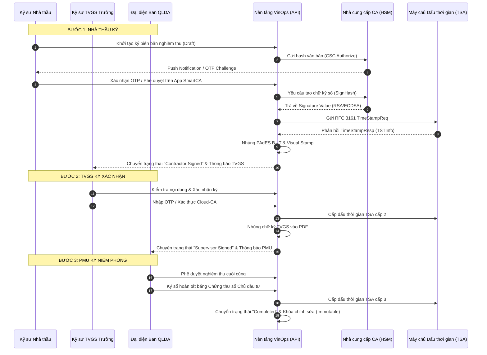

# HƯỚNG DẪN QUY TRÌNH KÝ SỐ ĐIỆN TỬ PHÁP LÝ & DẤU THỜI GIAN TSA TRÊN NỀN TẢNG VINOPS

> **Tài liệu tham chiếu:** ADR-015 (PKI Remote Signing & TSA Legal Dossier)  
> **Phiên bản:** 1.0.0  
> **Phạm vi áp dụng:** Toàn bộ dự án xây dựng triển khai trên nền tảng VinOps (Ban QLDA, Nhà thầu, Đơn vị TVGS).

---

## 1. Cơ sở Pháp lý & Tiêu chuẩn Kỹ thuật

Quy trình ký số từ xa và lưu trữ hồ sơ hoàn công điện tử trên nền tảng VinOps tuân thủ nghiêm ngặt các quy định pháp luật hiện hành của Nước Cộng hòa Xã hội Chủ nghĩa Việt Nam:

1. **Luật Giao dịch điện tử số 20/2023/QH15:** Công nhận giá trị pháp lý tương đương chữ ký tay và con dấu của chữ ký số chuyên dùng bảo đảm an toàn và chữ ký số công cộng.
2. **Nghị định 207/2026/NĐ-CP:** Quy định chi tiết về chữ ký điện tử, dịch vụ tin cậy và chứng thực điện tử trong quản lý dự án đầu tư xây dựng.
3. **Thông tư 32/2026/TT-BXD:** Hướng dẫn quản lý chất lượng thi công xây dựng, nghiệm thu điện tử và lưu trữ hồ sơ hoàn công số.
4. **Tiêu chuẩn Quốc tế & Kỹ thuật:**
   - **PAdES (PDF Advanced Electronic Signatures - ETSI EN 319 142):** Định dạng chữ ký nâng cao B-T, B-LT và B-LTA tích hợp chứng thư số X.509 và danh sách thu hồi OCSP/CRL.
   - **RFC 3161 Time-Stamp Protocol (TSA):** Dấu thời gian điện tử được cấp bởi Cơ quan cấp dấu thời gian quốc gia/công cộng (Root TSA), đảm bảo bằng chứng chống chối bỏ thời điểm ký (Proof of Existence).
   - **Cloud Signature Consortium (CSC v1.0.4):** Giao thức kết nối ký số từ xa HSM chuẩn mở quốc tế.

---

## 2. Chuẩn bị & Đăng ký Chứng thư số Từ xa (Remote Signing)

Mỗi cá nhân tham gia luồng ký số (Kỹ sư Nhà thầu, Kỹ sư TVGS, Đại diện BQLDA) cần hoàn tất các bước chuẩn bị sau:

### 2.1. Đăng ký Dịch vụ Ký số Từ xa (SmartCA / Cloud-CA)

VinOps hỗ trợ các nhà cung cấp dịch vụ chứng thực chữ ký số công cộng được cấp phép tại Việt Nam:

- **VNPT SmartCA** (Tập đoàn Bưu chính Viễn thông Việt Nam)
- **Viettel Cloud-CA** (Tập đoàn Công nghiệp - Viễn thông Quân đội)
- **TrustCA** (Công ty Cổ phần Công nghệ SAVIS)

### 2.2. Cài đặt Ứng dụng Xác thực Di động

1. Tải ứng dụng **VNPT SmartCA** hoặc **Viettel Cloud-CA** từ Apple App Store (iOS) hoặc Google Play Store (Android).
2. Đăng nhập bằng mã định danh cá nhân (CCCD/Định danh điện tử VNeID).
3. Bật phương thức xác thực sinh trắc học (FaceID / Vân tay) và cho phép nhận Thông báo đẩy (Push Notifications).
4. Khai báo liên kết Chứng thư số trên nền tảng VinOps tại mục: `Cài đặt Cá nhân > Ký số & Chứng thư số`.

---

## 3. Quy trình Trình ký Điện tử Tuần tự 3 Bên

Hệ thống VinOps thiết lập luồng ký tuần tự nghiêm ngặt (Strict Sequential Workflow). Biên bản không thể nhảy cóc cấp duyệt:

### Chi tiết các cấp ký:

1. **Cấp 1 - Kỹ sư Nhà thầu (`contractor_rep`):**
   - Khởi tạo yêu cầu nghiệm thu sau khi hoàn thành công việc tại hiện trường.
   - Chịu trách nhiệm về khối lượng, kích thước hình học và kết quả quan trắc thực tế.
2. **Cấp 2 - Kỹ sư Tư vấn Giám sát Trưởng (`tvgs_lead`):**
   - Kiểm tra đối chiếu với hồ sơ thiết kế và chỉ dẫn kỹ thuật được duyệt.
   - Xác nhận sự phù hợp về vật liệu, kết quả thí nghiệm và biện pháp an toàn.
3. **Cấp 3 - Đại diện Ban Quản lý Dự án (`pmu_manager`):**
   - Xác nhận nghiệm thu để phục vụ thanh quyết toán giai đoạn và tích hợp vào hồ sơ hoàn công.

---

## 4. Hướng dẫn Thao tác Giao diện

### 4.1. Thao tác Ký số từ xa qua Modal

1. Trên giao diện Biên bản nghiệm thu, nhấn nút **"Ký số Biên bản"** (màu xanh).
2. Hệ thống hiển thị cửa sổ **"Xác nhận Ký số Điện tử (ADR-015 PKI)"**:
   - **Nhà cung cấp:** Chọn _VNPT SmartCA_ hoặc _Viettel Cloud-CA_.
   - **Phương thức xác thực:** Chọn _Thông báo đẩy ứng dụng (Push Notification)_ hoặc _Mã OTP_.
   - Nhấn **"Gửi yêu cầu Ký"**.
3. **Xác thực trên điện thoại:**
   - Mở thông báo trên điện thoại từ ứng dụng SmartCA.
   - Kiểm tra mã tóm tắt tài liệu (Hash 8 ký tự cuối), tên biên bản và thời gian.
   - Xác nhận bằng sinh trắc học (FaceID/Vân tay) hoặc nhập mã PIN ký số.
4. **Hoàn tất:** Modal đếm ngược (tối đa 120 giây) sẽ tự động cập nhật trạng thái "Ký thành công" và hiển thị dấu mộc xanh.

### 4.2. Thao tác Từ chối Ký (Rejection)

Nếu phát hiện sai lệch kỹ thuật tại hiện trường:

1. Nhấn nút **"Từ chối Ký"** (màu đỏ).
2. Nhập **Lý do từ chối cụ thể** (bắt buộc, ví dụ: _"Cao độ móng trục C-2 sai lệch vượt tiêu chuẩn cho phép 20mm"_).
3. Nhấn **"Xác nhận từ chối"**.
4. **Hậu quả hệ thống:**
   - Phiên ký của người từ chối chuyển thành `rejected`.
   - Toàn bộ các phiên ký tiếp theo tự động đánh dấu `skipped`.
   - Biên bản nghiệm thu chuyển trạng thái `Rejected`, kích hoạt tạo phiếu Yêu cầu Khắc phục (Corrective Action/Issue) gửi Nhà thầu.

---

## 5. Kiểm tra & Xác thực Tính Toàn vẹn (Signature Validator Badge)

Tại trang xem tài liệu, mỗi chữ ký số được gắn một Huy hiệu Pháp lý (Signature Validator Badge):

| Trạng thái Huy hiệu         | Ý nghĩa Kỹ thuật & Pháp lý                                                                                                               | Hành động Khuyến nghị                                                                     |
| :-------------------------- | :--------------------------------------------------------------------------------------------------------------------------------------- | :---------------------------------------------------------------------------------------- |
| 🟢 **Chữ ký Hợp lệ**        | Mã băm PDF trùng khớp 100% với ByteRange ban đầu; Chứng thư số còn hiệu lực tại thời điểm ký; Dấu thời gian RFC 3161 hợp lệ.             | Tài liệu có giá trị pháp lý đầy đủ, sẵn sàng cho thanh toán và kiểm toán.                 |
| 🔴 **Văn bản bị sửa đổi**   | File PDF đã bị can thiệp sau khi ký (Hash mismatch); hoặc chữ ký số bị giả mạo.                                                          | **CẢNH BÁO:** Tài liệu mất giá trị pháp lý. Hệ thống tự động ghi nhật ký vi phạm an ninh. |
| 🟡 **Chứng thư số Hết hạn** | Chữ ký hợp lệ nhưng chứng thư số của người ký đã hết hạn tại thời điểm tra cứu (vẫn hợp lệ nếu có dấu thời gian TSA trước ngày hết hạn). | Kiểm tra dấu thời gian TSA để chứng minh thời điểm ký hợp lệ.                             |

Nhấp chuột vào huy hiệu để xem chi tiết:

- **Người ký & Đơn vị:** Họ tên, số CCCD, cơ quan chủ quản.
- **Cơ quan cấp chứng thư:** Tên Root CA (VNPT, Viettel, Ban Cơ yếu Chính phủ).
- **Thời điểm ký có dấu thời gian (TSA):** Giờ chính xác theo chuẩn Giờ Quốc tế UTC+7 cấp bởi máy chủ NTP/TSA chuẩn quốc gia.
- **Cấp độ PAdES:** PAdES B-LT (Long-Term Validation) hoặc PAdES B-LTA (Long-Term Archival).

---

## 6. Niêm phong & Đóng gói Hồ sơ Hoàn công Điện tử (As-Built Dossier)

Hồ sơ hoàn công bao gồm hàng trăm biên bản nghiệm thu, chứng chỉ vật liệu và bản vẽ hoàn công:

1. **Chuỗi Băm Mã hóa (Cryptographic Hash Chain):**
   - Mỗi tài liệu thành phần trong hồ sơ hoàn công được tính toán mã băm SHA-256 độc lập.
   - Hệ thống liên kết các mã băm thành chuỗi Merkle/Linear Chain:
     $$\text{NodeHash}_i = \text{SHA256}(\text{NodeHash}_{i-1} \parallel \text{ItemHash}_i)$$
2. **Niêm phong Cấp Chủ Đầu tư:**
   - Khi toàn bộ biên bản thành phần đã hoàn tất ký 3 bên, Giám đốc Ban QLDA thực hiện lệnh **Niêm phong Hồ sơ Hoàn công**.
   - Chữ ký số niêm phong được áp lên Root Hash của toàn bộ chuỗi băm kèm dấu thời gian TSA RFC 3161.
3. **Chống Chối bỏ & Bất biến (Immutability):**
   - Sau khi niêm phong, không một cá nhân hay quản trị viên nào có thể thêm, xóa, sửa bất kỳ thành phần nào trong hồ sơ hoàn công. Mọi can thiệp sẽ làm gãy chuỗi băm và báo động đỏ ngay lập tức.

---

## 7. Trách nhiệm Pháp lý & Quy định Nghiêm cấm

1. **Trách nhiệm bảo mật:** Người được cấp tài khoản ký số có trách nhiệm tự bảo quản thiết bị di động, mã PIN và tài khoản SmartCA. Nghiêm cấm chia sẻ tài khoản cho cấp dưới hoặc người khác ký thay.
2. **Chữ ký thay mặt tổ chức:** Khi đại diện doanh nghiệp hoặc ban quản lý ký số, chữ ký số cá nhân gắn liền với con dấu điện tử của pháp nhân theo quy định tại Nghị định 207/2026/NĐ-CP.
3. **Giá trị chứng cứ trong kiểm toán:** Mọi thao tác ký, duyệt, từ chối đều được ghi vết tự động vào bảng `vinops.audit_events` không thể tẩy xóa, phục vụ công tác thanh tra công trình và kiểm toán nhà nước.
